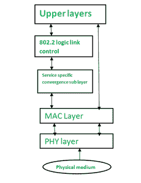

# IEEE 802 . 15 . 4 技术介绍

> 原文:[https://www . geesforgeks . org/introduction-of-IEEE-802-15-4-technology/](https://www.geeksforgeeks.org/introduction-of-ieee-802-15-4-technology/)

IEEE 802.15.4 是一种低成本、低数据速率的无线接入技术，适用于使用电池工作的设备。这描述了低速率无线个人区域网是如何工作的。

**属性:**
**1。标准化和联盟–**
它规定了无线个人区域网(WPAN)的低数据速率 PHY 和媒体访问控制层要求。
IEEE 802.15。协议栈包括–

*   紫蜂
*   6 洛潘
*   紫蜂 IP
*   ISA100.11a
*   无线 HART
*   线

**2。物理层-**
该标准支持 ISM 频段的各种 PHY 选项，频率范围从 2.4 GHz 到亚 GHz。IEEE 802.15.4 支持每秒 20 千比特、每秒 40 千比特、每秒 100 千比特和每秒 250 千比特的数据传输速度。基本结构假设 10 米的距离和每秒 250 千比特的数据速率。为了进一步降低功耗，甚至可以降低数据速率。IEEE 802.15.4 规范了物理层的射频收发器和信道选择，甚至一些能量和信号管理功能。根据所需的频率范围和数据性能，现在指定了六个 PhY。其中四个采用被称为直接序列扩频(DSSS)的跳频技术。

**3。媒体访问控制层–**
媒体访问控制层通过确定同一地区的设备将共享分配的频率来提供到 PHY 信道的链接。数据包的调度和路由也在这一层进行管理。802.15.4 媒体访问控制层负责许多功能，例如:

*   适用于在网络中作为控制器运行的设备。
*   用于借助设备关联和分离 pan。
*   设备的安全性。
*   处于对等关系的两台媒体访问控制设备之间的一致通信。

媒体访问控制层使用几种已建立的帧类型来完成这些功能。在 802.15.4 中，有四种不同类型的媒体访问控制帧:

*   数据帧
*   信标帧
*   确认帧
*   媒体访问控制命令帧

**4。拓扑–**
基于 IEEE 802.15.4 的网络可以在星型、对等或网状拓扑中开发。网状网络连接大量节点。这使得原本在范围之外的节点能够相互交互，从而使用中间节点来中继数据。

**5。安全性–**
为了数据安全，IEEE 802.15.4 标准采用了 128 位密钥长度的高级加密标准(AES)作为基本加密技术。为 802.15.4 激活此类安全措施会显著改变帧格式并使用少量有效负载。激活 AES 加密的第一个阶段是使用 802.15.4 报头的帧控制部分中的安全启用字段。为了安全起见，该字段是分配给 1 的单个位。当该位被置位时，通过从其有效载荷字段中取出某些字节，在源地址字段之后形成一个称为辅助安全报头的字段。

**6。竞争技术-**
IEEE 802 . 15 . 4 PHY 和媒体访问控制层是在不同物联网接入场景下运行的各种网络配置文件的基础。DASH7 是一种竞争无线电技术，具有不同的 PHY 和媒体访问控制层。

IEEE 802.15.4

**IEEE 802 . 15 . 4 的优势:**T2【IEEE 802 . 15 . 4 有以下优势–

*   廉价成本
*   长电池寿命，
*   快速安装
*   简单的
*   可扩展协议栈

**IEEE 802 . 15 . 4 的缺点:**
IEEE 802.15.4 的缺点包括–

*   IEEE 802.15.4 会导致干扰和多径衰落。
*   不采用跳频方法。
*   无限延迟
*   干扰敏感性

**IEEE 802 . 15 . 4 的应用:**T2【IEEE 802 . 15 . 4 应用–

*   工业中的无线传感器网络
*   建筑和家庭自动化
*   遥控器和互动玩具
*   汽车网络