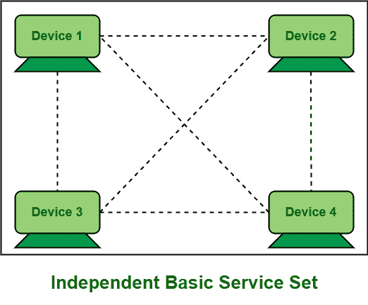

# 独立基础服务集介绍(IBSS)

> 原文:[https://www . geesforgeks . org/introduction-of-independent-basic-service-set-ibss/](https://www.geeksforgeeks.org/introduction-of-independent-basic-service-set-ibss/)

**独立基本服务集(IBSS)** 顾名思义，是一种允许无线设备或站点在没有任何介质或中央设备的情况下相互通信的服务集。它不包含或包含任何接入点。这就是为什么它也被称为特设模式或对等网络。对等网络，简单地说就是两个到更多的设备或站点或个人电脑直接相互连接，共享资源，而不需要任何单独的服务器计算机。IBSS 是一个很少使用的服务集。仅当两个或更多设备(如移动设备、笔记本电脑、平板电脑等)时才需要。希望共享或传输文件，而无需连接到接入点提供的任何无线网络。它被认为是最简单的 IEEE 802.11 网络之一，但它提供短程，覆盖面积小。

#### IBSS 的属性

*   它允许两个或多个设备直接相互通信，无需任何介质或中央设备。
*   它是所有 IEEE 802.11 网络中最简单和最容易的网络之一。
*   IBSS 不需要基础设施。

#### 应用程序

*   IBBS 主要用于不需要互联网进行通信的小型办公室。
*   它也用于建立不存在无线基础设施或需要的网络，如机场、公寓等。

#### 优势

*   在 IBSS，这些设备可以直接相互通信，而不依赖于分布式系统。
*   IBSS 主要需要无线基础设施，不需要互联网，或者被禁止(一个街区内不能接入有线网络)，如机场、酒店房间等。
*   IBSS 是一个简单的服务集，可以轻松快速地在任何地方建立无线网络。
*   IBSS 的主要优势之一是交通便利。工作站可以轻松地相互通信，没有任何网络问题。
*   沟通也不需要额外的费用。
*   客户端或用户可以从一个地方移动到另一个地方，因为它支持移动性。
*   在 IBSS，数据帧、流量、文件等。直接在站与站之间流动，站接收其他站发送的数据，并根据接收器的媒体访问控制地址过滤数据或流量。

#### 不足之处

*   IBSS 的主要缺点之一是它只覆盖小面积或有限的面积。因此，它不能用于创建长网络。
*   IBSS 不包括任何接入点，也没有可用的有线网络，因此它只能允许在设备或站点之间共享或传输小文件。
*   没有灵活性。