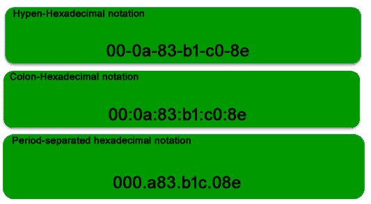
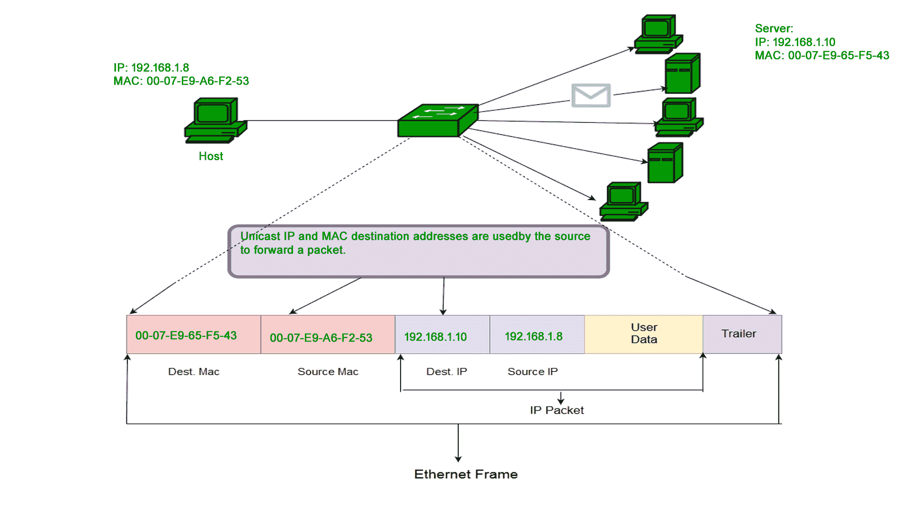
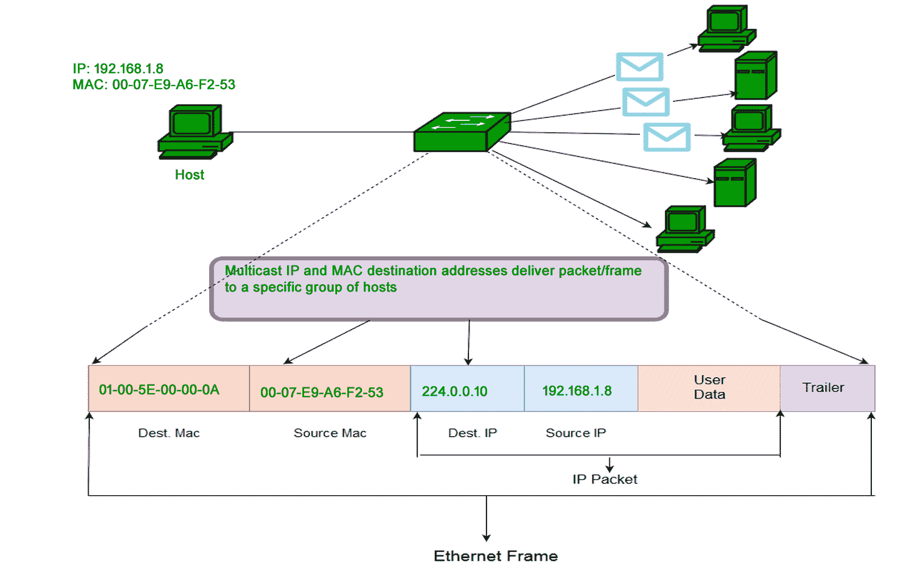
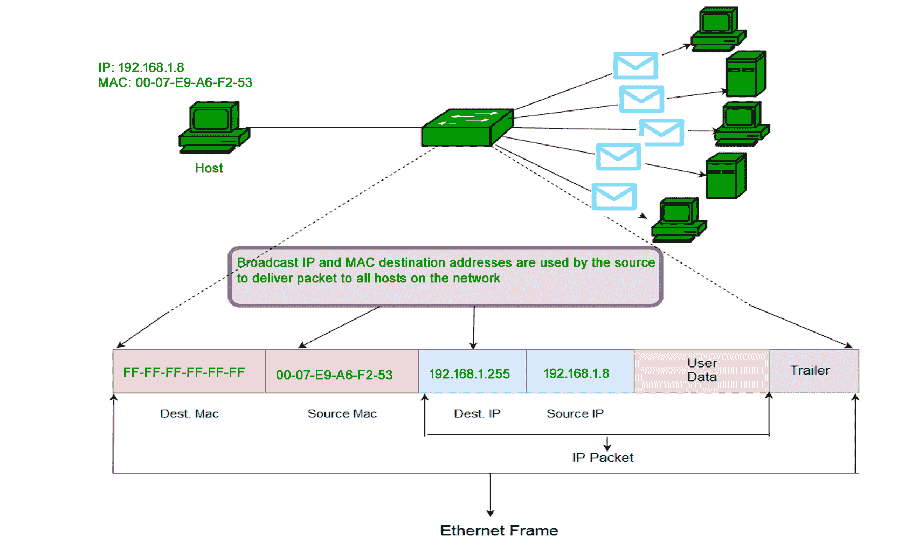

# 计算机网络 MAC 地址介绍

> 原文:[https://www . geesforgeks . org/计算机网络 mac 地址介绍/](https://www.geeksforgeeks.org/introduction-of-mac-address-in-computer-network/)

为了将数据从一台计算机传送到另一台计算机，我们需要一些地址。在计算机网络中，介绍了各种类型的地址；每个都在不同的层工作。媒体访问控制地址是在数据链路层工作的物理地址。在本文中，我们将讨论动态链接库中的寻址，也就是媒体访问控制地址。

### 媒体访问控制地址–

MAC 地址是计算机唯一的 **48 位**硬件号，在制造时嵌入网卡(称为**网卡**)中。媒体访问控制地址也被称为网络设备的**物理地址**。在 IEEE 802 标准中，数据链路层分为两个子层–

1.  逻辑链路控制子层
2.  媒体访问控制子层

媒体访问控制地址由数据链路层的媒体访问控制子层使用。媒体访问控制地址在世界范围内是独一无二的，因为有数百万个网络设备存在，我们需要唯一地识别每个设备。


### 媒体访问控制地址格式–

媒体访问控制地址是一个 12 位十六进制数(6 字节二进制数)，主要用冒号十六进制表示。媒体访问控制地址的前 6 位数字(比如 00:40:96)标识制造商，称为 OUI ( **组织唯一标识符**)。IEEE [注册管理机构委员会](http://standards.ieee.org/develop/regauth/index.html)将这些媒体访问控制前缀分配给其注册供应商。

以下是一些知名厂商的 OUI:

```
CC:46:D6 - Cisco 
3C:5A:B4 - Google, Inc.
3C:D9:2B - Hewlett Packard
00:9A:CD - HUAWEI TECHNOLOGIES CO.,LTD
```

最右边的六位代表**网络接口控制器**，由厂家指定。

如上所述，媒体访问控制地址用冒号十六进制表示。但这只是一种转换，不是强制性的。媒体访问控制地址可以使用以下任何格式表示–



**注:**冒号十六进制表示法由 *Linux 操作系统*使用，*思科系统*使用句点分隔十六进制表示法。

### 如何找到媒体访问控制地址–

```
Command for UNIX/Linux -  *ifconfig -a*
                          *ip link list* 
                         * ip address show*

Command forWindows OS -  *ipconfig /all* 

MacOS -                  * TCP/IP Control Panel*
```

**注意–**令牌环、以太网等局域网技术使用媒体访问控制地址作为物理地址，但有些网络(苹果对话)不使用媒体访问控制地址。

### 媒体访问控制地址的类型:

**1。单播-**
单播地址帧只发送到通向特定网卡的接口。如果地址第一个二进制八位数的最低有效位设置为零，则帧只能到达一个接收网卡。源机器的媒体访问控制地址总是单播。



**2。组播–**
组播地址允许源向一组设备发送帧。在第 2 层(以太网)多播地址中，地址第一个八位字节的最低有效位被设置为 1。IEEE 为标准协议使用的组地址分配了地址块 01-80-C2-xx-xx-xx(01-80-C2-00-00-00 至 01-80-C2-FF-FF-FF)。



**3。广播-**
与网络层类似，广播也可以在底层(数据链路层)进行。目的地址(FF-FF-FF-FF-FF-FF)的所有位都为 1 的以太网帧称为广播地址。以媒体访问控制地址为目的地的帧将到达属于该局域网段的每台计算机。



### 什么是 MAC 克隆–

一些互联网服务提供商使用媒体访问控制地址来为网关设备分配 IP 地址。当设备连接到互联网服务提供商时，DHCP 服务器记录媒体访问控制地址，然后分配 IP 地址。现在系统将通过媒体访问控制地址来识别。当设备断开连接时，它会丢失 IP 地址。如果用户想重新连接，DHCP 服务器会检查设备之前是否连接过。如果是这样，那么服务器会尝试分配相同的 IP 地址(以防租期未满)。如果用户更换了路由器，用户必须通知互联网服务提供商新的媒体访问控制地址，因为互联网服务提供商不知道新的媒体访问控制地址，因此无法建立连接。

或者另一种选择是**克隆**，用户只需用 ISP 克隆注册的 MAC 地址即可。现在路由器不断向 ISP 报告旧的媒体访问控制地址，不会有连接问题。

**参考文献–**

[MAC 地址–维基百科](https://en.wikipedia.org/wiki/MAC_address)
[RFC 7042 工具](https://tools.ietf.org/html/rfc7042)。

本文由 **Abhishek Agrawal** 供稿。如果你发现任何不正确的地方，或者你想分享更多关于上面讨论的话题的信息，请写评论。