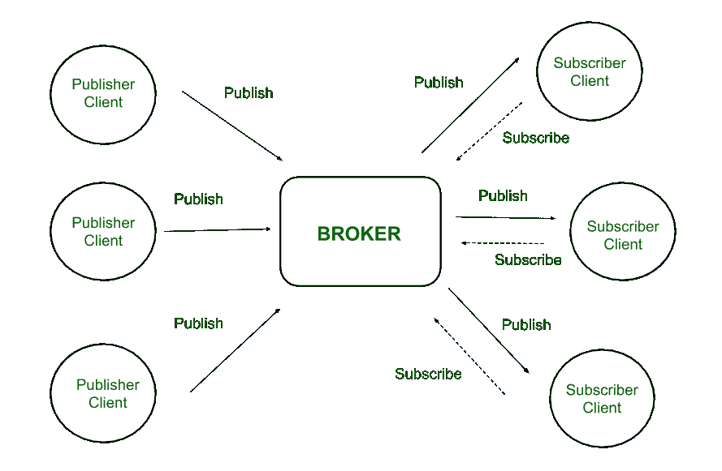
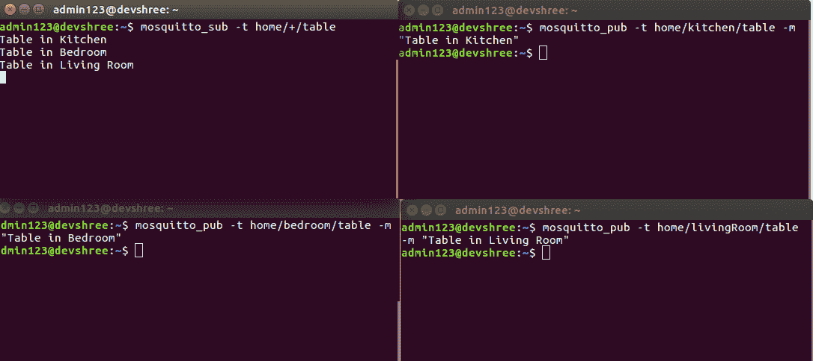
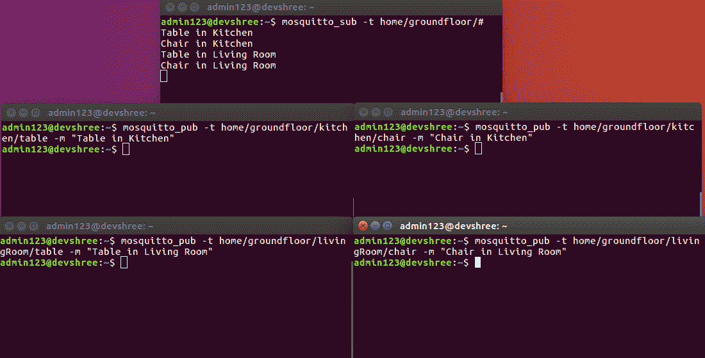

# 消息队列遥测传输协议(MQTT)介绍

> 原文:[https://www . geesforgeks . org/introduction-of-message-queue-遥测-传输-协议-mqtt/](https://www.geeksforgeeks.org/introduction-of-message-queue-telemetry-transport-protocol-mqtt/)

**MQTT** 是一种简单、轻量级的消息传递协议，用于在多个设备之间建立通信。它是基于 TCP 的协议，依赖于发布-订阅模型。这种通信协议适合于在具有低带宽和低功率要求的资源受限设备之间传输数据。因此，该消息协议广泛用于[物联网](https://www.geeksforgeeks.org/internet-things-iot-2/)框架中的通信。

**发布-订阅模型:**
该模型涉及多个客户端之间的交互，它们之间没有建立任何直接的连接。所有客户端仅通过称为代理的第三方与其他客户端通信。

**MQTT 客户端和经纪人:**
客户端向经纪人发布不同主题的消息。代理是接收这些消息并根据它们的主题过滤它们的中央服务器。然后，它将这些消息发送给订阅了这些不同主题的各个客户端。

因此，订阅了特定主题的客户端会收到该主题上发布的所有消息。



**图–**发布-订阅模型

在这里，代理是接收消息、过滤消息并将其分发给适当的客户端的中心枢纽，这样消息发布者和订阅者都是客户端。

**优势:**

1.  **易扩展性–**
    这个模型不局限于客户端之间的一对一通信。虽然发布者客户端针对特定主题发送一条消息，但代理会向订阅该主题的所有不同客户端发送多条消息。类似地，由多个这样的发布者客户端在多个不同主题上发送的消息将被发送给订阅这些主题的所有多个客户端。
    因此，使用该模型可以进行一对多、多对一以及多对多的通信。此外，由于这种双向通信协议，客户端可以发布数据，同时接收数据。因此，MQTT 被认为是双向协议。用于数据传输的默认未加密 MQTT 端口是 1883。用于安全传输的加密端口是 8883。
2.  **消除不安全的连接–**
    在多个设备相互连接的复杂系统中，每个设备不仅要管理与其他设备的连接，还必须确保这些连接是安全的。但是在发布-订阅模型中，代理变成了管理所有安全方面的中央服务器。它负责所有连接的客户端的身份验证和授权。
3.  **轻量级通信–**
    数据传输快速、高效、轻量级，因为 MQTT 消息的代码占用空间小。这些控制消息具有大小为 2 字节的固定报头和大小高达 256 兆字节的有效载荷消息。

**主题:**
在 MQTT 中，主题是 UTF-8 字符串，代理使用该字符串为每个连接的客户端过滤消息。每个主题由一个或多个不同的主题级别组成。每个主题级别由正斜杠分隔，也称为主题级别分隔符。主题和级别都区分大小写。

**主题示例–**

```
home/kitchen/table 
```

在这里，“家”、“厨房”和“餐桌”是不同层次的话题。

通配符是 MQTT 中使用的一个附加功能，使主题及其级别更加灵活和用户友好。

MQTT 主题包括两种类型的通配符:

**1。单级:“+”**
用“+”符号表示的单级通配符可以代替题目中的单级。

**示例–**
如果客户想要获得房屋内所有桌子的信息，它将订阅以下主题:

```
home/+/table 
```

因此，任何与餐桌、厨房、客厅、卧室等相关的信息都可以在这个话题上获得。



**图–**MQTT 中的单级主题

**2。多级:“#”**
用“#”符号表示的多级通配符可以替代题目中的多级。

**示例–**
如果客户想要了解厨房、客厅、卧室或底层任何其他房间内所有物品的信息，它将订阅主题:

```
home/groundfloor/# 
```

因此，任何与厨房用品、卧室用品、客厅用品相关的主题信息都可以在这个主题上获得。在这种情况下，可以获得多个级别的信息。



下面的程序说明了如何用 javascript 实现 MQTT。

## java 描述语言

```
//JavaScript Program for publish-subscribe model
/* jshint esversion : 6 */
"use strict";

//Importing MQTT
var mqtt = require('mqtt');

//Creating an instance of the client
var client = mqtt.connect({clientId: "001"});

//Definiting constants
var topic = "home/kitchen/table";
var message = "Table inside the kitchen";
var options = {retain: false, qos: 1};

//On successful connection
client.on('connect', function () {
    console.log(" After successful connection: ", client.connected);
    //If client is connected, then publish on the topic
    if (client.connected) {
        console.log(" Publishing on topic: ", topic);
        client.publish(topic, message, options);
    }
});

//On connectivity error
client.on('error', function (error) {
    console.log(" Connection error: ", error);
});

//On receiving message
client.on('message', function (topic, message) {
    console.log(" Received message: ", message.toString(), "on topic: ", topic);
    client.end();
});

function init() {
    //Subscribing to the topic
    console.log("\n Subscribing to topic");
    client.subscribe(topic, {qos: 1});
}

//Start of the program
init();
```