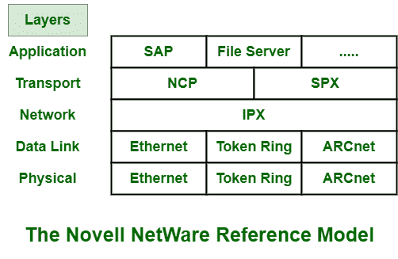
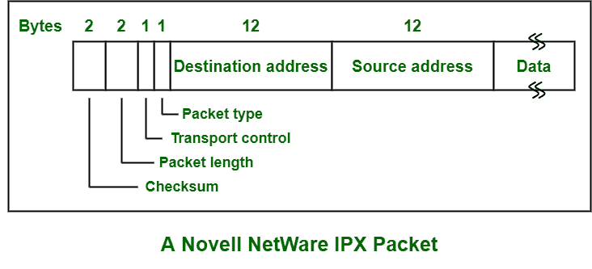

# Novell NetWare 简介

> 原文:[https://www . geesforgeks . org/introduction-of-Novell-NetWare/](https://www.geeksforgeeks.org/introduction-of-novell-netware/)

**Novell NetWare** 是一种网络操作系统。它提供广泛的网络服务，从简单易用的文件到网络用户、数据、安全，甚至资源管理。一般为网络或[局域网](https://www.geeksforgeeks.org/types-of-area-networks-lan-man-and-wan/)操作系统设计。

**Novell NetWare** 是 PC 界最流行、应用最广泛的网络系统。Novell NetWare 只是被设计用来被从大型机到个人电脑网络的各种公司使用。它只需要较低的硬件要求，并具有内存保护。它保持安全，并保护单个进程不相互攻击。Novell NetWare 是基本由 Novell，Inc .开发的停产网络操作系统。

在今天的市场上，它是最强大的网络操作系统之一。它一般使用专有协议栈，如下图所示。Novell NetWare 6.5 是 Novell 目前使用最广泛的网络操作系统之一。

**Novell Netware 中的协议:**

*   **Internet Package Exchange (IPX) –**
    Network layer generally runs unreliable connectionless internetwork protocol. It is called Internet Package Exchange (IPX) protocol. This protocol is simply used for routing and showing path to packets to move from one network node to another network throughout internetwork.

    IPX 的格式如下所示:

    

*   **NetWare Core Protocol (NCP) –**
    NCP is type of network protocol that is used in many products from Novell, Inc. It is actually Novell client-server protocol used for mainly Local Area Network (LAN). It is generally connected to NetWare Operating systems (OS). It also works with alternating operating systems along with UNIX, Linux, and Windows NT.
*   **顺序分组交换(SPX)–**
    SPX 也是 Novell Netware 使用的一种网络协议。其他操作系统也支持 SPX。它现在被认为是传统协议，因为它已经被 TCP/IP 所取代。该协议仅用于处理 Novell Netware 网络中的数据包排序。

**Novell Netware 的特点:**
Netware 最重要的特点如下:

*   **目录服务–**
    Novell 目录服务(NDS)是分布式目录服务，主要用于管理用户、服务器、外设等网络资源。它最初被称为网络软件目录服务。它使用 NDS 进行资源访问和身份验证。网络操作系统的目录服务允许用户识别和查找所需的网络资源。Novell Netware 的目录服务基本上有三种，如 Bindery、NDS、EDirectory。
*   **用户界面–**
    它包含简单的用户界面，用户和计算机系统可以通过该界面轻松交互。
*   **硬件要求–**
    这个网络操作系统不需要或者需要很多硬件设备。它需要非常少的硬件设备。
*   **互操作性–**
    使用这种联网操作系统，提高了计算机系统或软件简单地与多种类型的计算机系统交换和利用信息的能力。