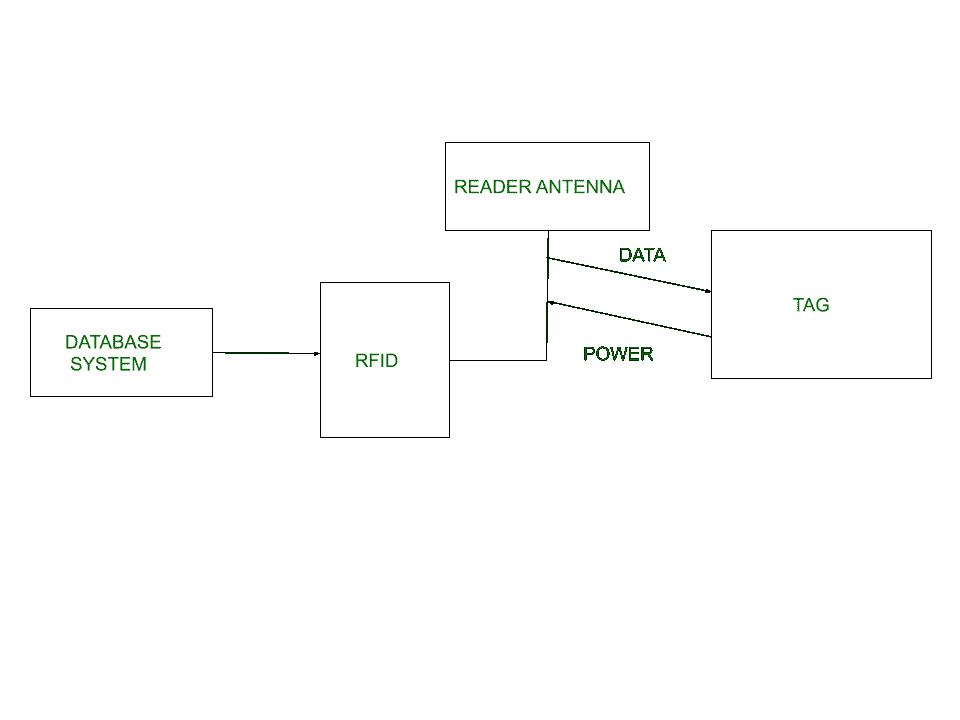
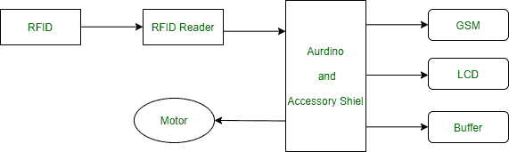

# 射频识别(RFID)介绍

> 原文:[https://www . geesforgeks . org/射频识别简介-rfid/](https://www.geeksforgeeks.org/introduction-of-radio-frequency-identification-rfid/)

**射频识别(射频识别)**是一种通过网络上的无线电传输来跟踪或识别物体的方法。数字编码在射频识别标签中的数据，可以被阅读器读取。与传统的条形码和二维码相比，这是一种作为标签或标记的设备，在此期间，通过读取器从存储在数据库中的标签读取数据。它通常在视线之外读取，无论是无源还是有源射频识别。

**RFID 的种类:**
RFID 有很多种，每一种都有不同的属性，但或许 RFID 技术最迷人的一面是，大多数 RFID 标签既没有电插头，也没有电池。相反，操作它们所需的所有能量都是由射频识别阅读器以无线电波的形式提供的。这项技术被称为无源射频识别，以区别于标签上有电源的(不太常见的)有源射频识别。

**超高频 RHID(超高频 RFID )** 。它用于装运托盘和一些驾照。阅读器发送 902-928 兆赫波段的信号。通过改变标签反射阅读器信号的方式，标签可以在数米的距离内进行通信；读者能够接收到这些反射。这种操作方式被称为反向散射。

**高频射频识别。**它的工作频率为 13.56 兆赫，很可能存在于你的护照、信用卡、书籍和非接触式支付系统中。高频射频识别有一个短距离，通常是一米或更短，因为物理机制是基于感应而不是反向散射。

还有其他形式的使用其他频率的射频识别，如低频射频识别(低频射频识别)，它是在高频射频识别之前开发的，用于动物跟踪

**RFID 有两种类型:**

1.  **无源 RFID–**
    在该设备中，射频标签不通过电源连接，无源射频标签存储其功率。当它从有源天线发射时，射频标签使用特定频率，如 125-134 兆赫作为低频，13.56 兆赫作为高频，856 兆赫至 960 兆赫作为超高频。

2.  **有源射频识别–**
    在这个设备中，射频标签由发射信号的电源连接，并且有一个接收数据的天线。

**RFID 的工作原理:**
一般来说，RFID 利用无线电波来执行 AIDC 功能。AIDC 代表自动识别和数据采集技术，该技术执行对象识别以及数据的收集和映射。

天线是一种将电能转换成无线电波的装置，用于阅读器和标签之间的通信。射频识别阅读器从检测标签的射频识别标签中检索信息，并将数据读取或写入标签。它可以包括一个处理器、封装、存储器以及发射器和接收器单元。

**射频识别的特点:**

*   射频识别标签由微电路和天线两部分组成。
*   这个标签被保护材料覆盖，保护材料起到屏蔽外部环境影响的作用。
*   这种标签可以是有源的，也可以是无源的，其中我们主要广泛使用无源射频识别。

**RFID 的应用:**

*   它用于跟踪集装箱、卡车和铁路、汽车。
*   它用于资产跟踪。
*   它用于信用卡的存取应用。
*   它用于人员跟踪。
*   控制进入禁区。
*   它使用身份证标记。
*   供应链管理。
*   防伪(例如，在制药行业)。

**RFID 的优势:**

*   它提供数据访问和实时信息，无需花费太多时间。
*   射频识别标签遵循指令并存储大量信息。
*   射频识别系统是非视线性质的技术。
*   它提高了生产的效率和可追溯性。
*   在短时间内读取数百个标签。

**RFID 的缺点:**

*   对射频识别设备进行编程需要更长的时间。
*   即使加密，射频识别也很容易被截获。
*   在射频识别系统中，有两三层普通的家用箔片来阻挡无线电波。
*   射频识别设备存在隐私问题，任何人都可以获取任何信息。
*   由于电池的原因，有源射频识别可能会更贵。