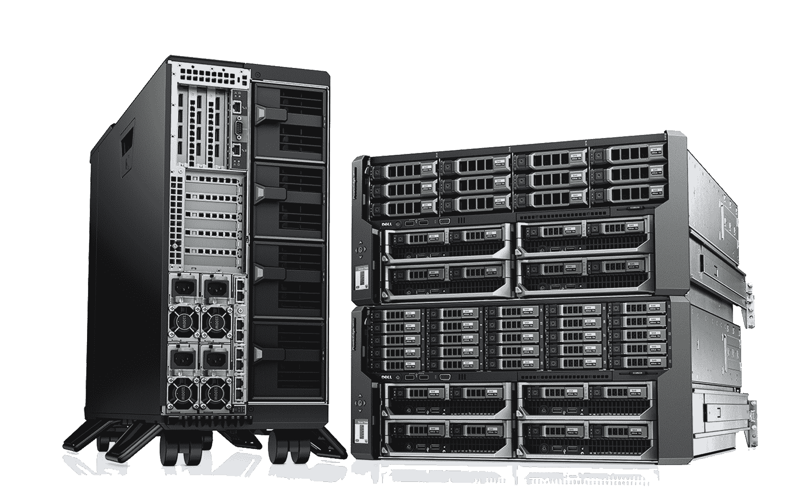
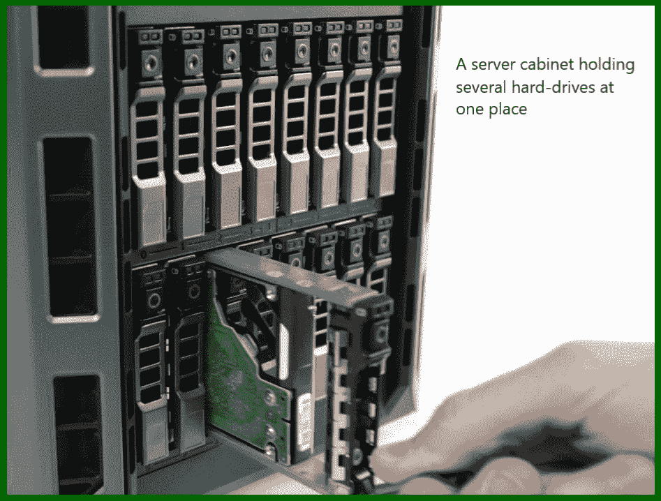
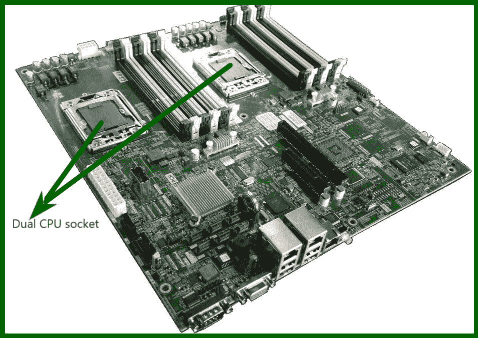
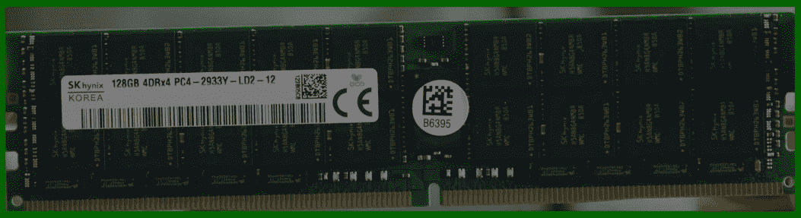

# 服务器介绍

> 原文:[https://www.geeksforgeeks.org/introduction-of-server/](https://www.geeksforgeeks.org/introduction-of-server/)

服务器是用于特定目的的专用计算机，与台式计算机不同，这些计算机的耐用性、寿命和工作时间比台式计算机更长。

**服务器的功能:**
服务器是为其他计算机提供服务和功能的。使用服务器的其他计算机称为“客户机”，这种共享模式称为“客户机-服务器”模式。

通常情况下，每台计算机都可以通过其操作系统功能转变为服务器。但是由于硬件的限制以及操作系统的限制，它们无法支持大量的连接。服务器计算机使用与台式电脑相同的部件，但这些部件是为耐用性和不间断工作条件而设计的。

**服务器的硬件要求:**
硬件功能类似于台式 PC，服务器使用的部件都是特殊等级的。

**例:**
服务器用硬盘更耐磨，更耐撕裂，更耐震动，可以轻松承受这些震动数年，确实更贵。不像廉价的台式电脑驱动器，它不太耐磨，抗撕裂和振动。

一台服务器可以有许多硬盘，并且所有这些硬盘都使用 RAID 配置进行连接。RAID 软件会自动将所有数据分发到每个驱动器，并且在驱动器出现故障时，它会将数据重新构建到安装在故障驱动器位置的新驱动器上。

主板也很贵，配有双或四甚至八 CPU 配置，并支持大量内存(高达 1-2TB 的内存)。此外，服务器主板可以支持许多硬盘。

服务器使用 ECC 内存(纠错内存)，也就是说，如果出现错误，内存会自己检查错误并进行纠正，使服务器更加可靠。服务器内存很大(高达 100GB 或 128GB)。

服务器有冗余电源，以便在断电时保持服务器正常运行。它使用服务器级操作系统，如 Linux、Windows 服务器、macOS 服务器等。这些操作系统被配置为处理数千个并发连接。

**服务器计算机的用途:**
服务器可用作:-

1.  **应用服务器–**
    主要为用户提供对应用的访问，无需在各自的 PC 上安装应用的副本。示例:-像 web 应用程序服务器一样，它可以是 www 服务器或本地服务器。
2.  **Catalog servers –**
    It keeps and maintains an index or table of content of information which can be accessed by other computers throughout the World Wide Web.

    **示例:**目录服务器和名称服务器就是其中的一些示例。

3.  **计算服务器–**
    这种类型的服务器通过网络与客户端共享其大量的计算资源，如中央处理器、内存和存储。
4.  **数据库服务器–**
    这种类型的服务器维护特定类型的数据库，如果用户可以访问该数据库，则用户可以访问该数据库。示例:–数据库可以是书籍、视频、图片、音乐等。

像这样有传真服务器，文件服务器，媒体服务器，邮件服务器，游戏服务器，打印服务器，代理服务器等。这样，可以设置任意数量的服务器来使用。

**服务器与 PC 的区别:**

| 服务器 | 个人电脑 |
| --- | --- |
| 它是为冗余和不间断工作时间而设计的。 | 它不是为冗余和更长的工作时间而设计的。 |
| 硬件很贵。 | 硬件没那么贵。 |
| 仅使用专用硬件。 | 不使用专用硬件。 |
| 不同的任务使用不同的服务器。示例:–电子邮件服务器、文件服务器等… | 一台电脑可以用于任何数量的任务。 |

