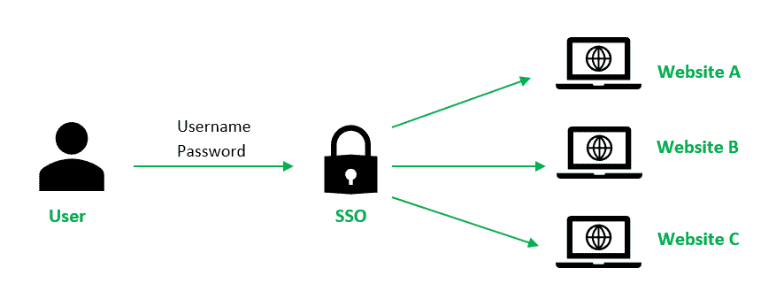
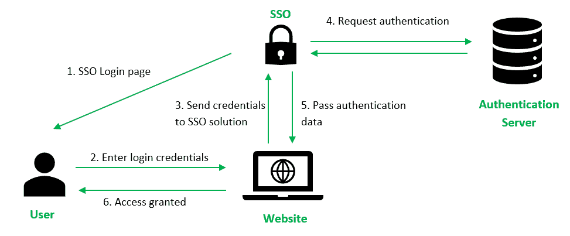

# 单点登录介绍

> 原文:[https://www . geesforgeks . org/单点登录简介/](https://www.geeksforgeeks.org/introduction-of-single-sign-on-sso/)

**单点登录(SSO)** 是一种身份验证方案，用户只需使用单一用户名和密码登录，就可以安全地进行身份验证并访问多个应用程序和网站。
例如，登录你的谷歌账户一次，你就可以访问谷歌应用，如谷歌文档、谷歌邮箱和谷歌驱动。

如果没有单点登录解决方案，该网站将维护一个登录凭据(用户名和密码)数据库。每次用户登录网站时，它都会对照其数据库检查用户的凭据，并对用户进行身份验证。

使用单点登录解决方案，网站不会在其数据库中存储登录凭据。相反，单点登录使用共享的身份验证服务器集群，用户只需输入一次登录凭据进行身份验证。利用一次登录和多次访问的这一特性，保护单点登录系统中的登录凭据至关重要。
因此，强烈建议将单点登录与其他强身份验证手段(如智能令牌或一次性密码)集成，以实现多因素身份验证。

**SSO 是如何工作的？**

1.  用户在网站上输入登录凭据，网站会检查用户是否已经通过单点登录解决方案的身份验证。如果是这样，单点登录解决方案将允许用户访问网站。否则，它会为用户提供单点登录解决方案。
2.  用户在单点登录解决方案上输入用户名和密码。
3.  用户的登录凭据被发送到单点登录解决方案。
4.  单点登录解决方案寻求身份提供者(如活动目录)的身份验证，以验证用户的身份。一旦验证了用户的身份，身份提供者就向单点登录解决方案发送一个验证。
5.  身份验证信息从单点登录解决方案传递到网站，用户将被授权访问该网站。
6.  成功登录单点登录后，网站会以令牌的形式传递身份验证数据，以此验证用户在导航到不同的应用程序或网页时是否通过了身份验证。

**SSO 的优势:**
这些对用户、对商家都是优势。

**针对用户–**

*   访问第三方网站的风险降低，因为网站数据库不存储用户的登录凭据。
*   增加了用户的便利性，因为他们只需要记住并输入一次登录信息。
*   提高了用户的安全保障，因为网站所有者不存储登录凭据。

**适用于企业–**

*   提高客户基础和满意度，因为单点登录提供了更低的准入门槛和无缝的用户体验。
*   降低管理客户用户名和密码的信息技术成本。

**SSO 的劣势:**

*   如果登录凭据没有得到安全保护，并且暴露或被盗，安全风险会增加，因为对手现在可以使用单个凭据访问许多网站和应用程序。
*   身份验证系统必须具有高可用性，因为可用性的丧失会导致使用共享身份验证系统集群的应用程序被拒绝服务。