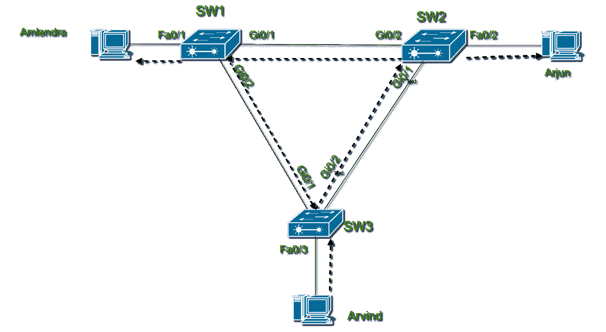
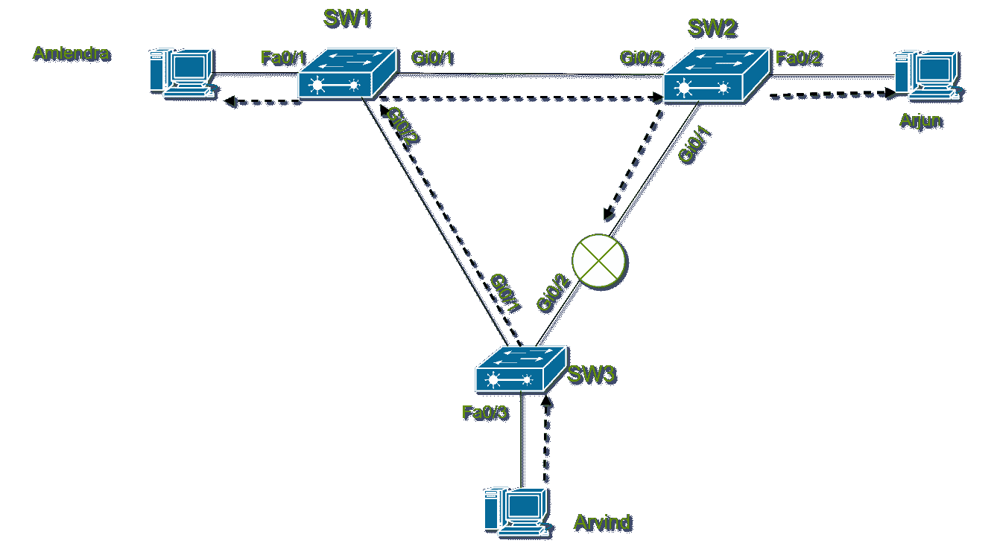

# 介绍生成树协议(STP)

> 原文:[https://www . geesforgeks . org/生成树协议简介-stp/](https://www.geeksforgeeks.org/introduction-of-spanning-tree-protocol-stp/)

在局域网中，增加冗余链路以提高局域网的网络可用性。但是这种冗余链路可能会导致帧在网络中无限循环，直到采取某些措施，例如，某些链路被关闭。为了解决帧循环问题，生成树协议应运而生。

**生成树的需求:**
考虑以下场景，3 台交换机，每台交换机连接一个用户。

**Figure –** Looping of Frame in LAN

Arvind 向局域网发送一个广播帧，按照交换机的本质，该帧是从除接收端口(Fa0/3)之外的其他端口(Gi0/1 和 Gi0/2)发送出去的。现在，该帧到达 SW2，SW2 也从 Gi0/2 和 Fa0/2 端口广播该帧。SW1 在其 Gi0/1 端口接收帧。SW1 也广播帧，然后该帧到达 SW3，帧广播继续。请记住，此帧广播也发生在从 SW3 到 Gi0/1 端口的其他方向。上面讨论的帧循环来自 SW3 的 Gi0/2 端口。你可以想象在那个小局域网里帧泛滥。这种帧在局域网上的永久循环被称为*广播风暴*。

帧的这种循环导致如下所述的三个问题:

1.  **MAC 表不稳定–**
    由于帧在局域网内循环，交换机的 MAC 表经常发生变化。循环导致不正确的媒体访问控制表条目，从而导致不正确的帧传送。
2.  **广播风暴–**
    局域网中链路周围帧的重复转发导致链路使用效率低下。
3.  **多帧传输–**
    循环的一个非常严重的负面影响是同一帧的多个副本被传送到主机。这个过程让主持人感到困惑。

**生成树协议有什么帮助？**
生成树协议通过将交换机端口置于*转发*或*阻塞*状态来防止帧在局域网中循环。处于转发状态的接口(交换机端口)正常工作，但处于阻塞状态的接口不处理收到的任何帧，除了 STP 消息和其他重要开销。阻止接口不学习媒体访问控制地址，不转发帧，也不处理接收到的帧。
现在，如果我们再次考虑上面讨论的 SW3 Gi0/2 接口处于阻塞状态的场景。

**Figure –** Frame looping prevention by STP

*   阿尔温德把帧发送到 SW3。
*   SW3 仅将帧转发到 Gi0/1 端口，因为 Gi0/2 端口处于阻塞状态。
*   现在，SW1 接收帧并转发到 Fa0/1 和 Gi0/1 接口。
*   SW2 接收帧并转发到 Fa0/2 和 Gi0/1 接口。
*   SW3 将在 Gi0/2 接口上接收帧，但由于帧处于阻塞状态，因此会忽略该帧。

这样，通过使用 STP 可以防止帧在局域网中循环。