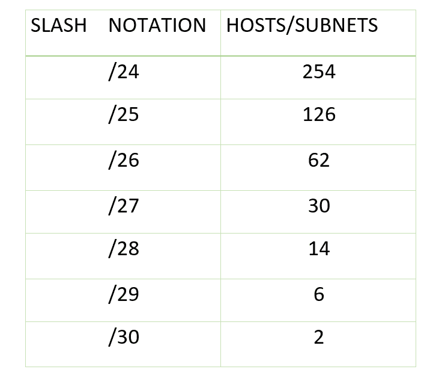

# 可变长度子网掩码介绍(VLSM)

> 原文:[https://www . geesforgeks . org/可变长度子网掩码介绍-vlsm/](https://www.geeksforgeeks.org/introduction-of-variable-length-subnet-mask-vlsm/)

VLSM 代表可变长度子网掩码，其中子网设计在同一个网络中使用多个掩码，这意味着单个 A 类、B 类、C 类或网络的不同子网使用多个掩码。它用于提高子网的可用性，因为子网的大小可以变化。它也被定义为子网的子网划分过程。

**实施 VLSM 的步骤–**
在 VLSM，子网根据需求使用块大小，因此需要多次划分子网。假设有一个管理员要管理四个部门。这些部门是拥有 120 台计算机的销售和采购部门、拥有 50 台计算机的开发部门、拥有 26 台计算机的会计部门和拥有 5 台计算机的管理部门。

如果管理员拥有 IP 192.168.1.0/24，则可以通过以下步骤分配部门级 IP:

1.  For each segment select the block size that is greater than or equal to the actual requirement which is the sum of host addresses, broadcast addresses and network addresses. Make a list of subnets possible:

    
    **表–**可能的子网列表

2.  根据从最高到最低要求的块大小，以降序排列所有段。

    ```
    Sales and Purchase: 120
    Development: 50
    Accounts: 26
    Management: 5 
    ```

3.  最高的可用 IP 必须分配给最高的需求，因此销售和采购部门获得 192.168.1.0/25，其中有 126 个有效地址，可轻松用于 120 台主机。使用的子网掩码是 255.255.255.128
4.  下一个网段需要一个 IP 来处理 50 台主机。网络号为 192.168.1.128/26 的 IP 子网是次高的，可以分配给 62 台主机，满足开发部门的要求。使用的子网掩码是 255.255.255.192
5.  同样，下一个 IP 子网 192.168.1.192/27 可以满足会计部门的要求，因为它有 30 个有效的主机 IP，可以分配给 26 台计算机。使用的掩码是 255.255.255.224
6.  最后一个网段需要 5 个有效的主机 IP，子网 192.168.1.224/29 可以满足这个要求，子网掩码为 255.255.255.248。可以选择掩码为 255.255.255.240 的 IP，但它有 14 个有效的主机 IP，相比之下要求较少，因此选择了与要求相当的 IP。因此，与 FLSM 相比，VLSM 的知识产权浪费较少。

**VLSM 相对于 FLSM 的优势–**

1.  在固定长度子网掩码子网划分(FLSM)中，所有子网大小相同，主机数量相同，但在 VLSM，子网大小是可变的，主机数量也是可变的，因此通过允许不同掩码长度的路由系统满足要求，使得 IP 寻址更加高效。
2.  在 FLSM，知识产权地址是有浪费的，但在 VLSM，知识产权地址的浪费是最小的。
3.  对于私有 IP 地址，FLSM 是首选，而对于公共 IP 地址，VLSM 是最佳选择。