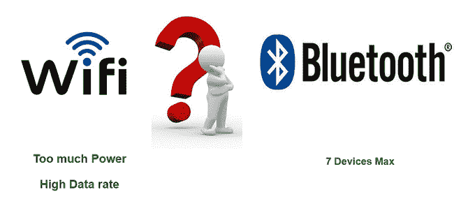
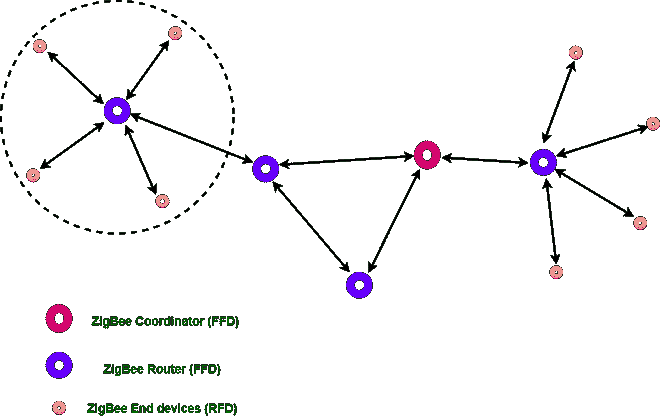
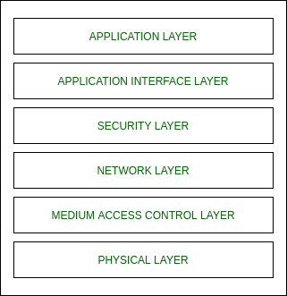

# ZigBee 的引入

> 原文:[https://www.geeksforgeeks.org/introduction-of-zigbee/](https://www.geeksforgeeks.org/introduction-of-zigbee/)

ZigBee 是个人区域网络任务组，具有低速率任务组 4。它是一种家庭网络技术。紫蜂是为控制和传感网络而创建的技术标准。我们知道 Zigbee 是任务组 4 的个人区域网络，所以它是基于 IEEE 802.14.4 的，由 ZigBee 联盟创建的。

紫蜂是一种标准，旨在满足短距离无线通信中低数据速率低功耗设备的低成本实现需求。

**为什么是另一种短程通信标准？？**T3】

**紫蜂设备类型:**

*   **Zigbee 协调器设备**–它与路由器通信。该设备用于连接设备。
*   **Zigbee 路由器**–用于在设备之间传递数据。
*   **Zigbee 终端设备**–这是将要被控制的设备

**Zigbee 标准的一般特性:**

*   低功耗
*   低数据速率(20- 250 千位/秒)
*   短程(75-100 米)
*   网络加入时间(~ 30 毫秒)
*   支持小型和大型网络(最多 65000 台设备(理论)；240 台设备(实际上))
*   产品成本低，实现成本低(开源协议)

**工作频段**(网络中仅选择一个信道使用):

1.  **通道 0** : 868 MHz(欧洲)
2.  **1-10 频道** : 915 兆赫(美国和澳大利亚)
3.  **11-26 频道** : 2.4 GHz(全球)

**Zigbee 网络拓扑结构:**

*   星型拓扑(紫蜂智能能源)
*   网状拓扑(自愈过程)
*   树形布局

**Zigbee 的架构:**
Zigbee 架构是 6 层的组合。

1.  应用层
2.  应用接口层
3.  安全层
4.  网路层
5.  媒体访问控制层
6.  物理层

*   应用层存在于用户层面。
*   应用接口层、安全层和网络层是紫蜂联盟，它们用于存储数据并使用堆栈。
*   媒体访问控制和物理层是 IEEE 802.15.4，它们是硬件，是硅，意味着它们只接受 0 和 1。

**通道接入:**

1.  **基于竞争的方法**(具有冲突避免机制的载波侦听多路访问)
2.  **无争用方法**(协调器为每个设备指定特定的时隙(保证时隙(GTS))

**紫蜂应用:**

1.  家庭自动化
2.  医疗数据收集
3.  工业控制系统