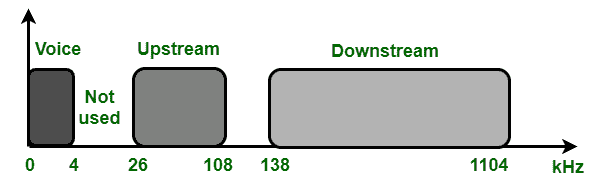
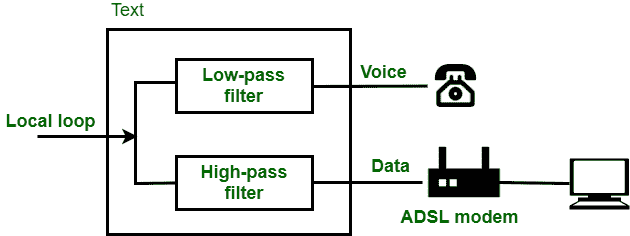
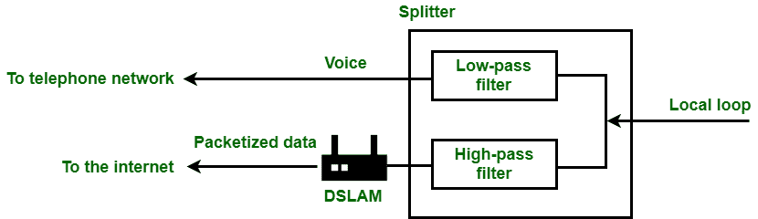

# 非对称数字用户线路(ADSL)简介

> 原文:[https://www . geeksforgeeks . org/简介-非对称-数字-用户线-adsl/](https://www.geeksforgeeks.org/introduction-to-asymmetric-digital-subscriber-line-adsl/)

[ADSL(非对称数字用户线)](https://www.geeksforgeeks.org/adsl-full-form/)是 [DSL 技术](https://www.geeksforgeeks.org/digital-subscriber-line-dsl/)的首创技术。它就像 56K 调制解调器一样，能够在下游方向提供比上游方向更高的数据速度。这就是为什么它的名字叫不对称 DSL 的原因。它不均匀地划分带宽，以满足住宅用户的需求。我们知道，商业目的需要更高的带宽，因此不适合他们。

ADSL 中的带宽划分

**使用现有的本地循环:**
它使用现有的本地循环。它能够达到传统调制解调器无法达到的数据速率，这只是因为使用了双绞线本地环路，即能够处理高达 1.1 兆赫的带宽，但在电话公司的终端办公室安装了滤波器，每个环路的带宽限制高达 4 千赫。没有滤波器，1.1 兆赫可用于数据和语音通信。

**自适应技术:**
不幸的是，1.1 MHz 只是一个理论带宽。由于电缆尺寸、使用的信号等原因，住宅和交换局之间的距离等因素会影响带宽。在设置数据速率之前，该技术的开发人员为此目的使用自适应技术。因此，我们可以说，ADSL 技术的数据速率不是固定的，它根据使用的本地环路的条件和类型而变化。

**离散多音技术:**
ADSL 的标准调制技术是离散多音技术，它结合了 QAM 和 FDM。有 1.104 MHz 带宽可用。它分为 256 个频道。以下是带宽分布–

*   **IDLE–**
    不使用 1 到 5 个频道，这些频道将提供语音和数据通信之间的间隙。

*   **上游数据和控制–**
    通道 6 至 30 用于上游数据传输和控制。一个通道用于控制，其他 24 个通道用于数据传输。

*   **Downstream Data and Control –** 
    Channels 31 to 255 are used for downstream data transfer and control. Like upstream in this also one channel is used for control and other 224 are used for data transfer. 

**客户现场:ADSL 调制解调器**
ADSL 调制解调器安装在客户现场。在这个本地环路中，连接到一个分离器，用于分离语音和数据通信。调制和解调是使用 DMT 完成的，它创建了单独的下行和上行信道。

ADSL 调制解调器

分路器必须安装在电话公司的客户驻地。语音线路可以通过房子里现有的线路安装，但是数据线需要由专业人员安装。因此，ADSL 线路变得昂贵。

**电话公司站点:DSLAM**
视图与电话公司站点不同。他们不是使用 ADSL 调制解调器，而是使用 DSLAM，即数字用户线多路复用。除了 ADSL 功能之外，它还有一个附加功能，可以将发送到互联网的数据打包。以下是 DSLAM 的配置

DSLAM

**ADSL 的特点:**

*   高速互联网接入。
*   互联网和呼叫设施。
*   公平的价格。
*   实时获取信息。