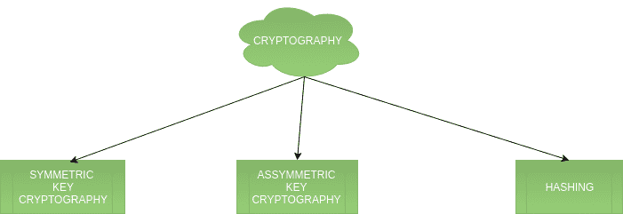
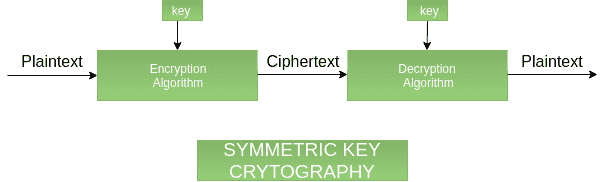
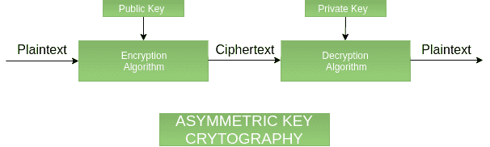
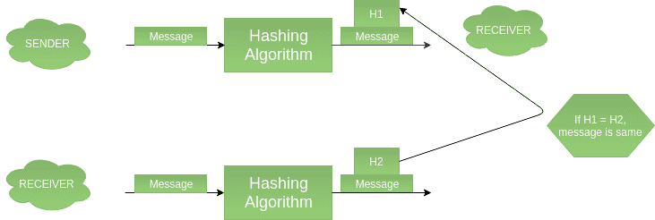
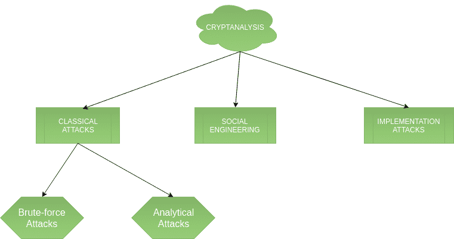

# 加密术语介绍

> 原文:[https://www . geesforgeks . org/密码术语介绍/](https://www.geeksforgeeks.org/introduction-to-crypto-terminologies/)

密码学是我们处理网络安全的一个重要方面。“加密”意味着秘密或隐藏。密码学是一门秘密写作的科学，旨在对数据保密。另一方面，密码分析是打破密码系统的科学，有时是艺术。这两个术语都是所谓密码学的一个子集。

**分类–**
流程图描述了密码学只是保护网络安全的因素之一。密码学是指对代码的研究，包括编写代码(密码学)和解决代码(密码分析)。下面是加密术语及其各种类型的分类。

**1。密码学–**
密码学分为对称密码、非对称密码和哈希。以下是这些类型的描述。

1.  **Symmetric key cryptography –**
    It involves usage of one secret key along with encryption and decryption algorithms which help in securing the contents of the message. The strength of symmetric key cryptography depends upon the number of key bits. It is relatively faster than asymmetric key cryptography. There arises a key distribution problem as the key has to be transferred from the sender to receiver through a secure channel.

    

2.  **Asymmetric key cryptography –**
    It is also known as public key cryptography because it involves usage of a public key along with secret key. It solves the problem of key distribution as both parties uses different keys for encryption/decryption. It is not feasible to use for decrypting bulk messages as it is very slow compared to symmetric key cryptography.

    

3.  **Hashing –**
    It involves taking the plain-text and converting it to a hash value of fixed size by a hash function. This process ensures integrity of the message as the hash value on both, sender\’s and receiver\’s side should match if the message is unaltered.

    

**2。密码分析–**

1.  **经典攻击–**
    可以分为 a)数学分析和 b)蛮力攻击。暴力攻击对密钥的所有可能情况运行加密算法，直到找到匹配。加密算法被视为一个黑盒。分析攻击是指通过分析加密算法的内部结构来破坏密码系统的攻击。
2.  **社会工程攻击–**
    这是一种依赖于人的因素的东西。诱骗某人向攻击者透露他们的密码或允许访问受限区域都会受到这种攻击。当向任何不可信的第三方透露密码时，人们应该小心谨慎。
3.  **实施攻击–**
    侧信道分析等实施攻击可用于获取密钥。在攻击者能够获得对密码系统的物理访问的情况下，它们是相关的。