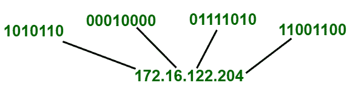

# 域名介绍

> 原文:[https://www.geeksforgeeks.org/introduction-to-domain-name/](https://www.geeksforgeeks.org/introduction-to-domain-name/)

互联网上的每台计算机都有一个本质上唯一的地址。它是一串数字，被称为 IP 地址。为了相互通信，计算机通过其 [IP 地址](https://www.geeksforgeeks.org/introduction-of-classful-ip-addressing/)识别另一台计算机。它以点分十进制或二进制十进制表示。示例:地址 172.16.122.204 用点分十进制表示时，可以转换成二进制表示。转换后变成 10101100 00010000 01111010 11001100。

[](https://media.geeksforgeeks.org/wp-content/uploads/20201201115819/IP.png)

但人类很难记住这个 IP 地址。因此，为了容易地在互联网上找到位置，域名系统被发明了。DNS 代表[域名服务器](https://www.geeksforgeeks.org/domain-name-system-dns-in-application-layer/)。它实现了一个分布式数据库，将 IP 地址转换为唯一的字母数字地址，称为**域名**。基本上，域名是由一个或多个句点(“)分隔的字母和/或数字序列).它就像指向计算机网络上唯一 IP 地址的指针。举个例子，可以把**域名看作地址**， **[DNS](https://www.geeksforgeeks.org/working-of-domain-name-system-dns-server/) 看作互联网的通讯录**。

**例-1:**
我们来考虑一个域名的例子；

```
www.google.com, www.yahoo.com 
```

在这个“yahoo.com”被称为域名。
“www。”告诉浏览器寻找该域的万维网接口。

从上面的例子可以清楚地看出，域名比 IP 地址更容易记住。

**例-2:**
假设 www.yahoo.com 的 IP 地址是 69.147.76.15。与 IP 地址 69.147.76.15 相比，很容易记住 www.yahoo.com。

由此，我们可以这样说；域名是指与 IP 地址相关联的字母串，DNS 是一种用于将 IP 地址转换为域名的机制。

**域名类型:**
DNS 已经将所有的域名组织成一个层次结构。在这个层次结构的顶部是各种顶级域，其次是二级、三级域和子域。所有这些类型的域名如下

**顶级域名(TLD) :**
顶级域名在互联网的 DNS 结构中处于最高级别。它有时也被称为扩展。它进一步分为国家代码顶级域名和通用顶级域名，国家描述如下

*   **国家/地区代码顶级域名(cclds):**
    它由两个字母的域名组成，每个国家/地区包含一个条目。示例–。在印度。代表澳大利亚。我们支持联合国。日本的 jp 等。为了瞄准当地受众，公司和组织会使用它。只有该国的居民才被允许注册其指定的顶级域名，但现在一些国家允许其境外的用户注册其相应的顶级域名。
*   **通用顶级域名:**
    这些域名对所有用户开放注册，无论其公民身份、居住地或年龄如何。一些 gTLD 是。商业网站。网络公司。做生意。组织的组织。教育 edu。

在顶级域名之下还有其他各种级别–
**第二级:**
它在域名体系中仅次于 TLD。它也被命名为标签。例如:in .co.in .。co 是下的二级域名。在 ccTLD 中。

**第三关:**
在第二关正下方。例如:在 yahoo.co.in。雅虎是第二级域名下的第三级域名。公司在。在 ccTLD 中。

**子域:**
它是 DNS 层次结构中较高域名的一部分。示例:yahoo.com 包含的子域。login.yahoo.com 是这个域名的一个子域

**域名优势:**

*   用户不需要记住 IP 地址。
*   更加可靠和安全。

**域名的劣势:**

*   IP 地址的改变有几个原因，由于这个 IP 地址的计算机得到改变，但域名系统可能已经缓存了以前的 IP，这将导致给我们错误的信息。