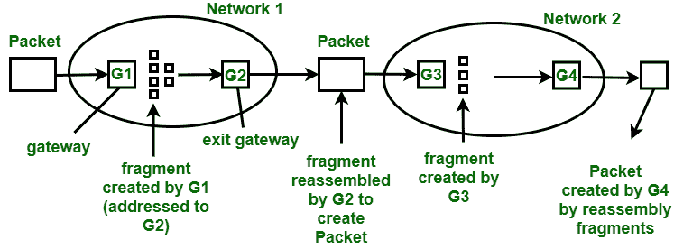
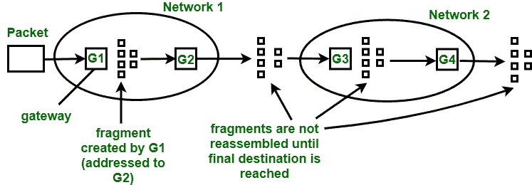

# 碎片介绍

> 原文:[https://www . geesforgeks . org/碎片化介绍/](https://www.geeksforgeeks.org/introduction-to-fragmentation/)

**分片**是网络层的一个重要功能。这是一种网关将较大的数据包分解或分割成较小的数据包的技术，称为分段。然后，每个片段作为单独的内部数据包发送。每个片段都有单独的头和尾。

有时，当一个分段数据报遇到处理较小分段的网络时，也会被分段。因此，数据报在到达最终目的地之前可能会被分段多次。碎片化的反向过程是困难的。片段的重组通常由目的主机完成，因为每个片段都变成了一个独立的数据报。

关于**碎片示例**的参考，可以参考:[碎片示例](https://www.geeksforgeeks.org/fragmentation-network-layer/)

重组有两种不同的策略，或者我们可以说片段的重组:透明片段化和非透明片段化。

1.  **Transparent Fragmentation :**

    这种分段是由一个网络完成的，并对所有后续网络(数据包将通过这些网络)透明。每当一个大数据包到达网关时，它会将数据包分成更小的片段，如下图所示，网关 G1 将数据包分成更小的片段。

    

    图–透明碎片

    在此之后，每个片段将寻址到同一个出口网关。一个网络的现有网关重组或重新组合所有片段示例如上图所示，作为出口网关，网络 1 的 G2 在将 G1 创建的所有片段传递给网络 2 之前，重新组合它们。因此，后续网络不知道碎片已经发生。自动柜员机网络使用这种策略。这些网络使用特殊的硬件来提供透明的数据包分段。

    透明度策略有以下一些缺点:

    *   在网络中重组片段的退出片段必须在收到所有片段时知道。
    *   一些片段选择不同的网关进行退出，这导致了较差的性能。
    *   它在重复分割和重组大数据包时增加了相当大的开销。
2.  **Non-Transparent Fragmentation :**
    This fragmentation is done by one network is non-transparent to the subsequent networks through which a packet passes. Packet fragmented by a gateway of a network is not recombined by exit gateway of same network as shown in the below figure.

    图–不透明碎片

    一旦数据包被分段，每个片段都被视为原始数据包。数据包的所有片段都通过出口网关，这些片段的重组在目的主机上完成。

    不透明碎片的缺点如下:

    *   每个宿主都有重组片段的能力。
    *   当一个包被分段时，碎片应该以这样的方式编号，使得原始数据流可以被重建。
    *   总开销由于碎片而增加，因为每个片段必须有自己的头。