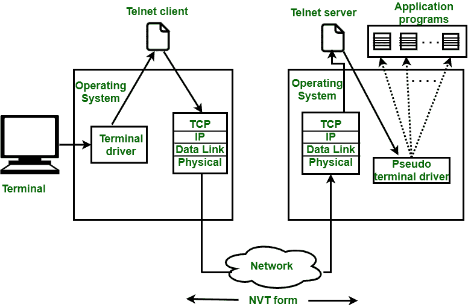
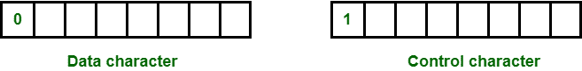

# 远程登录介绍

> 原文:[https://www.geeksforgeeks.org/introduction-to-remote-login/](https://www.geeksforgeeks.org/introduction-to-remote-login/)

**远程登录**是用户可以登录远程站点即计算机并使用远程计算机上可用服务的过程。在远程登录的帮助下，用户能够理解将处理结果从远程计算机传送到本地计算机的结果。

**Figure –** Remote login

使用[远程登录](https://www.geeksforgeeks.org/introduction-to-telnet/)实现。

**远程登录程序:**

1.  当用户在本地计算机上输入内容时，本地操作系统接受字符。
2.  本地计算机不解释字符，它将把它们发送到 TELNET 客户端。
3.  TELNET 客户端将这些字符转换成一个名为**网络虚拟终端(NVT)字符**的通用字符集，并将它们传递给本地 TCP/IP 协议栈。
4.  NVT 形式的命令或文本通过互联网传播，并将到达远程计算机的 TCP/IP 堆栈。
5.  字符随后被传递到操作系统，然后传递到远程登录服务器。
6.  然后，远程登录服务器将该字符更改为远程计算机可以理解的字符。
7.  远程操作系统从**伪终端驱动程序**接收字符，该驱动程序是一个假装字符来自终端的软件。
8.  然后，操作系统将字符传递给适当的应用程序。

**Figure –** Remote login procedure

**NVT 字符集:**

*   使用 NVT 字符集，TELNET 客户端将字符翻译成 NVT 格式并传送到网络。
*   TELNET 服务器将数据和命令从 NVT 形式转换成远程计算机可以理解的另一种形式。
*   NVT 使用两组字符，一组用于数据，另一组用于控制。两个字符的大小都是 8 位字节。
*   对于数据，NVT 是一个 8 位字符集，其中 7 个最低位与 ASCII 相同，最高位为 0。
*   对于控制字符，NVT 使用 8 位字符集，其中最高位设置为 1。

**Figure –** NVT Character Set
