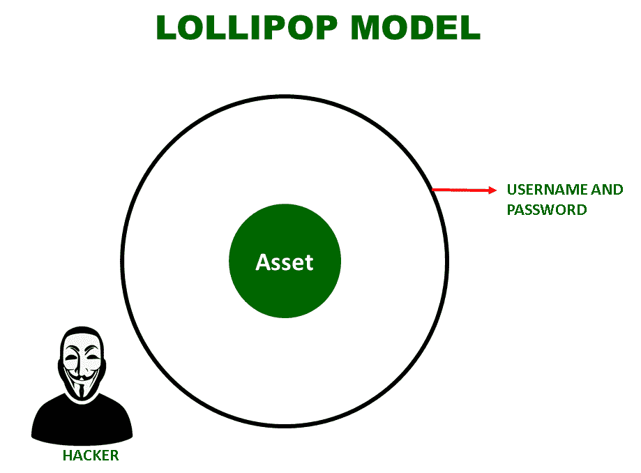
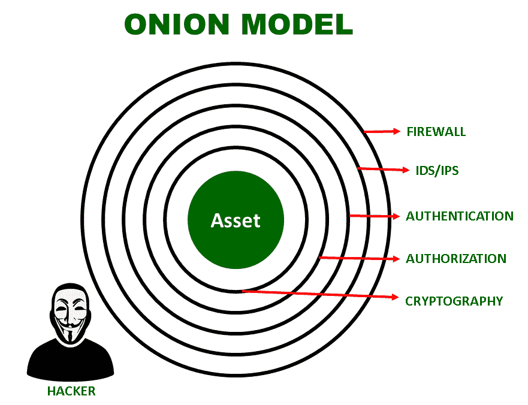

# 安全防御模型介绍

> 原文:[https://www . geesforgeks . org/安全-防御-模型简介/](https://www.geeksforgeeks.org/introduction-to-security-defense-models/)

这些模型主要用于防御目的，即保护数据或资产。

安全防御模型主要有两种:棒棒糖模型和洋葱模型。这些解释如下。

**1。棒棒糖模型:**
棒棒糖模型是与棒棒糖类比的防御模型。棒棒糖是中间有一块巧克力，在巧克力的周围，有一层外皮，主要是糖味的糖浆。一个人舔啊舔，最后中间的巧克力露出来了。

将棒棒糖的这种类比映射到模型中，如上图所示，黑客只需要打破这一层安全就可以获得资产，在这种情况下，假设它是用户名和密码。一旦完成，黑客就可以访问资产。所以棒棒糖模型并不是一个很好的网络安全模型。

**2。洋葱模型:**
洋葱模型是与洋葱类比的防御模型。洋葱是一种由层组成的蔬菜。只有剥开每一层，我们才能到达洋葱的中心。还有，剥皮的时候，我们的眼睛会流泪。

将洋葱的这个类比映射到模型，如上图所示，黑客需要打破所有的安全层才能访问资产。在这种情况下，破坏每一层，即[防火墙](https://www.geeksforgeeks.org/introduction-of-firewall-in-computer-network/)、IDS/IPS、[认证](https://www.geeksforgeeks.org/difference-between-authentication-and-authorization/)、授权和[加密](https://www.geeksforgeeks.org/cryptography-and-its-types/)，应该会让他热泪盈眶。简单来说，破解每一层对黑客来说都应该是复杂且极具挑战性的。所以洋葱模型被认为是[网络安全](https://www.geeksforgeeks.org/network-security/)的好模型。