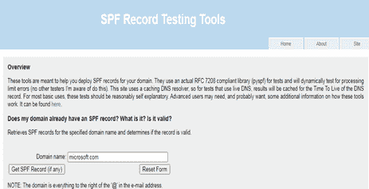
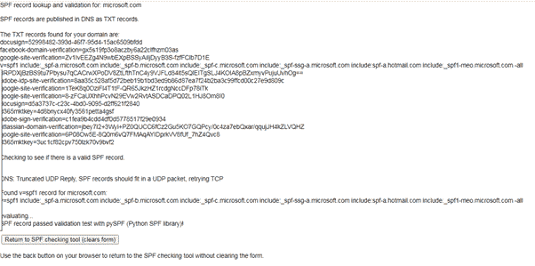

# 发件人策略框架介绍(SPF)

> 原文:[https://www . geesforgeks . org/introduction-to-senders-policy-framework-SPF/](https://www.geeksforgeeks.org/introduction-to-senders-policy-framework-spf/)

[**域**](https://www.geeksforgeeks.org/introduction-to-domain-name/) **:**
一个域就是后面的“www”并在电子邮件地址中跟随“@”。用专业术语来说，域名(或域名)是一个网站的地址，互联网用户可以在这里找到不同种类的网站，也用于识别互联网上的计算机。

**发件人策略框架(SPF) :**
SPF 代表发件人策略框架。它有助于保护电子邮件地址(包括发件人和收件人)免受恶意活动的影响，如欺骗、垃圾邮件和网络钓鱼。我们可以称之为电子邮件身份验证类型，因为它验证并确保发送(或接收)的电子邮件来自授权的邮件服务器，以防止伪造行为。

想象一下，你经常访问的任何一个电子商务网站都缺乏其域名的 SPF 记录，你会收到与折扣和优惠相关的虚假电子邮件。毫无疑问，这会损害网站的声誉。

嗯，我们大多数人使用谷歌、雅虎、Hotmail 等的电子邮件服务。他们特别关注这些方法，但是那些有他们定制的域的组织应该确保他们的域安全。对于这些组织来说，看一看他们的 SPF 记录是很重要的，让我们来看一个相同的案例。例如，一个组织的域缺少有效的 SPF 记录，这可能会给攻击者带来优势，因为他们可能会滥用该组织的邮件地址，从而发生欺诈。

**SPF 记录:**
SPF 记录是一个 [DNS](https://www.geeksforgeeks.org/domain-name-system-dns-in-application-layer /) TXT 记录，包含那些被允许和授权为我们的域发送邮件的邮件服务器(IP 地址和/或主机名)的列表。它必须添加到我们域的域名系统区域。单个域可以有一个单个的 SPF TXT 记录。但是，一个域的 TXT 记录可以指定多个可以为该域发送邮件的服务器和域。

**如何查看 SPF 记录？**

1.  了解您的域名或域名提供商。
2.  使用在线可用的工具来检查您的域的 SPF 记录，如 Kitterman SPF、mxtools 等。
3.  或者简单地为 SPF 创建您的 TXT 记录。

让我们检查一下 Microsoft.com 域名–

1.  去 kitterman.com
2.  输入要检查其 SPF 记录的域。
3.  在这种情况下，输入的域具有有效的 SPF 记录，所以让我们看看它们是什么样子的–

在这里，您将进入该域

kitterman.com 提交的有效特殊目的机构记录报告

**优势:**

*   **防范网络钓鱼攻击–**
    每当攻击者试图使用您的域发送虚假电子邮件时，收件人邮件服务器都会收到一条警报，指出邮件来源是恶意的，并会向收件人显示一条警告消息来标记该域。发生这种情况是因为 SPF 记录进行了身份验证。
*   **有助于维护域的声誉–**
    维护公司域的 SPF 记录反映了组织对其组织及其客户的网络安全的认识和关注。它还提高了电子邮件的可靠性&送达。

**缺点:**

*   **SPF 记录的维护–**
    SPF 记录应该不断更新，因为大多数情况下需要第三方供应商发送邮件，所以每当供应商的记录发生变化时，就有必要更新记录。
*   **转发邮件的身份验证问题–**
    如果从您的域发送的电子邮件是由其他人转发的，则该人的 IP 不会列在您的 SPF 记录中，因此现在接收邮件的服务器会错误地将其标记为(转发的邮件)，并且邮件未通过 SPF 身份验证。

**限制:**

*   对于 SPF 记录，只允许进行 10 次 DNS 查找，即每条记录最多可以进行 10 次 DNS 查找，如果超过此限制，则 SPF 身份验证将失败。
*   它缺乏报告，这使得 SPF 更难维护。
*   当电子邮件被转发时，SPF 中断。此时，“转发器”成为消息的“新发送者”。它将无法通过新目的地执行的 SPF 检查。

最后，SPF 记录对于包含在任何组织的邮件服务中非常重要，并且应该保持最新。除了 SPF，如果使用其他安全技术，如 DKIM(域密钥识别邮件)和 DMARC 记录，那么它将为系统提供反欺骗和强大的保护。