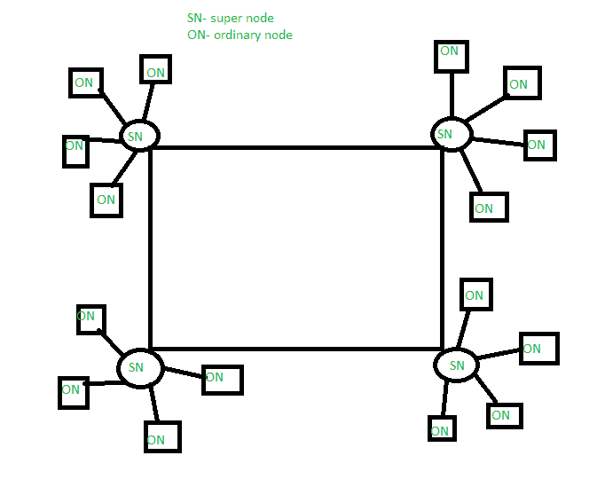

# Skype 简介

> 原文:[https://www.geeksforgeeks.org/introduction-to-skype/](https://www.geeksforgeeks.org/introduction-to-skype/)

Skype 是一种电信应用。我们使用 skype 进行日常聊天、视频会议、通过 SkypeIn 和 SkypeOut 进行语音通话。Skype 使用[VoIP(Ip 语音)](https://www.geeksforgeeks.org/voice-over-internet-protocol-voip/)来执行这些任务。Skype 使用虚拟网络在人们之间建立连接，并且不需要任何 [IP 地址](https://www.geeksforgeeks.org/introduction-of-classful-ip-addressing/)进行连接。它的功能基于覆盖网络。

**什么是覆盖网络？**

*   覆盖网络是由节点和虚拟链路组成的虚拟网络。
*   它可以根据用户需求提供额外的网络服务。
*   在给定的网络环境中更高效地运行。示例–在[临时网络](https://www.geeksforgeeks.org/introduction-of-mobile-ad-hoc-network-manet/)中路由。
*   它具有开放和可扩展的网络架构。

**Skype 架构:**

*   Skype 是一种基于覆盖网络的点对点应用程序，无需对现有架构进行太多更改即可引入更多功能。
*   基础架构由主机(用户机器)和超级节点(能够在增强模式下工作的主机)组成。
*   超级节点是根据机器的可达性、可用带宽来选择的。

Skype 架构

**工作:**

*   **用户连接–**
    用户通过认证的登录服务器连接到超级节点。每台主机都维护一个它们可以连接的超级节点 IP 地址缓存。
*   **搜索用户–**
    用户搜索由超级节点完成。它执行搜索用户的全局索引，并继续扩展搜索，直到找到该用户。它不断地从一个超级节点移动到另一个超级节点，寻找那个特定的主机。对于具有全局 IP 地址的主机，用户搜索通常需要三到四秒钟才能完成。
*   **语音连接–**
    找到搜索到的用户后，使用 [TCP(传输控制协议](https://www.geeksforgeeks.org/tcp-ip-model/)是一种安全的端到端协议)建立两者之间的语音连接，用于发出呼叫请求和呼叫结束的信号。对于语音呼叫的数据流，使用 TCP 或 [UDP(用户数据报协议)](https://www.geeksforgeeks.org/user-datagram-protocol-udp/)。一般来说，UDP 是首选的，因为快速的数据流。
*   **安全性–**
    使用软件对主机用户之间传输的音频进行加密和解密，这也增强了 skype 的通话质量和安全性。