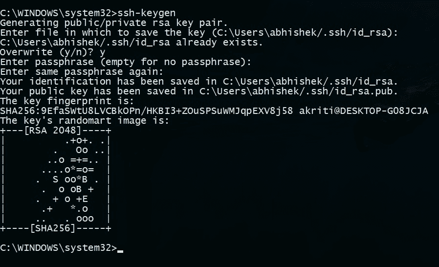

# SSH(安全外壳)密钥介绍

> 原文:[https://www . geesforgeks . org/introduction-to-ssh secure-shell-keys/](https://www.geeksforgeeks.org/introduction-to-sshsecure-shell-keys/)

**SSH(安全外壳)**是 SSH 协议中使用的访问凭据。换句话说，它是一种用于通过网络传输加密数据的[加密](https://www.geeksforgeeks.org/cryptography-and-its-types/)网络协议。它允许您连接到一台服务器或多台服务器，而不必记住或输入要从一个系统远程登录到另一个系统的每个系统的密码。
它总是成对出现:

1.  **公钥–**大家都能看到，不用保护。(用于加密功能)
2.  **私钥–**留在计算机中，必须受到保护。(用于解密功能)

密钥对可以是以下类型:

1.  **用户密钥–**如果公钥和私钥仍在用户手中。
2.  **主机密钥–**如果公钥和私钥在远程系统上。
3.  **会话密钥–**在传输大量数据时使用。

**SSH 是如何工作的？**
它使用非对称密码进行加密和解密。加密方式有很多:

```
rsa, dsa, ed25519 etc. 
```

一般程序是:-

*   本地计算机(系统)的公钥被传递给要访问的服务器。
*   然后，服务器识别公钥是否已注册。
*   如果是这样，服务器然后创建一个新的密钥，并用通过本地计算机发送给它的公钥加密它。
*   这个加密的代码被发送到本地计算机。
*   该数据由系统的私钥解锁，并被发送到服务器。
*   服务器收到此数据后验证本地计算机。
*   SSH 创建一条路由，所有加密的数据都通过它传输，没有安全问题。

SSH 是基于密钥的认证，不容易受到[蛮力攻击](https://en.wikipedia.org/wiki/Brute-force_attack)。
比登录 id 和密码(中间可盗)更方便安全。如果服务器遭到破坏，则不会暴露有效凭据。

**生成 SSH 密钥对:**

```
Open your command prompt
type : ssh-keygen
Press enter
It will ask you for a location. Press Enter for default location.
If its already there, press 'y' to overwrite.
You may enter passphrase as you like, press enter. 
```

下面给出了在最新版本的 Windows 10 中生成 SSH 密钥对的示例:



**在 Windows、Linux、Mac 上生成 SSH 密钥:**

```
OMAC OsX and Linux : terminal (build in)
OWindows :- PuTTY 
```