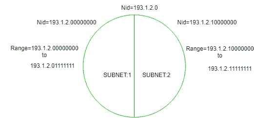

# 子网划分介绍

> 原文:[https://www.geeksforgeeks.org/introduction-to-subnetting/](https://www.geeksforgeeks.org/introduction-to-subnetting/)

当一个更大的网络被分成更小的网络时，为了维护安全，这就是所谓的子网划分。因此，对于较小的网络来说，维护更容易。

**现在，我们来谈谈将网络分为两部分:**
因此，要将网络分为两部分，需要从主机 ID 部分为每个 Subnet 选择一位。



在上图中，有两个子网。

**注意:**是 C 类 IP 所以，网络 id 部分有 24 位，主机 id 部分有 8 位。

*   **For Subnet-1:**
    The first bit which is chosen from the host id part is zero and the range will be from (193.1.2.00000000 till you get all 1’s in the host ID part i.e, 193.1.2.01111111) except for the first bit which is chosen zero for subnet id part.

    因此，子网-1 的范围:

    ```
    193.1.2.0 to 193.1.2.127 
    ```

*   **For Subnet-2:**
    The first bit chosen from the host id part is one and the range will be from (193.1.2.100000000 till you get all 1’s in the host ID part i.e, 193.1.2.11111111).

    因此，子网-2 的范围:

    ```
    193.1.2.128 to 193.1.2.255 
    ```

**注:**

1.  要将网络分成四个(2 <sup>2</sup> )部分，您需要从每个子网的主机 id 部分中选择两位，即(00，01，10，11)。
2.  要将网络分成八(2 <sup>3</sup> )部分，您需要从每个子网的主机 id 部分中选择三位，即(000，001，010，011，100，101，110，111)等等。