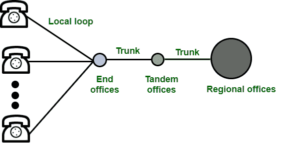
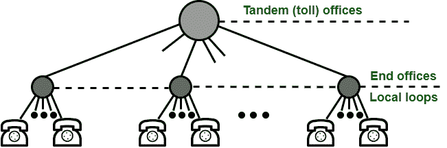

# 电话网介绍

> 原文:[https://www . geesforgeks . org/电话网介绍/](https://www.geeksforgeeks.org/introduction-to-telephone-network/)

电话网络用于提供语音通信。电话网络使用电路交换。最初，整个网络被称为使用模拟信号的普通老式电话系统。随着技术的进步，即在计算机时代，除了语音之外，还有一个传送数据的功能。今天的网络是模拟的，也是数字的。

**电话网络的主要组成部分:**电话网络有三个主要组成部分:

1.  本地循环
2.  男用短裤
3.  中继局

有不同级别的交换局，如终端局、汇接局和地区局。整个电话网络如下图所示:

电话系统

**本地环路:**本地环路是用于将用户电话连接到最近的终端局或本地中心局的双绞线电缆。出于语音目的，其带宽为 4000 赫兹。检查与每个本地环路相关联的电话号码非常有趣。办公室由前三位数字定义，本地环路号码由后四位数字定义。

**中继线:**它是一种用于处理办公室之间通信的传输介质。通过多路复用，中继可以处理数百或数千个连接。主要通过光纤或卫星链路进行传输。

**交换局:**因为任何两个用户之间都有永久的物理链路。为了避免这种情况，电话公司使用位于交换局的交换机。交换机能够连接各种环路或中继，并允许不同用户之间的连接。

中继局

**电话网优势:**

*   这是一个电路交换网络。
*   没有传输延迟，因为可以选择任何接收器。
*   它价格便宜，因为它是一个广泛传播的网络。

**电话网络的缺点:**

*   连接需要很长时间。
*   它的传输速度很低。

**电话网应用:**

*   它有助于联系人们。
*   商业组织用它来宣传他们的产品。
*   它也被世界各地用于娱乐目的。