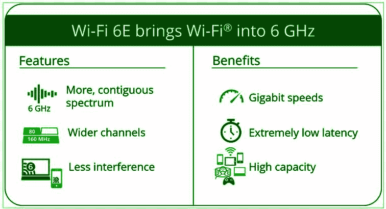

# 无线保真 6 (WiFi-6)简介

> 原文:[https://www . geeksforgeeks . org/introduction-to-wireless-fidelity-6-wifi-6/](https://www.geeksforgeeks.org/introduction-to-wireless-fidelity-6-wifi-6/)

[鉴于 IEEE 802.11 规范组，Wi-Fi(无线保真)](https://www.geeksforgeeks.org/what-is-wi-fiwireless-fidelity/)是一组无线网络协议，通常用于局域网(局域网)和互联网接入。Wi-Fi 是非营利 Wi-Fi 联盟的一个品牌名称，它将 Wi-Fi 认证一词的使用限制在有效完成互操作性认证测试的项目上。能够利用无线网络进步的设备包括个人电脑、工作站、手机和平板电脑、电视、打印机、扬声器、车辆等。

[Wi-Fi](https://www.geeksforgeeks.org/basics-of-wi-fi/) 利用了 IEEE 802 协议家族的各个部分，旨在与它的有线同族“以太网”完美互通。可行的小工具可以通过无线通道相互连接，就像有线小工具和互联网一样。不同的 IEEE 802.11 协议指南规定了无线网络的各种适应，不同的无线电技术进步决定了无线电波段、最极端的范围和可能达到的速度。

无线网络通常使用 2.4 千兆赫(120 毫米)超高频和 5 千兆赫(60 毫米)SHF ISM 无线电组；这些组被分成不同的通道。信道可以在网络之间共享，然而仅仅一个发射机就可以在任何时间直接在本地发送。

硬件通常支持无线网络的不同变体。为了进行通信，各种设备必须使用典型的无线网络形式。变体在它们工作的无线电波段、它们拥有的无线电带宽、它们能够支持的最极端的信息速率以及不同的微妙之处之间形成对比。一些再现允许使用各种接收线，这赋予了更值得注意的速度，同时减少了阻碍。

一般来说，硬件基本上记录了无线网络利用其支持的 IEEE 标准名称的改编。2018 年，Wi-Fi 共谋将世代编号标准化，因此设备可以显示它支持 Wi-Fi 4(如果硬件支持 802.11n)、Wi-Fi 5 (802.11ac)和 Wi-Fi 6(802.11 ax)。

<figure class="table">

| 第三代/IEEE 标准 | 最大链接率 | 被收养的 | 频率 |
| Wi-Fi-6 (802.11ax) | 半双工，
600-9608 兆位/秒
 | Two thousand and nineteen | 2.4/5 GHz
1-6 GHz ism
 |
| 无线局域网 5 （802.11ac） | 半双工，
433-6933 兆位/秒
 | Two thousand and fourteen | 5 千兆赫 |
| Wi-Fi 4 (802.11n) | 半双工，
72-600 兆位/秒
 | Two thousand and eight | 2.4/5 千兆赫 |
| Wi-Fi 3 (802.11g) | 半双工，
3-54 兆位/秒
 | Two thousand and three | 2.4ghz |
| 无线网络 2 (802.11a) | 半双工，
1.5-54 兆位/秒
 | One thousand nine hundred and ninety-nine | 5 千兆赫 |
| Wi-Fi 1 (802.11b) | 半双工，
1-11 兆比特/秒
 | One thousand nine hundred and ninety-nine | 2.4ghz |
| (Wi-Fi 1、Wi-Fi 2、Wi-Fi 3 无品牌，但有非官方分配) |

**Wi-Fi-6 :**
Wi-Fi-6 是另一种无线常态。它还被称为 802.11ax，随时准备在网络可用性和客户端体验增强方面掀起波澜。Wi-Fi 标准的下一个时代是 Wi-Fi-6，也称为 802.11ax，这是无情发展的最新进展。

该标准扩展了 802.11ac 的质量，同时包括效率、适应性和多功能性，允许新的和现有的网络加速和限制尖端应用。IEEE 提出了 Wi-Fi-6 标准，使千兆以太网无线的自由和极快的速度与授权无线电的可靠性和一致性相结合。

**Wi-Fi-6 的优势:**
Wi-Fi-6 允许企业和专业组织在类似的无线局域网(WLAN)基础上帮助新兴应用，同时向更成熟的应用传达更高的管理评价。这种情况让位于新的行动计划和扩大的无线网络选择。

**Wi-Fi-6 和 802.11ax 有区别吗？**
不，他们是等价的。Wi-Fi 联盟在暗指 IEEE 802.11ax 规范时，开始了铸造表达“Wi-Fi-6”的使命。这表明这是无线网络的第六个时代。其原因是简化展示信息，使 802.11ax 能够更好地与第三代合作伙伴计划(3GPP)在蜂窝(示例–5G)中使用的原则相比较。

**Wi-Fi-6 的批准:**
IEEE-Standards Association 目前已预订，以确认 2020 年 IEEE Wi-Fi-6 的最终修正。尽管如此，还是依靠无线网络联盟来保证 2019 年 8 月修正案的关键功能，并在接下来的几年中认证额外的功能(包括 6 千兆赫频段)。

**对 Wi-Fi-6 的期待:**

*   **Benefits :** 
    Wi-Fi-6 will expand on achievement of 802.11ac. It will let access points uphold more customers in high traffic situations and will give a superior experience for encountering regular wireless LAN networks. It will likewise give a more unsurprising performance to cutting edge applications, for example, 4K or 8K video, high-traffic superior quality cooperation applications, every wireless office, and Internet of Things (IoT). Wi-Fi-6 will drive Wi-Fi toward future as development of wireless proceeds. 
*   **Access Points :** 
    There are some Wi-Fi-6 access-points as of now available, directed for early adopters and clients who are anxious to test new norm. The access points that are delivered early will be per-standard APs in light of fact that standard will not yet have been ratified. This implies key highlights that are essential for Wi-Fi-6 may not be upheld on a portion of these underlying, pre-standard APs. 

    尽管如此，当可访问时，这些接入点的一部分将可以选择通过编程更新获得认证，无线网络 6 亮点将得到维护。这种方法类似于 802.11ac 和 802.11n
    等早期的表述

*   **技术尺寸:**
    使用 1024 正交幅度调制(QAM)的密集调制，能够实现超过 35%的速度突发。基于正交频分多址的调度。强大的高效信令，以显著降低的接收信号强度指示(RSSI)实现更好的活动，等等。

*   **兼容性:**
    同样，随着彼此不断的 Wi-Fi 推进，Wi-Fi-6 将反向可行或向后兼容，在现有创新的基础上进行扩展，使其更加高效。

**Wi-Fi-6 技术的主要优势:**

*   更高的信息率。

*   扩展限制-在各种类型的设备消耗带宽的高密度区域提高性能。

*   提高电源效率。

**相比其他 Wi-Fi 标准的优势:**

*   更一致和可靠的网络连接为客户端、物联网和所有应用程序提供无缝体验。

*   Wi-Fi-6 (802.11ax)比过去的各种 Wi-Fi 标准处理更多的信息。它还为每个接入点处理更多动态客户。它实现了比过去的无线标准快几倍的速度提升，以最小的努力改善了客户端体验和对带宽的应用程序的执行。

*   2.4 GHz 的上一次更新是在 10 年前。Wi-Fi-6 支持对 2.4 GHz 频段的新升级，通过需要更高活力效率和更好 Wi-Fi 包容性的物联网小工具来改善您的无线工作。

Wi-Fi-6 将解决不同标准和物联网设备试图与网络连接所带来的高流量问题。Wi-Fi-6E 在 Wi-Fi-6 的所有方面都取得了进展，但也意味着它支持全新的 6 千兆赫频率。

Wi-Fi-6E 最多可以使用 14 个额外的 80 兆赫频道或 7 个额外的超宽 160 兆赫 6 千兆赫分流，用于高质量视频流和增强现实等应用。Wi-Fi-6E 设备影响这些更宽的通道和额外的能力，以传达更突出的网络执行，并立即支持更多的 Wi-Fi 客户端，即使在极其拥挤和堵塞的情况下。

无线网络 6E 将获得更显著的创新进步无线网络将呈现新的使用案例，并加快与 5G 网络的下一代连接。

来源:https://www.wi-fi.org

**测试环境中的进步和性能:**
无线网络的无处不在及其补充不同无线创新的能力保证了将所有人和所有事物与现实世界联系起来。无线网络的名气也同样造就了极其多样化和人口密集的无线网络环境，需要创新的进步来解决客户的问题。Wi-Fi CERTIFIED 6 传达了增强功能和新功能，使 Wi-Fi 设备能够在最密集和动态的网络环境中高效工作。

无线网络 6 现在能够将一个无线信道分成大量的子信道。这些子信道中的每一个都可以传送为替代设备计划的信息。这是通过许多人称为正交频分多址或正交频分多址的方式来实现的。因此，无线接入点可以毫不延迟地与更多的设备进行对话。

这个新标准同样改进了多输入多输出。这包括许多天线，让接入点可以立即与不同的设备通话。有了 Wi-Fi 5，接入点可以同时与设备通话，但这些小工具无法同时做出反应。Wi-Fi-6 对多用户或多输入多输出进行了改进，使小工具能够同时对无线接入点做出反应。

彼此靠近的无线接入点可能在类似的信道上通信。在这种情况下，收音机会调进来，静观其变，等待一个合理的信号，然后再回答。使用 Wi-Fi-6，彼此靠近的无线接入点可以配置为具有独特的基本服务集(BSS)。这个“颜色”只是一个介于 0 和 7 之间的数字。如果一台设备正在检查频道是否正常并接通，它可能会看到一个带有微弱信号和交替“颜色”的传输。然后，它将能够忽略这个标志，并以任何速度进行通信，而不会暂停，因此这将改善拥挤区域中的执行，同样被称为“空间频率重用”

这些只是绝对最迷人的东西，然而新的 WI-Fi 标准还包含了许多升级。例如，无线网络 6 将同样包含改进的波束形成。

<figure class="table">

| 特征 | 无线网络-5 | 无线网络-6 |
| 正交频分多址 | 不适用的 | 正交频分多址特征允许数据传输信号被分成更小的信号。 |
| 多用户 MIMO | 下行方向可用 | 上行链路和下行链路方向均可用 |
| 基于触发器的随机访问 | 不适用的 | 允许未直接分配资源的基站执行 UL 正交频分多址传输 |
| 空间频率复用 | 不适用的 | 它允许相邻的 802.11.ax 路由器协调和调整传输请求的功率，以增加设备连接到正确路由器并保持连接的机会 |
| 资产净值 | 单一导航 | 两个导航 |
| 目标唤醒时间 | 不适用的 | 这降低了功耗和介质访问连接 |
| 分裂 | 静态碎片 | 动态碎片化 |
| 保护间隔持续时间 | 0.4 或 0.8 微秒 | 0.8、1.6 或 3.2 微秒 |
| 符号持续时间 | 3.2 微秒 | 12.8 微秒 |

</figure>

</figure>