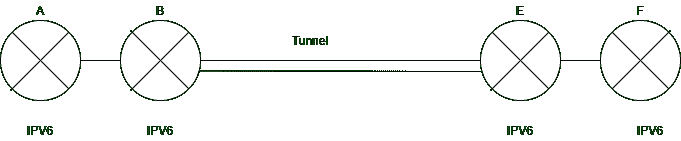
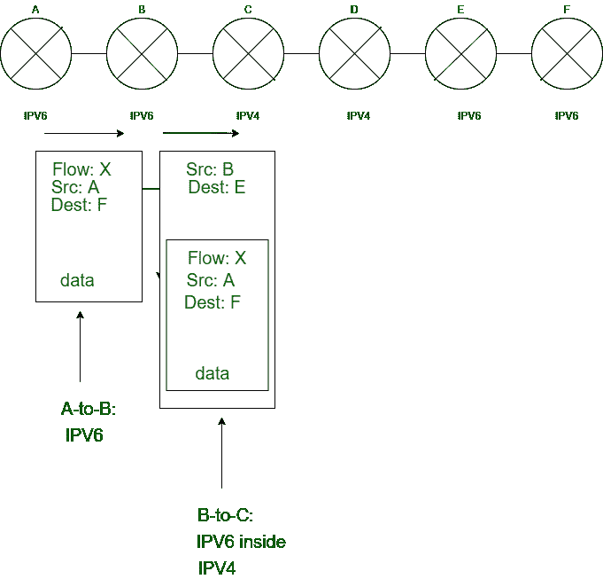

# IP 封装

> 原文:[https://www.geeksforgeeks.org/ip-in-ip-encapsulation/](https://www.geeksforgeeks.org/ip-in-ip-encapsulation/)

在本文中，我们将讨论 IP-in-IP 封装的概述，然后讨论封装的工作及其过程，最后总结并讨论 IP-in-IP 封装过程的逻辑和物理视图。我们一个一个来讨论。

**封装:**
用简单的术语来说，封装基本上是在现有数据包中添加新数据包的过程。目标地址字段。在网络通信中，包是最小的信息单元，基本包包含通信时重要的报头信息，基本包包含发送方和接收方的报头信息。在发送系统上，当协议将数据添加到数据包报头时，这个过程称为数据封装。因此，我们可以将封装称为打包数据的行为，或者将每一层的报头添加到实际数据中。因此，当数据到达传输层时，它不再被称为数据，而是在网络术语中被称为网段。此外，当网段到达网络层时，它不再被称为网段，而是被称为数据包。

**网络协议中的封装:**
例如，让我们假设我们有一个 IPv6(互联网协议版本 6)。因此，只要数据包到达路由器，路由器就只支持 IPv4(互联网协议版本 4)。现在已经没有办法传递信息了。这就是 IP 封装中的 IP 进入画面的地方。通过使用这种封装过程，我们可以在现有的数据包中添加一个新的数据包，以便有效地传递信息。

**封装过程:**
首先，取正在接收的 IPv6 数据包，由于路由器不支持 IPv6，我们取那个接收的数据包，然后在接收到的数据包上面，用一个新的数据包进行封装，这个新的数据包叫做 IPv4。这里，我们不涉及 IPv6 地址。我们只是保持它完好无损，因为路由器只支持 IPv4，我们添加了一个新的 IP 20 字节头，其中我们将有一个 32 位 IP 地址的来源和目的地。这就是 IP 中的 IP 封装的过程。

**IP 封装过程的逻辑和物理视图:**
分别考虑以下 IP 封装过程的逻辑和物理视图。现在，您将看到 IP-in-IP 封装过程的逻辑和物理视图的解释部分，如下所示。

 

*   这里的 A、B、C、D、E、F 是网络中的路由器。在本例中，源地址为 A，目的地址为 f。因此，数据包在路由器 A 生成，并且必须到达路由器 f
*   首先，数据包从源 A 到达源 B 没有任何麻烦。现在，由于路由器 C 只支持 IPv4，所以接收到的 IP 报头不会被触碰或更改。但是在这里，新的数据包被添加到接收到的数据包中，其中源节点是 B，目的节点是 e。这意味着 B 正在添加 IPv4 地址，因为 C 只支持 IPv4。所以，为了将数据从 B 发送到 C，我们需要使用 IPv4，因为 C 只支持 IPv4。
*   此图的另一个要点是，从 A 到 B 的链路连接到 IPv6，而从 B 到 C 的链路连接到 IPv4。
*   这意味着路由器 B 同时支持 IPv4 和 IPv6。相同的封装分组被传输到路由器 D。因此，一旦分组到达源 D，该链路将被删除，因为下一个链路，即从 D 到 E 的链路已经是 IPv6，这意味着节点可以直接接收内部分组(内部 IPv6 分组)。这样，当相邻路由器不支持相同的 IP 版本时，IP-in-IP 封装就可以工作了。