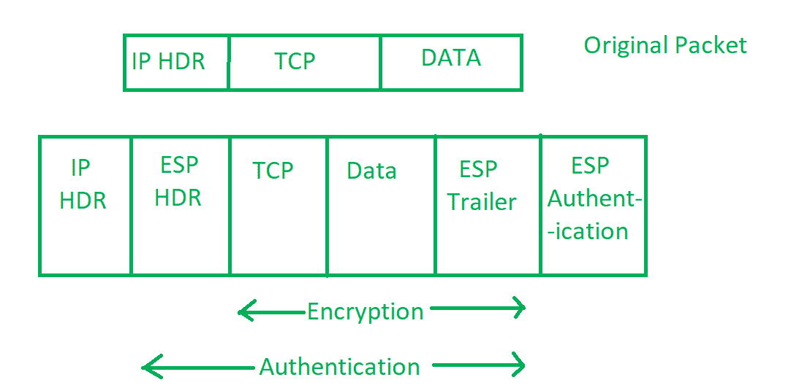

# IP 安全(IPSec)

> 原文:[https://www.geeksforgeeks.org/ip-security-ipsec/](https://www.geeksforgeeks.org/ip-security-ipsec/)

**IP 安全(IPSec)** 是互联网工程任务组(IETF)在 IP 网络上的两个通信点之间的标准协议套件，提供数据认证、完整性和机密性。它还定义了加密、解密和验证的数据包。其中定义了安全密钥交换和密钥管理所需的协议。

**IP 安全的用途–**
IPsec 可以用来做以下事情:

*   加密应用层数据。
*   为通过公共互联网发送路由数据的路由器提供安全性。
*   提供不加密的身份验证，就像验证数据来自已知的发送方一样。
*   通过使用 IPsec 隧道建立电路来保护网络数据，在 IpSec 隧道中，两个端点之间发送的所有数据都是加密的，就像虚拟专用网络(VPN)连接一样。

**知识产权安全组件–**
它有以下组件:

1.  **封装安全负载(ESP)–**
    它提供数据完整性、加密、认证和防重放。它还为有效负载提供身份验证。

*   **Authentication Header (AH) –**
    It also provides data integrity, authentication and anti replay and it does not provide encryption. The anti replay protection, protects against unauthorized transmission of packets. It does not protect data’s confidentiality.

    

    *   **Internet Key Exchange (IKE) –**
    It is a network security protocol designed to dynamically exchange encryption keys and find a way over Security Association (SA) between 2 devices. The Security Association (SA) establishes shared security attributes between 2 network entities to support secure communication. The Key Management Protocol (ISAKMP) and Internet Security Association which provides a framework for authentication and key exchange. ISAKMP tells how the set up of the Security Associations (SAs) and how direct connections between two hosts that are using IPsec.

    互联网密钥交换(IKE)提供消息内容保护，也是实现标准算法(如 SHA 和 MD5)的开放框架。该算法的 IP sec 用户为每个数据包生成一个唯一的标识符。然后，该标识符允许设备确定分组是否正确。未经授权的数据包将被丢弃，并且不会交给接收方。

    

    **知识产权安全工作–**

    1.  主机检查数据包是否应该使用 IPsec 传输。这些数据包流量会自行触发安全策略。这是在发送数据包的系统应用适当的加密时完成的。主机还会检查传入的数据包是否正确加密。
    2.  然后 **IKE 阶段 1** 开始，其中 2 台主机(使用 IPsec)相互认证自己以启动安全通道。它有两种模式。**主模式**提供更高的安全性，**主动模式**使主机能够更快地建立 IPsec 电路。
    3.  然后，在最后一步中创建的通道用于安全地协商 IP 电路通过 IP 电路加密数据的方式。
    4.  现在， **IKE 阶段 2** 通过安全信道进行，在该信道中，两个主机协商在会话中使用的加密算法的类型，并就与这些算法一起使用的秘密密钥材料达成一致。
    5.  然后通过新创建的 IPsec 加密隧道交换数据。这些数据包由主机使用 IPsec SAs 加密和解密。
    6.  When the communication between the hosts is completed or the session times out then the IPsec tunnel is terminated by discarding the keys by both the hosts.