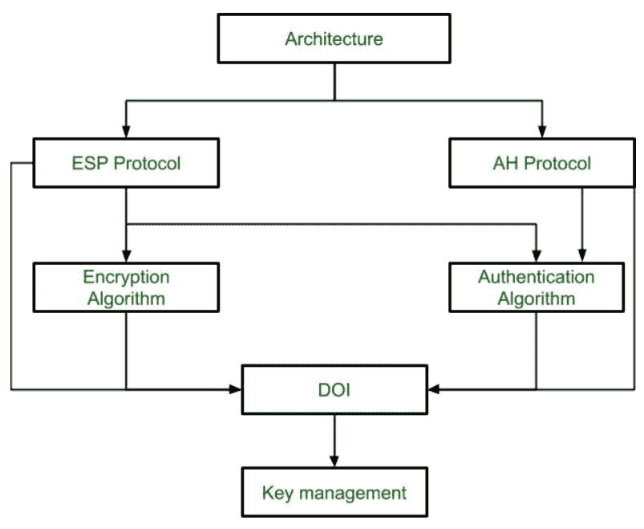
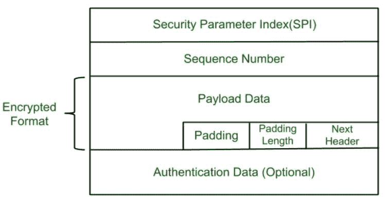

# IPSec 架构

> 原文:[https://www.geeksforgeeks.org/ipsec-architecture/](https://www.geeksforgeeks.org/ipsec-architecture/)

**IPSec (IP 安全)架构**使用两种协议来保证流量或数据流的安全。这些协议是 ESP(封装安全负载)和 AH(认证报头)。IPSec 体系结构包括协议、算法、DOI 和密钥管理。为了提供三种主要服务，所有这些组件都非常重要:

*   机密
*   证明
*   完整

**IP 安全架构:**

**1。架构:**
架构或 IP 安全架构涵盖了 IP 安全技术的一般概念、定义、协议、算法和安全需求。

**2。ESP 协议:**
ESP(封装安全负载)提供保密服务。封装安全负载通过两种方式实现:

*   带有可选身份验证的 ESP。
*   带身份验证的 ESP。

**数据包格式:**

*   **Security Parameter Index(SPI):** 
    This parameter is used in Security Association. It is used to give a unique number to the connection build between Client and Server. 
*   **Sequence Number:** 
    Unique Sequence number are allotted to every packet so that at the receiver side packets can be arranged properly. 
*   **Payload Data:** 
    Payload data means the actual data or the actual message. The Payload data is in encrypted format to achieve confidentiality. 
*   **Padding:** 
    Extra bits or space added to the original message in order to ensure confidentiality. Padding length is the size of the added bits or space in the original message. 
*   **Next Header:** 
    Next header means the next payload or next actual data. 
*   **认证数据**
    此字段在 ESP 协议数据包格式中是可选的。

**3。加密算法:**
加密算法是描述用于封装安全负载的各种加密算法的文档。

**4。AH 协议:**
AH(认证头)协议提供认证和完整性服务。身份验证头只有一种实现方式:身份验证和完整性。

身份验证报头包括数据包格式以及与使用 AH 进行数据包身份验证和完整性相关的一般问题。

**5。认证算法:**
认证算法包含描述用于 AH 和 ESP 认证选项的认证算法的文档集。

**6。DOI(解释域):**
DOI 是支持 AH 和 ESP 协议的标识符。它包含相互关联的文档所需的值。

**7。密钥管理:**
密钥管理包含描述发送方和接收方之间如何交换密钥的文档。