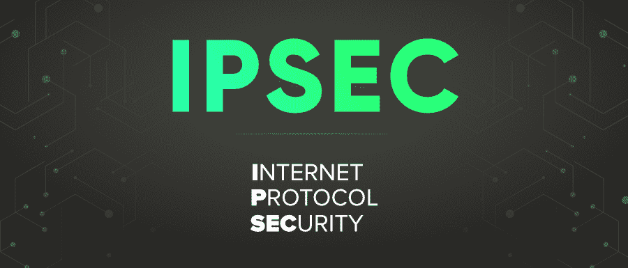

# IPSec 完整表单

> 原文:[https://www.geeksforgeeks.org/ipsec-full-form/](https://www.geeksforgeeks.org/ipsec-full-form/)

**IPSec** 代表**互联网协议安全**。它是 IP 网络上两个通信点之间的一套协议，提供数据身份验证、数据完整性和机密性。它是由互联网工程任务组(IETF)在 1995 年开发的。它定义了 IP 网络流量安全服务的体系结构，并给出了一个在 IP 层提供安全的框架，以及一套旨在通过 IP 网络数据包的身份验证和加密来提供安全的协议。IPsec 包括定义用于加密、解密和身份验证的加密算法的协议。

#### 证券类型

它为 IP 数据包定义了两种安全机制:

*   **ESP 协议(封装安全负载协议):**它提供了对 IP 包中的数据进行加密的方法。
*   **AH 协议(认证头协议):**它定义了对 IP 数据包进行数字签名的方法。

**示例:** IPSec 可用于为通过公共互联网安全发送路由数据的路由器提供安全性。

#### IPSec 的特点

*   **防重放保护:**当检测到序列号重复的数据包时，IPSec 为每个数据包分配唯一的号码，然后重放并丢弃该数据包。*   **数据认证-** 哈希消息认证码(HMAC)验证数据包未被更改。*   **透明性:** IPSec 在传输层之下工作，因此对用户和应用程序是透明的。*   **保密性:**数据包在传输前由发送方加密，因此敏感数据只会到达预期的接收方。*   **动态重新加密:**以设定的时间间隔重新加密程序取代了手动重新配置密钥。

    #### IPSec 的优势

    #### IPSec 的缺点

    *   IPSec 工作在第 3 层，即网络层，因此它对更高的网络层没有影响。它为应用程序提供了透明度。最终用户无需担心 IPSec 或其配置。
    *   因为它是在网络层实现的，所以 IPSec 允许监控通过网络的所有流量。
    *   在任何数据交换过程中，IPSec 都使用公钥来帮助安全传输机密数据，因此保护密钥可以确保安全的数据传输。
    *   IPSec 只需要修改操作系统，所以基于 IPSec 的虚拟专用网不需要担心应用的类型。
    *   IPSec 最大的缺点之一是它的访问范围广，允许访问基于 IPSec 的网络的单个设备，也可以授予其他设备特权。
    *   如果软件开发人员不遵守 IPSec 的标准，IPSec 会导致软件的一些兼容性问题。
    *   IPSec 有很高的 C.P.U 使用率当数据包很小时，由于 IPSec 使用了很大的开销，网络的性能会降低。
    *   IPSec 中使用的某些算法的安全性是一个问题，如果有人使用损坏的算法，服务器将面临更大的黑客风险。