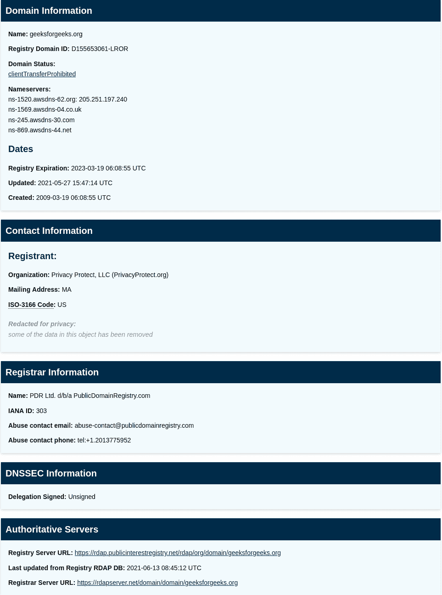

# IPv6 和 DNSSEC:它们的缓慢适应

> 原文:[https://www . geeksforgeeks . org/IPv6-and-dnssec-his-slow-adaption/](https://www.geeksforgeeks.org/ipv6-and-dnssec-their-slow-adaptation/)

在本文中，我们将讨论 IPv6 和 DNSSEC 的概述，并将详细讨论 IPv6 部署缓慢的原因以及所有这些优势。我们一个一个来讨论。

**先决条件–**
[互联网协议版本 6](https://www.geeksforgeeks.org/internet-protocol-version-6-ipv6/) 和 [IPv4 vs IPv6](https://www.geeksforgeeks.org/differences-between-ipv4-and-ipv6/)

**概述:**
互联网并不像看起来那么简单，它是很多协议栈的合并。其中许多人经历了许多变化，变得更好了，但是为什么他们在现实世界中的适应没有那么好。在这篇文章中，我们将讨论为什么互联网的两个重要功能适应缓慢，即 IPv6 和 DNSSEC。

**IPv6 协议:**
IPv6 是互联网协议(IP)的最新版本，其中 IPv4 是其前身。IPv6 看起来有点像 64:ff9b::22da:3e74，而 IPv4 看起来像 34.218.62.116。创建 IPv6 的主要原因是 IPv4 地址耗尽，IPv4 大约有 40 亿个，IPv6 是 3.4×10 38 地址。IPv6 还有其他不同的优势，如内置 IPsec、多角色转换、无状态地址自动配置、更短的 IP 报头字段等。您可以从以下链接了解更多信息。

**有了这些好处，为什么 IPv6 部署缓慢:**

*   **昂贵–**
    IPv6 的运行成本可能更便宜，但初始适应成本相当高。许多路由器和交换机都是为 IPv4 创建的，更改所有其他路由器和交换机既麻烦又昂贵。拥有一个 IP 地址是在互联网上交流的必备规则。对员工进行 IPv6 的培训和教学也成为组织的负担

*   **IPv4 领域的常规发展–**
    在互联网的路由和 IP 地址分配方面发展无类域间路由(CIDR)，并广泛使用网络地址转换(NAT)，延迟 IP v4 地址耗尽以允许 IPv6 部署。甚至大多数支持 IPv6 的操作系统都选择 NAT 而不是它。

*   **兼容性–**
    支持 IPv6 的软硬件兼容性也是一个挑战。有许多旧设备仍在互联网上运行。未来几年，向最终用户设备添加兼容性可能会成功，但将其添加到旧的业务基础架构将需要更多时间。

*   **IP 双栈的好处–**
    许多早期采用者已经将 IPv6 添加到他们的 IPv4 设备中，同时受益于两者。成功完成向 IPv6 的过渡需要更多时间。

*   **隐私–**
    隐私几乎没有丢失可能不是问题，但跟踪和广告有可能会增加，因为 IPv6 有如此多的地址，您可以将地址永久附加到设备上。

**DNSSEC :**
互联网(或称 DNS)最初的设计一点安全功能都没有随着互联网的发展，成为我们生活中至关重要的一部分，人们需要安全。为了使域名系统查询免受域名系统欺骗和缓存中毒的影响，DNSSEC(域名系统安全扩展)是互联网工程任务组(IETF)的一套扩展规范，由互联网名称与数字地址分配机构(ICANN)推广，用于通过使用数据的加密身份验证来保护域名服务器和请求设备中交换的数据的安全，没有可用性或机密性，并且它已经通过身份验证否认存在和数据完整性。您可以从 [DNSSEC、DNS 欺骗](https://www.geeksforgeeks.org/dns-spoofing-or-dns-cache-poisoning/)、[和 DNS 缓存中毒](https://www.geeksforgeeks.org/dns-spoofing-or-dns-cache-poisoning/)了解更多信息。

**为什么 DNSSEC 没被大家用:**

*   **部署支持–**
    支持是适应任何技术的最大问题之一。DNSSEC 在注册服务商层面的支持正在增加，但仍有一些注册服务商和注册管理机构不支持 DNSSEC。Azure DNS 还不支持。

*   **解析器–**
    DNSSEC 要完全正常工作，我们需要不支持它的解析器。像 1.1.1.1、8.8.8.8、9.9.9.9 这样的解决者确实支持它，但是还有很多互联网服务提供商还没有开始支持它。

*   **一个错误可能导致重大中断–**
    如果我们在将 DNSSEC 部署到我们的 DNS 区域时出错，这可能会导致重大中断，因为该域不会被解析为 IP。

*   **DNSSEC–**
    DNSSEC 不错，但不是完全的解决方案，因此主要玩家并不认为支持这一点会减缓其适应速度

**示例:**
您可以通过执行 whois 查找来检查某个域是否是 DNSSEC 签名的，如下所示。

geeksforgeeks.org 没有利用 DNSSEC