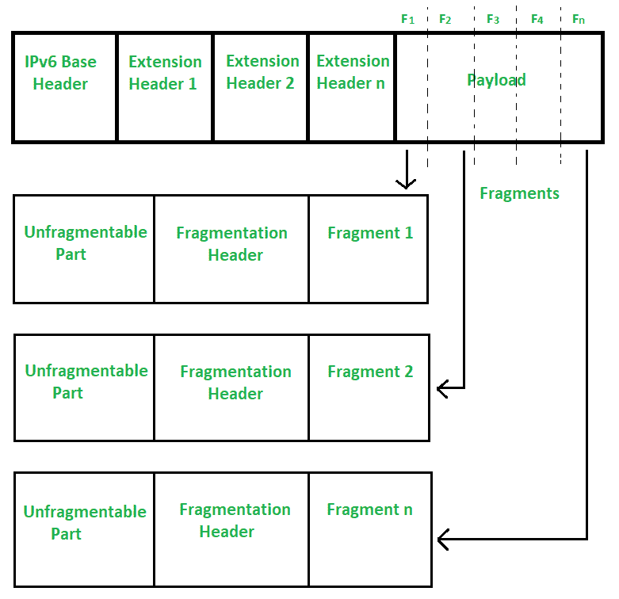

# IPv6 分片头

> 原文:[https://www.geeksforgeeks.org/ipv6-fragmentation-header/](https://www.geeksforgeeks.org/ipv6-fragmentation-header/)

先决条件–[互联网协议版本 6 (IPv6)报头](https://www.geeksforgeeks.org/internet-protocol-version-6-ipv6-header/)
[在 IPv4 中，分段](https://www.geeksforgeeks.org/ipv4-datagram-fragmentation-and-delays/)是在需要时在目的地或路由器上完成的，而在 IPv6 中，只有源应该进行分段，而不是路由器。只有当源知道路径[最大传输单元](https://www.geeksforgeeks.org/what-is-mtumaximum-transmission-unit/)时，才能做到这一点。在 Ipv6 中，“不分段”位总是 1，其中情况在 IPv4 中不同，“更多分段”位仅是分段报头中的标志，该标志为 1 位。如下图所示，两个位留作将来使用。

互联网协议版本 6 碎片报头–

*   **下一个报头–**
    下一个报头是一个 8 位字段，用于标识分段报头之后的报头类型。
*   **保留–**
    这是一个 8 位字段，目前完全为零。将来，我们可能会在这里找到一些有用的东西来填充。另外，还保留了一个额外的 2 位字段供以后使用。
*   **片段偏移量–**
    它与大小为 13 位的 [IPv4](https://www.geeksforgeeks.org/introduction-and-ipv4-datagram-header/) 完全相同。就像我们在 IPv4 中放大片段偏移量一样，我们也将在 IPv6 中这样做。
*   **更多碎片(M)–**
    这里的更多碎片位用“M”表示。这是一个一位字段，告诉我们后面是否还有更多碎片。如果更多的片段位为零，那么它意味着它的最后一个片段，如果为 1，那么它可以是除了最后一个之外的任何分组。
*   **识别号–**
    特定数据包所有片段的识别号字段大小都是 IPv4 的两倍。在数据包标识符字段中是 32 位，在 IPv4 中是 16 位。

IPv6 发送方可能会在源位置执行分段，因为 IPv6 路由器无法执行分段，因此如果数据包对于下一跳来说太大，路由器将生成一个 ICMP 数据包，让源知道数据包太大。

碎片头通过支持最小 1280 字节的数据包大小，尽可能减少碎片的使用。如上图所示，碎片是如何根据发送方知道的 MTU 发生的。

IPv6 和其他扩展报头是**不可分割的**部分，因为每个片段都必须经过节点或路由器，并且在每个路由器上，需要存储在这些扩展报头中的信息。这就是为什么 IPv6 数据包分为两部分。一个是不可分割的部分，另一个是**可分割的**部分。不可分割的部分在这两者之间不会遇到任何修改，另一个可分割的部分被分成许多小片段，如片段 1、片段 2 等。

创建小片段后，片段头和特定片段(如片段 1)连接到不可分割部分并发送到目的地。有效载荷长度可能在分段之后以及在分段报头被添加之后发生变化，相应的字段例如下一个报头、标识号、分段偏移以及更多的分段比特被适当地填充。