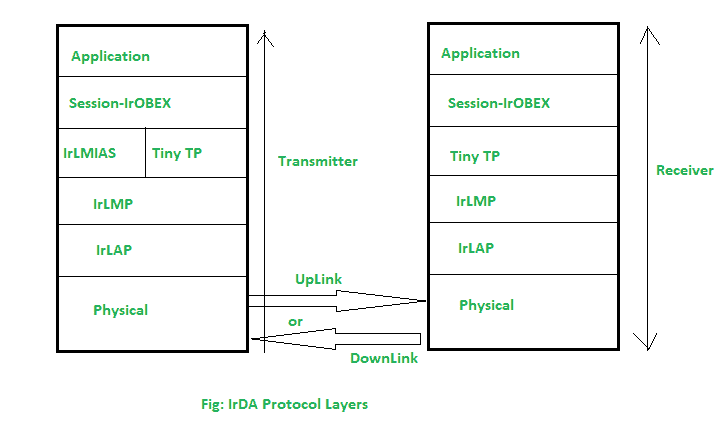

# 红外数据协会

> 原文:[https://www . geesforgeks . org/irda-红外-数据-关联/](https://www.geeksforgeeks.org/irda-infrared-data-association/)

**简介:**
IrDA(红外数据协会)是一种部署在红外线中的个人通信区域网络。

**IrDA 应用程序:**

*   当笔记本电脑和移动设备都进入各自的红外接收器和探测器的附近和视线范围内时，数据传输就发生了。
*   将文档从笔记本电脑发送到打印机。
*   通过交换个人电脑手持的名片。
*   这为用台式机和笔记本电脑协调日程和电话簿提供了灵活性。
*   点对点通信是该协议的主要特点。

**IrDA 协议层:**
那里有不同的 IrDA 协议层

*   应用层
*   会话层
*   IrLMIAS
*   IrTinyTP
*   爱尔兰足球俱乐部
*   物理层

红外数据采集协议层

**应用层:**

*   在这个应用层协议中，安全性起着至关重要的作用。
*   同步(PIM)、对象推送(PIM)或二进制文件传输是该层提供的功能。

**会话层:**
IrOBEX、IrLAN、IrBus、IrMC、TrTran、IrComm 都在这一层执行不同的任务。

**关闭提示:**

*   分段和重组发生在这个层。
*   它提供到 IrLMP 的连接。

**irmp:**

*   它多路复用多个应用程序数据以及独占链接访问。
*   它在对等体之间提供了一个特别的连接。

**物理层:**

*   该层具有接入半双工或交替方向双工接入的能力。
*   它提供 1 米或 10 厘米的值(对于低功率发光二极管)。
*   **不同模式:**同步 PPM、同步串行、异步串行

**会话和传输 IrDA 协议:**

*   红外局域网接入使用红外局域网。
*   为了通过操纵杆、键盘、鼠标和游戏端口访问串行总线，使用了 IrBUS。
*   在这个协议中，IrMC 提供移动通信和电话协议。
*   IrTran 是一种用于图像文件传输的传输协议。
*   IrComm 协议通过模拟串行(Ex。RS232CCOM)或并行端口。