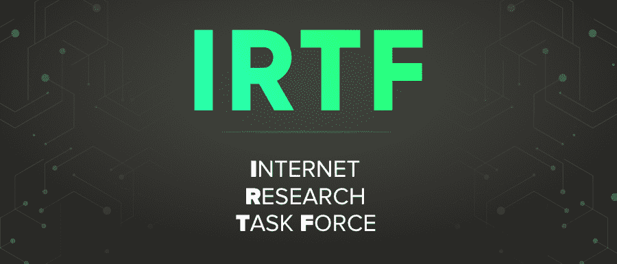

# IRTF 全形

> 哎哎哎:# t0]https://www . geeksforgeeks . org/irtf-full form/

**IRTF** 代表**互联网研究工作队**。它专注于与网络相关的长期研究问题。这通常是一家成立研究小组来探索互联网技术发展的公司。
IRTF 由 IRTF 主席与网络研究指导小组(IRSG)协商管理。

IRTF 可以由各种有重点的长期研究小组组成。这些小组研究与互联网协议、应用程序、架构和技术相关的主题。研究小组拥有稳定的未来成员资格，这是在探索研究问题时营销研究协作和团队合作事件所必需的。参与的是个人贡献者，而不是组织代表。
IRTF 由 IRTF 主席与网络研究指导小组(IRSG)协商管理。IRSG 的成员包括 IRTF 主席、众多研究小组的主席以及 IRTF 主席从研究界挑选的其他个人。

#### 特征

*   研究小组(RG)对该文件进行了深入的技术和编辑审查，并同意将其公布。
*   研究指导小组(IRSG)审查该文件并批准其出版。
*   互联网工程指导小组(IESG)审查该文件，以确保与当前或预期的标准化活动没有任何冲突。
*   该文档随后被交给 RFC 编辑器进行发布。

#### 优势

*   专注于与网络相关的长期研究问题。
*   研究小组拥有稳定的长期成员。
*   参与的是个人贡献者，而不是组织代表。

    #### 不足之处

    *   IRTF 包括数量有限的旅行资助，以支持学者的出席。