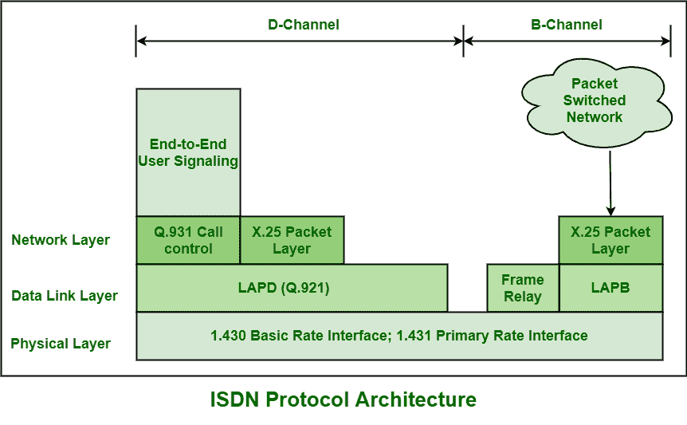

# ISDN 协议架构

> 原文:[https://www.geeksforgeeks.org/isdn-protocol-architecture/](https://www.geeksforgeeks.org/isdn-protocol-architecture/)

[综合业务数字网络(ISDN)](https://www.geeksforgeeks.org/integrated-services-digital-network-isdn/) 被简单地认为是通用数字网络，它能够借助于非常小的一组标准的多用途用户网络接口，高度和全面地支持语音、数据、文本和图像等广泛的服务。它也有助于为未来电信网络和服务的发展和建立提供非常有用的框架。

以前，它被称为综合数字网(IDN)，基本上是交换和传输的标准化数字技术。综合业务数字网还支持两种交换操作，即电路交换操作和分组交换操作。综合业务数字网协议体系结构兼顾了这两种交换操作。电路交换以 64 kbps 的标称比特率提供，而分组交换以高达 64 kbps 的宽比特率范围提供。

**信道类型:**
ISDN 一般包含三种类型的信道，即 B 信道(承载信道)、D 信道(数据信道)和 H 信道(混合信道)。

1.  **B 通道:**
    B 通道通常有 64 kbps 的数据速率。语音、数据或其他低数据速率信息需要此信道。对于更高的数据速率，两个 B 通道将被合并，以提供总共 128 kbps 的数据速率。
2.  **D 通道:**
    D 通道通常有 16 到 64 kbps 的数据速率。信令或分组交换数据需要该信道。d 通道甚至不传送数据。只需携带所有控制信号，如建立呼叫、振铃、呼叫中断等。公共信道信令为所有使用的带外信令传送控制信号。使用这个通道订阅一般为 B 连接提供安全性。还需要携带数据或信息，如视频文本、远程文本、紧急服务警报等。在没有信号的情况下。
3.  **H-Channel :**
    H-channel 一般有 kbps、1536 kbps 或者 1920 kbps 的数据速率。视频、视频会议、高速数据/音频等需要此通道。

**层的类型:**
ISDN 通常包含两种不同的分层机制，其中一种用于 B/H 信道，另一种用于 D 信道。对于 D 信道，ISDN 包含三层协议架构。另一方面，对于 B 信道，综合业务数字网只包含一个协议层，即物理层，其余上层取决于应用。

1.  **物理层:**
    在该层，B 和 D 通道相同，使用 BRI 或 PRI 接口。它定义了各种主要方面，如接口 R、S、T 和 U 的机械和电气规格、编码或电源等。它也基于 X.21，用于通过 8 针连接器与公共电路交换网络接口。
2.  **数据链路层:**
    在该层，B 或 D 通道一般使用 LAPB 或 LAPD。B 通道和 D 通道使用不同的数据链路协议，即 LAPB 用于 B 通道，LAPD 用于 D 通道。
3.  **网络层:**
    在这个通道上，B 通道在连接电路交换、分组交换、帧中继或自动柜员机网络方面有不同的选择。