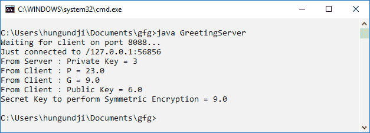

# 客户端和服务器之间 Diffie-Hellman 算法的 Java 实现

> 原文:[https://www . geesforgeks . org/Java-实现-diffie-hellman-算法-客户端和服务器之间/](https://www.geeksforgeeks.org/java-implementation-of-diffie-hellman-algorithm-between-client-and-server/)

**以客户机-服务器方式实现 Diffie-Hellman 算法的程序。**

**先决条件:** [服务器套接字编程](https://www.geeksforgeeks.org/socket-programming-in-java/)[迪菲-赫尔曼算法](https://www.geeksforgeeks.org/implementation-diffie-hellman-algorithm/)

Diffie Hellman 算法正被用于建立一个共享的秘密，当通过公共网络交换数据时，该秘密可用于秘密通信。

在下面的程序中，客户端将共享、和公钥的值。而服务器将接受这些值并计算其公钥并将其发送给客户端。

客户端和服务器都将使用公钥计算对称加密的密钥。

**程序 1:服务器程序**

```
import java.net.*;
import java.io.*;

public class GreetingServer {
    public static void main(String[] args) throws IOException
    {
        try {
            int port = 8088;

            // Server Key
            int b = 3;

            // Client p, g, and key
            double clientP, clientG, clientA, B, Bdash;
            String Bstr;

            // Established the Connection
            ServerSocket serverSocket = new ServerSocket(port);
            System.out.println("Waiting for client on port " + serverSocket.getLocalPort() + "...");
            Socket server = serverSocket.accept();
            System.out.println("Just connected to " + server.getRemoteSocketAddress());

            // Server's Private Key
            System.out.println("From Server : Private Key = " + b);

            // Accepts the data from client
            DataInputStream in = new DataInputStream(server.getInputStream());

            clientP = Integer.parseInt(in.readUTF()); // to accept p
            System.out.println("From Client : P = " + clientP);

            clientG = Integer.parseInt(in.readUTF()); // to accept g
            System.out.println("From Client : G = " + clientG);

            clientA = Double.parseDouble(in.readUTF()); // to accept A
            System.out.println("From Client : Public Key = " + clientA);

            B = ((Math.pow(clientG, b)) % clientP); // calculation of B
            Bstr = Double.toString(B);

            // Sends data to client
            // Value of B
            OutputStream outToclient = server.getOutputStream();
            DataOutputStream out = new DataOutputStream(outToclient);

            out.writeUTF(Bstr); // Sending B

            Bdash = ((Math.pow(clientA, b)) % clientP); // calculation of Bdash

            System.out.println("Secret Key to perform Symmetric Encryption = "
                               + Bdash);
            server.close();
        }

        catch (SocketTimeoutException s) {
            System.out.println("Socket timed out!");
        }
        catch (IOException e) {
        }
    }
}
```

**程序 2:客户端程序**

```
import java.net.*;
import java.io.*;

public class GreetingClient {
    public static void main(String[] args)
    {
        try {
            String pstr, gstr, Astr;
            String serverName = "localhost";
            int port = 8088;

            // Declare p, g, and Key of client
            int p = 23;
            int g = 9;
            int a = 4;
            double Adash, serverB;

            // Established the connection
            System.out.println("Connecting to " + serverName
                               + " on port " + port);
            Socket client = new Socket(serverName, port);
            System.out.println("Just connected to "
                               + client.getRemoteSocketAddress());

            // Sends the data to client
            OutputStream outToServer = client.getOutputStream();
            DataOutputStream out = new DataOutputStream(outToServer);

            pstr = Integer.toString(p);
            out.writeUTF(pstr); // Sending p

            gstr = Integer.toString(g);
            out.writeUTF(gstr); // Sending g

            double A = ((Math.pow(g, a)) % p); // calculation of A
            Astr = Double.toString(A);
            out.writeUTF(Astr); // Sending A

            // Client's Private Key
            System.out.println("From Client : Private Key = " + a);

            // Accepts the data
            DataInputStream in = new DataInputStream(client.getInputStream());

            serverB = Double.parseDouble(in.readUTF());
            System.out.println("From Server : Public Key = " + serverB);

            Adash = ((Math.pow(serverB, a)) % p); // calculation of Adash

            System.out.println("Secret Key to perform Symmetric Encryption = "
                               + Adash);
            client.close();
        }
        catch (Exception e) {
            e.printStackTrace();
        }
    }
}
```

使用 javac 编译程序，并打开两个控制台/终端运行系统

**输出:**
在第一个控制台运行**服务器程序**，它会等待客户端的连接。客户端一连接，结果就会弹出


在第二个控制台，运行**客户端的程序**
