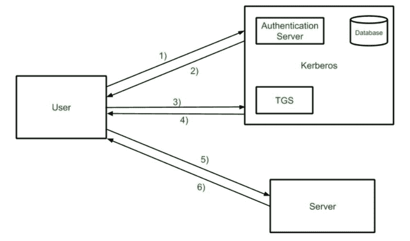

# Kerberos

> 原文:[https://www.geeksforgeeks.org/kerberos/](https://www.geeksforgeeks.org/kerberos/)

**Kerberos** 提供集中式认证服务器，其功能是将用户认证到服务器，服务器认证到用户。在 Kerberos 身份验证中，服务器和数据库用于客户端身份验证。Kerberos 作为第三方可信服务器运行，称为密钥分发中心(KDC)。网络上的每个用户和服务都是一个主体。

Kerberos 的主要组件是:

*   **认证服务器(AS):**
    认证服务器执行票据授予服务的初始认证和票据。
*   **数据库:**
    认证服务器验证用户对数据库的访问权限。
*   **票据授予服务器(TGS):**
    票据授予服务器为服务器签发票据

**Kerberos 概述:**

*   **步骤-1:**
    用户登录并请求主机上的服务。因此，用户请求票证授予服务。
*   **步骤 2:**
    认证服务器使用数据库验证用户的访问权限，然后给出票证授予票证和会话密钥。使用用户密码对结果进行加密。
*   **步骤 3:**
    使用密码解密信息，然后将票据发送到票据授予服务器。票证包含用户名和网络地址等授权码。
*   **步骤-4:**
    票据授予服务器解密用户发送的票据，认证者验证请求，然后创建票据以向服务器请求服务。
*   **第 5 步:**
    用户将票据和认证器发送到服务器。
*   **步骤-6:**
    服务器验证票证，然后授权码生成对服务的访问。此后，用户可以访问服务。