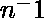

# 密码学中的背包加密算法

> 原文:[https://www . geeksforgeeks . org/背包-加密算法加密/](https://www.geeksforgeeks.org/knapsack-encryption-algorithm-in-cryptography/)

**背包加密算法**是第一个通用的公钥密码算法。它是由**拉尔夫·默克尔**和**默丁·赫尔曼**在 1978 年开发的。由于它是公钥密码系统，因此需要两个不同的密钥。一个是用于加密过程的公钥，另一个是用于解密过程的私钥。在这个算法中，我们将处理两个不同的背包问题，其中一个简单，另一个困难。简单背包用作私钥，硬背包用作公钥。简易背包是用来推导硬背包的。

对于简单背包，我们将选择一个**超增背包问题**。超增背包是一个序列，其中每个下一项都大于前面所有项的和。

**示例–**

```
{1, 2, 4, 10, 20, 40} is a super increasing as
1<2, 1+2<4, 1+2+4<10, 1+2+4+10<20 and 1+2+4+10+20<40.
```

**<u>导出公钥</u>**

*   **Step-1:**
    选择一个超增背包{1，2，4，10，20，40}作为私钥。

*   **步骤-2:**
    选择两个数字 n 和 m，将私钥的所有值乘以数字 n，然后求模 m，m 的值必须大于私钥中所有值的和，例如 110。而数字 n 应该与 m 没有公因数，例如 31。

*   **步骤-3:**
    使用 m 和 n 计算公钥的值

```
1x31 mod(110) = 31
2x31 mod(110) = 62
4x31 mod(110) = 14
10x31 mod(110) = 90
20x31 mod(110) = 70
40x31 mod(110) = 30
```

*   因此，我们的公钥是{31，62，14，90，70，30}
    ，私钥是{1，2，4，10，20，40}。

现在举个例子来了解加密和解密的过程。

**示例–**
让我们的纯文本为 100100111100101110。

**1。加密:**
由于我们的背包包含六个值，因此我们将纯文本分成六组:

```
100100  111100  101110 
```

将公钥的每个值与每个组的相应值相乘，并取它们的和。

```
100100  {31, 62, 14, 90, 70, 30}
1x31+0x62+0x14+1x90+0x70+0x30 = 121

111100  {31, 62, 14, 90, 70, 30}
1x31+1x62+1x14+1x90+0x70+0x30 = 197

101110  {31, 62, 14, 90, 70, 30}
1x31+0x62+1x14+1x90+1x70+0x30 = 205 
```

所以，我们的密码是 121 197 205。

**2。解密:**
接收方收到需要解密的密文。接收器也知道 m 和 n 的值
所以，首先我们需要找到，它是 n mod m 的乘法逆，即，

```
n x  mod(m) = 1

31 x mod(110) = 1

 = 71
```

现在，我们必须将 71 与每个密文块相乘，取模 m。

```
121 x 71 mod(110) = 11 
```

然后，我们必须从私钥{1，2，4，10，20，40}的值中得出 11 的和，即
1+10=11，从而得出相应的位 1 和其他位 0，即 100100。
同样，

```
197 x 71 mod(110) = 17
1+2+4+10=17 = 111100

And, 205 x 71 mod(110) = 35
1+4+10+20=35 = 101110 
```

将它们组合后，我们得到解码的文本。
100100111100101110 这是我们的纯文本。