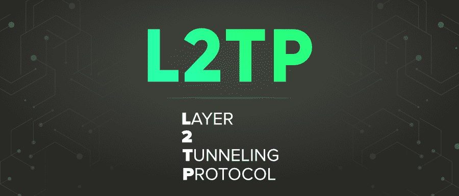

# L2TP 完整版

> 原文:[https://www.geeksforgeeks.org/l2tp-full-form/](https://www.geeksforgeeks.org/l2tp-full-form/)

**L2TP** 代表**第 2 层隧道协议**，于 2000 年发布，作为建议的标准 RFC 2661。它是一种计算机网络协议，旨在支持互联网服务提供商使用的虚拟专用网连接，以支持虚拟专用网在互联网上的运行。L2TP 结合了另外两个隧道协议的最佳特性——微软的 **PPTP** (点对点隧道协议)和思科系统的 **L2F** (第二层转发)。L2TP 集成了 PPTP 的所有功能，但使用 IPsec 进行加密。

#### L2TP 的特点

*   **平台:**易于配置和设置，因为几乎所有现代操作系统都支持它。
*   **性能:**在不稳定的网络上也提供稳定的性能，这使得它对于远程网络连接更安全和更好。
*   **安全:** L2TP 不提供自己的加密。但是它通常是用 IPsec 身份验证套件实现的。当它与 IPSec 配对时，它还使用 UDP 端口 500(用于 IKE 互联网密钥交换)、4500(用于 NAT)和 1701(用于 L2TP 流量)。
*   **稳定性:**在各种网络和运行设备上证明是稳定的。

#### L2TP 的优势

*   L2TP 防止数据在发送方和接收方之间传输时被入侵者操纵，在传输前需要共享密钥或数字签名。
*   它具有成本效益，即使在实施后也不收取管理费用。
*   提供有效的连接。
*   它非常可靠，在不稳定的网络连接上使用时不会遇到任何性能问题。
*   它甚至对身份验证过程进行加密，从而使数据更安全，免受入侵者的攻击。
*   L2TP 的端点位于不同的机器上，因为它使用分组交换网络连接。这消除了可能的长距离充电，因为连接可以终止于本地电路集中器。
*   最适合安全性至关重要的任务，例如在线购物。

#### L2TP 的缺点

*   由于双重封装，它的传输速度比其他协议慢。
*   L2TP 较高的 CPU 使用率也导致了较慢的速度。
*   当它通过 UDP 通信时，相对更容易被防火墙阻止。
*   它没有自己的加密。它必须依赖 IPsec 进行加密。