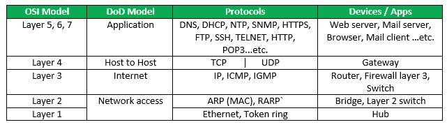
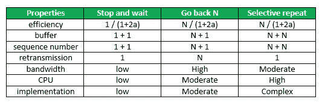
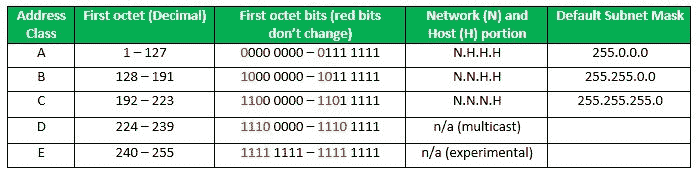
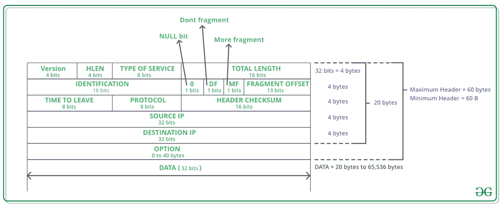
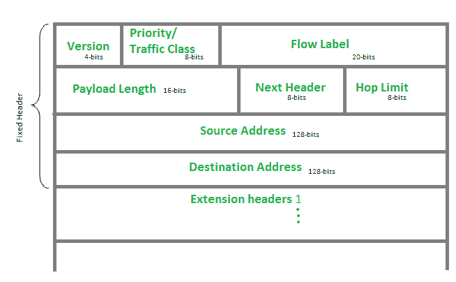
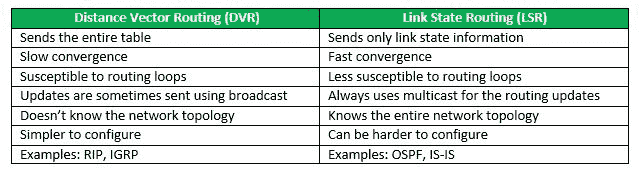
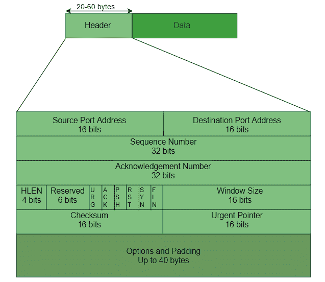
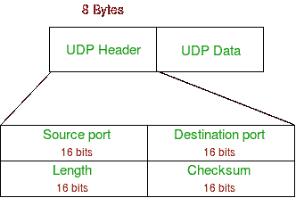
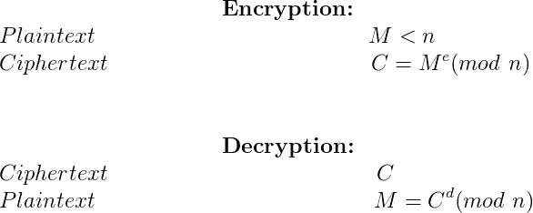

# 最后一分钟笔记–计算机网络

> 原文:[https://www . geesforgeks . org/最后一分钟-笔记-计算机-网络/](https://www.geeksforgeeks.org/last-minute-notes-computer-network/)

参见所有科目的最后一分钟笔记[此处](https://www.geeksforgeeks.org/lmns-gq/)。

**现场视察层、数据单元和功能:**

| 层 | 数据单元 | 功能 |
| --- | --- | --- |
| 应用层 | 数据 | 邮件服务，目录服务，FTAM |
| 表示层 | 数据 | 加密/解密、压缩 |
| 会话层 | 数据 | 会话建立、同步、对话控制器 |
| 传输层 | 数据报段 | 分割 |
| 网路层 | 小包裹 | 流量控制、分段、路由 |
| 数据链路层 | 框架 | 流量控制、错误控制、访问控制 |
| 物理层 | 位 | 位同步、比特率控制、物理拓扑 |

**层及其用途–**

### 物理层

[**网络拓扑:**](https://www.geeksforgeeks.org/network-topologies-computer-networks/)

*   **网状拓扑:**
    在网状拓扑中，每个设备都通过特定的通道连接到另一个设备。如果假设 N 个设备相互连接，那么连接 NC 2 所需的链路总数。
*   **总线拓扑:**
    总线拓扑是一种网络类型，其中每台计算机和网络设备都连接到一根电缆。如果连接了 N 个设备，则需要的电缆数量为 1，即主干电缆，并且需要 N 条引入线。
*   **星型拓扑:**
    在星型拓扑中，所有设备都通过电缆连接到单个集线器。如果 N 个设备相互连接，则所需的电缆数量为 N
*   **环形拓扑:**
    在这种拓扑中，它形成一个环，将一个设备与其恰好两个相邻的设备连接起来。

[**传输模式:**](https://www.geeksforgeeks.org/transmission-modes-computer-networks/)

*   **单工模式**:通信是单向的，就像在单行道上一样。链路上的两个设备中只有一个可以传输，另一个只能接收。
*   **半双工模式**:每个站都可以收发，但不能同时收发。
*   **全双工模式**:两站可以同时收发。

[**【曼彻斯特编码】**](https://www.geeksforgeeks.org/computer-network-manchester-encoding/) :当有一长串 0 和 1 时，接收端出现问题。问题是同步由于缺少传输而丢失。

*   **NRZ 级编码**:当输入信号从‘1’变为‘0’或从‘0’变为‘1’时，信号的极性发生变化。它将第一位数据视为极性变化。
*   **NRZ-反相/差分编码**:在这种情况下，位间隔开始时的跃迁等于 1，如果位间隔开始时没有跃迁，则等于 0。

### 数据链路层

1.  **Flow Control**
    N = Sender’s Window Size. (in SR both sender and receiver window are same)
    a = Tp /Tt

    

2.  序号> =(发送方窗口大小)+(接收方窗口大小)
3.  时分复用效率(轮询)= T t / (T 轮询 + T t
4.  在 CSMA/光盘中，TT>= 2 * TpT4】因此，最小帧长度= 2*T p *B
5.  在 CSMA/光盘中，效率= 1/(1 + 6.44a)
6.  [**CSMA/光盘退避算法**](https://www.geeksforgeeks.org/back-off-algorithm-csmacd/)
    等待时间=退避时间
    让 n =碰撞号或重传序列号。
    然后，等待时间= K * T 时隙
    其中 K = [0，2n–1]
7.  N =站点数量
    早期令牌重新插入:效率= 1/(1 + a/N)
    延迟令牌重新插入:效率= 1/(1 + (N+1)a/N)
8.  纯 Aloha 效率= 18.4 %
    时隙 Aloha 效率= 36.8%
9.  [**Maximum data rate (channel capacity) for noiseless and noisy channels**](https://www.geeksforgeeks.org/computer-network-maximum-data-rate-channel-capacity-noiseless-noisy-channels/)
    *   **无噪声信道:奈奎斯特比特率**
        比特率= 2 *带宽* log2(L)
        其中，L 是用于表示数据的信号电平数。
    *   **噪声信道:香农容量**
        容量=带宽* log2(1 +信噪比)
        其中，信噪比为信噪比
10.  **误差控制**
    *   [**汉明码**](https://www.geeksforgeeks.org/computer-network-hamming-code/) :是一组纠错码，可用于检测和纠正数据从发送方移动或存储到接收方时可能出现的错误。
        **冗余位:**
        2 r ≥ m + r + 1
        其中，r =冗余位，m =数据位
11.  [**DLL 中的成帧**](https://www.geeksforgeeks.org/computer-network-framing-data-link-layer/) :它为发送方提供了一种传输一组对接收方有意义的比特的方式。
    **字符/字节填充:**当帧由字符组成时使用。如果数据包含 ed，那么字节被填充到数据中以区别于 ED。
    **位填充**:发送方填充一个位来打破模式，即在数据中附加一个 0 = 0111**0**1。

### 网路层

[**类全寻址表**](https://www.geeksforgeeks.org/ip-addressing-introduction-and-classful-addressing/) :

[**IPv4 报头数据报**](https://www.geeksforgeeks.org/network-layer-introduction-ipv4/) :

[**IP 版本 6 表头格式**](https://www.geeksforgeeks.org/computer-network-internet-protocol-version-6-ipv6-header/)

[**【互联网控制消息协议】**](https://www.geeksforgeeks.org/internet-control-message-protocol-icmp/) :因为 IP 没有发送错误和控制消息的内置机制。它依赖于互联网控制消息协议(ICMP)来提供错误控制。

1.  源抑制消息
2.  参数问题
3.  超过时间的消息
4.  Destination un-reachable

    [**DVR 与 LSR**](https://www.geeksforgeeks.org/computer-network-distance-vector-routing-vs-link-state-routing/)
    的区别

    [**开放最短路径优先(OSPF)**](https://www.geeksforgeeks.org/open-shortest-path-first-ospf-router-roles-configuration/) :开放最短路径优先(OSPF)是一种链路状态路由协议，用于使用自己的 SPF 算法寻找源路由器和目的路由器之间的最佳路径。
    指定路由器(DR)和备用指定路由器(BDR)的选举在广播网络或多址网络中进行。
    **选举标准:**

    1.  具有最高路由器优先级的路由器将被声明为灾难恢复
    2.  如果路由器优先级相同，则考虑最高路由器。首先，考虑最高环回地址。如果没有配置环回，则考虑路由器接口上的最高活动 IP 地址。

    [**路由信息协议(RIP)**](https://www.geeksforgeeks.org/computer-network-routing-information-protocol-rip/) :是一种动态路由协议，利用跳数作为路由度量，寻找源网络和目的网络之间的最佳路径。它是一种距离矢量路由协议，AD 值为 120，工作在 OSI 模型的应用层。RIP 使用端口号 520。
    **跳数**:

    1.  跳数是源网络和目的网络之间的路由器数量。跳数最低的路径被认为是到达网络的最佳路由，因此被放在路由表中。
    2.  RIP 允许的最大跳数为 15，跳数为 16 被视为网络不可达。

    ### 传输层

    [**TCP 报头**](https://www.geeksforgeeks.org/tcp-services-and-segment-structure/)
    

    [**在 TCP 拥塞控制算法中**](https://www.geeksforgeeks.org/computer-network-tcp-congestion-control/)
    当超时发生时算法进入慢启动阶段
    当 3 次重复发生时算法进入拥塞避免阶段

    [**TCP 三向握手过程**](https://www.geeksforgeeks.org/computer-network-tcp-3-way-handshake-process/)
    **第一步(SYN)** :第一步，客户端想和服务器建立连接，所以发送一个带有 SYN(同步序列号)的段，通知服务器客户端很可能开始通信，用什么序列号开始段
    **第二步(SYN + ACK)** :服务器用设置好的 SYN-ACK 信号位响应客户端请求。确认(ACK)表示它收到的数据段的响应，SYN 表示它可能以什么序列号开始数据段
    **步骤 3 (ACK)** :在最后一部分中，客户端确认服务器的响应，并且它们都建立了可靠的连接，它们将使用该连接开始实际的数据传输。

    [**UDP 报头**](https://www.geeksforgeeks.org/gate-cs-notes-gq/)
    

    参考[TCP 和 UDP 的区别](https://www.geeksforgeeks.org/differences-between-tcp-and-udp/)

    ### 应用层

    [**域名服务器**](https://www.geeksforgeeks.org/dns-domain-name-server/) : DNS 是一种主机名到 IP 地址的转换服务。DNS 是一个分布式数据库，在名称服务器的层次结构中实现。它是客户端和服务器之间消息交换的应用层协议。

    [**动态主机配置协议(DHCP)**](https://www.geeksforgeeks.org/computer-network-dynamic-host-configuration-protocol-dhcp/) 是一种应用层协议，用于提供:
    子网掩码(选项 1–例如 255.255.255.0)
    路由器地址(选项 3–例如 192.168.1.1)
    DNS 地址(选项 6–例如 8.8.8.8)
    供应商类别标识符(选项 43–例如‘unifi’= 192 . 168。

    [**简单网络管理协议(SNMP)**](https://www.geeksforgeeks.org/computer-network-simple-network-management-protocol-snmp/) : SNMP 是一种应用层协议，使用 UDP 端口号 161/162。SNMP 用于监控网络，检测网络故障，有时甚至用于配置远程设备。

    [**简单邮件传输协议(SMTP)**](https://www.geeksforgeeks.org/simple-mail-transfer-protocol-smtp/) : SMTP 是应用层协议。想要发送邮件的客户端打开到 SMTP 服务器的 TCP 连接，然后通过该连接发送邮件。SMTP 服务器始终处于侦听模式。只要侦听到来自任何客户端的 TCP 连接，SMTP 进程就会在该端口上启动连接(25)。成功建立 TCP 连接后，客户端进程会立即发送邮件。

    [**文件传输协议(FTP)**](https://www.geeksforgeeks.org/computer-network-file-transfer-protocol-ftp/) :文件传输协议(FTP)是在本地和远程文件系统之间移动文件的应用层协议。它运行在 TCP 之上，就像 HTTP 一样。为了传输文件，FTP 并行使用两个 TCP 连接:控制连接和数据连接。

    [**超文本传输协议(HTTP)**](https://www.geeksforgeeks.org/http-non-persistent-persistent-connection/) :是一种应用层协议，使用 TCP 作为底层传输，通常运行在端口 80 上。HTTP 是一种无状态协议，即服务器不维护关于过去客户端请求的信息。

    ### 网络安全性

    对于对称密钥:需要 n*(n-1)/2 个密钥。
    对于公钥:需要 2*n 个密钥(每个节点将有私钥和公钥)。

    [**密码学中的 RSA 算法**](https://www.geeksforgeeks.org/rsa-algorithm-using-multiple-precision-arithmetic-library/)
    
    

    [**Deffie Hellman 密钥交换**](https://www.geeksforgeeks.org/implementation-diffie-hellman-algorithm/)
    R1 = gxmod p
    R2 = gymod q
    两者将具有相同的密钥= g xy mod p。