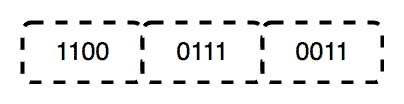
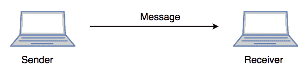

# 现场视察模型的各层

> 原文:[https://www.geeksforgeeks.org/layers-of-osi-model/](https://www.geeksforgeeks.org/layers-of-osi-model/)

先决条件:[计算机网络基础](https://www.geeksforgeeks.org/basics-computer-networking/)

OSI 代表**开放系统互连**。它是由国际标准化组织于 1984 年开发的。它是一个 7 层架构，每一层都有特定的功能要执行。所有这 7 层协同工作，在全球范围内将数据从一个人传输到另一个人。

### **1。物理层(第 1 层):**

现场视察参考模型的最底层是物理层。它负责设备之间的实际物理连接。物理层包含**位形式的信息。**负责将单个比特从一个节点传输到下一个节点。当接收数据时，该层将获得接收到的信号，并将其转换为 0 和 1，然后将其发送到数据链路层，数据链路层将把帧放回一起。

物理层的功能是:

1.  **位同步:**物理层通过提供时钟来提供位的同步。该时钟控制发送方和接收方，从而提供位级同步。
2.  **比特率控制:**物理层还定义了传输速率，即每秒发送的比特数。
3.  **物理拓扑:**物理层指定不同设备/节点在网络中的排列方式，即总线、星形或网状拓扑。
4.  **传输模式:**物理层还定义了数据在两个相连设备之间流动的方式。各种可能的传输模式有单工、半双工和全双工。

*集线器、中继器、调制解调器、电缆都是物理层设备。
**网络层、数据链路层和物理层也称为**下层**或**硬件层**。

### **2。数据链路层(DLL)(第 2 层):**

数据链路层负责消息的节点到节点传递。该层的主要功能是确保物理层上从一个节点到另一个节点的数据传输没有错误。当数据包到达网络时，动态链接库负责使用其媒体访问控制地址将其传输到主机。
数据链路层分为两个子层:

1.  逻辑链路控制
2.  媒体访问控制

根据网卡(网络接口卡)的帧大小，从网络层接收到的数据包被进一步分成帧。DLL 还将发送方和接收方的媒体访问控制地址封装在报头中。

接收方的媒体访问控制地址是通过将一个 ARP(地址解析协议)请求放在电线上询问“谁有那个 IP 地址？”目的主机会用它的媒体访问控制地址进行回复。

数据链路层的功能是:

1.  **成帧:**成帧是数据链路层的功能。它为发送方提供了一种传输对接收方有意义的一组比特的方式。这可以通过在帧的开头和结尾附加特殊的位模式来实现。
2.  **物理寻址:**创建帧后，数据链路层在每个帧的报头中添加发送方和/或接收方的物理地址(MAC 地址)。
3.  **差错控制:**数据链路层提供差错控制机制，在该机制中，它检测和重传损坏或丢失的帧。
4.  **流量控制:**两侧的数据速率必须恒定，否则数据可能会损坏。因此，流量控制会在收到确认之前协调可发送的数据量。
5.  **访问控制:**当单个通信信道被多个设备共享时，数据链路层的 MAC 子层有助于确定在给定时间哪个设备对该信道具有控制。

**数据链路层中的数据包称为**帧**。*
***数据链路层由网卡和主机设备驱动处理。*
****交换机&网桥是数据链路层设备。*

### **3。网络层(第 3 层):**

网络层负责将数据从一台主机传输到位于不同网络中的另一台主机。它还负责数据包路由，即从可用的路由数量中选择传输数据包的最短路径。发送方和接收方的 IP 地址由网络层放在报头中。
网络层的功能是:

1.  **路由:**网络层协议决定哪条路由适合从源到目的地。网络层的这一功能被称为路由。
2.  **逻辑寻址:**为了唯一识别网间的每个设备，网络层定义了一个寻址方案。发送方&接收方的 IP 地址由网络层放在报头中。这样的地址唯一且通用地区分每个设备。

网络层的 **段*称为**包**。

**网络层由路由器等网络设备实现。

### **4。传输层(第 4 层):**

传输层向应用层提供服务，并从网络层获取服务。传输层中的数据被称为*段*。它负责完整消息的端到端传递。传输层还提供成功数据传输的确认，并在发现错误时重新传输数据。
**·在发送方:**
传输层接收来自上层的格式化数据，执行**分段**，并且还实现**流程&错误控制**以确保正确的数据传输。它还在报头中添加源和目标端口号，并将分段数据转发到网络层。
<u>注意:</u>发送方需要知道与接收方应用相关联的端口号。
通常，默认或手动配置该目的端口号。例如，当 web 应用程序向 web 服务器发出请求时，它通常使用端口号 80，因为这是分配给 web 应用程序的默认端口。许多应用程序都分配了默认端口。
**:在接收端:**
传输层从其报头中读取端口号，并将收到的数据转发给相应的应用程序。它还对分割的数据进行排序和重组。

传输层的功能是:

1.  **分段和重组:**该层接受来自(会话)层的消息，将消息分成更小的单元。生成的每个段都有一个与之关联的标题。目的站的传输层重新组装消息。
2.  **服务点寻址:**为了将消息传递到正确的进程，传输层报头包括一种称为服务点地址或端口地址的地址类型。因此，通过指定该地址，传输层确保消息被传递到正确的进程。

传输层提供的服务:

1.  **面向连接的服务:**这是一个三阶段的过程，包括
    –连接建立
    –数据传输
    –终止/断开
    在这种类型的传输中，接收设备在接收到一个或一组数据包后向源设备发回确认。这种传输方式既可靠又安全。
2.  **无连接服务:**这是一个一阶段过程，包括数据传输。在这种类型的传输中，接收器不确认收到数据包。这种方法允许设备之间更快的通信。面向连接的服务比无连接的服务更可靠。

**传输层中的数据称为**段**。*
***传输层由操作系统操作。它是操作系统的一部分，通过系统调用与应用层通信。*
*传输层被称为 OSI 模型的**心脏。***

### **5。会话层(第 5 层):**

该层负责连接的建立、会话的维护、身份验证，并确保安全性。
会话层的功能是:

1.  **会话建立、维护和终止:**该层允许两个进程建立、使用和终止连接。
2.  **同步:**该层允许进程将被视为同步点的检查点添加到数据中。这些同步点有助于识别错误，以便正确地重新同步数据，并且不会过早地切断消息的结尾，避免数据丢失。
3.  **对话控制器:**会话层允许两个系统以半双工或全双工方式开始相互通信。

** *在作为“应用层”的 TCP/IP 模型中，下面 3 层(包括会话层)全部集成为一层。*
** *这 3 层的实现都是由网络应用自己完成的。这些也被称为**上层**或**软件层**。*

<u>场景:</u>
我们来考虑一个场景，用户想要通过浏览器中运行的某个 Messenger 应用程序发送消息。这里的“信使”充当应用层，为用户提供创建数据的界面。该消息或所谓的数据被压缩、加密(如果有安全数据的话)，并被转换成比特(0 和 1)，以便能够被传输。

### **6。表示层(第 6 层):**

表示层也称为**翻译层**。应用层的数据在这里被提取出来，并按照所需的格式进行操作，以便通过网络传输。
表示层的功能是:

1.  **翻译:**比如 ASCII 到 EBCDIC。
2.  **加密/解密:**数据加密将数据转换为另一种形式或代码。加密数据称为密文，解密数据称为纯文本。键值用于加密和解密数据。
3.  **压缩:**减少网络上需要传输的位数。

### **7。应用层(第 7 层):**

在现场视察参考模型堆栈的最顶层，我们找到了由网络应用程序实现的应用层。这些应用程序产生数据，这些数据必须通过网络传输。该层还充当应用服务访问网络和向用户显示接收信息的窗口。
例:应用–浏览器、Skype Messenger 等。
** *应用层也叫桌面层。*

应用层的功能有:

1.  网络虚拟终端
2.  FTAM-文件传输访问和管理
3.  邮件服务
4.  目录服务

OSI 模型作为参考模型，由于发明较晚，没有在互联网上实现。目前使用的模型是 TCP/IP 模型。

本文由**昆达娜·蒂亚里****哈什塔·潘迪**供稿。如果你喜欢 GeeksforGeeks 并想投稿，你也可以使用[write.geeksforgeeks.org](https://write.geeksforgeeks.org)写一篇文章或者把你的文章邮寄到 review-team@geeksforgeeks.org。看到你的文章出现在极客博客主页上，帮助其他极客。

如果你发现任何不正确的地方，或者你想分享更多关于上面讨论的话题的信息，请写评论。