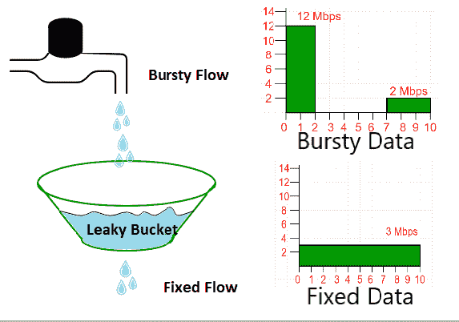
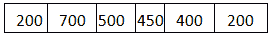

# 计算机网络|漏桶算法

> 原文:[https://www.geeksforgeeks.org/leaky-bucket-algorithm/](https://www.geeksforgeeks.org/leaky-bucket-algorithm/)

在网络层，网络在做出服务质量保证之前，必须知道正在保证什么流量。拥塞的主要原因之一是流量经常是突发性的。
要理解这个概念，首先我们要对流量塑造知之甚少。**流量整形**是一种控制发送到网络的流量和速率的机制。拥塞管理的方法称为流量整形。流量整形有助于调节数据传输速率并减少拥塞。
流量整形算法有 2 种:

1.  漏桶
2.  令牌桶

假设我们有一个水桶，我们以随机的顺序倒水，但我们必须以固定的速度取水，为此我们将在水桶的底部打一个洞。它将确保水以某个固定的速度流出，而且如果水桶装满，我们将停止向里面倒水。
输入速率可以变化，但输出速率保持不变。同样，在网络中，一种称为漏桶的技术可以消除突发流量。突发块存储在桶中，并以平均速率发送出去。



在图中，我们假设网络已经为主机承诺了 3 Mbps 的带宽。漏桶的使用塑造了输入流量，使其符合这一承诺。在图中，主机以 12 兆位/秒的速率发送一串数据，持续 2 秒钟，数据总量为 24 兆位。主机静默 5 秒钟，然后以 2 Mbps 的速率发送数据 3 秒钟，总共 6 Mbits 的数据。总体而言，主机在 10 秒内发送了 30 兆字节的数据。漏桶通过在相同的 10 秒内以 3 兆字节/秒的速率发送数据来平滑流量。
如果没有漏桶，开始的突发可能会消耗超过为此主机预留的带宽，从而损害网络。我们还可以看到漏桶可以防止拥塞。
利用 FIFO 队列可以实现简单的漏桶算法。先进先出队列保存数据包。如果流量由固定大小的数据包(例如，自动柜员机网络中的信元)组成，则该过程会在时钟的每个节拍从队列中移除固定数量的数据包。如果流量由可变长度数据包组成，固定输出速率必须基于字节数或位数。
以下是变长数据包的算法:

1.  在时钟滴答声时将计数器初始化为 n。
2.  如果 n 大于数据包的大小，则发送数据包，并将计数器减数据包大小。重复此步骤，直到 n 小于数据包大小。
3.  重置计数器并转到步骤 1。

**示例–**让 n=1000
数据包=



由于 n >在队列前面，即 n > 200
因此，n=1000-200=800
大小为 200 的数据包被发送到网络。


现在再次在队列前面，即 n > 400
因此，大小为 400 的 n=800-400=400
数据包被发送到网络。


因此，程序停止。
在时钟的另一个刻度上初始化 n=1000。
重复此过程，直到所有数据包都发送到网络。
以下是上述办法的实施:

## C++

```
// cpp program to implement leakybucket
#include<bits/stdc++.h>
using namespace std;
int main()
{
    int no_of_queries, storage, output_pkt_size;
    int input_pkt_size, bucket_size, size_left;

    // initial packets in the bucket
    storage = 0;

   // total no. of times bucket content is checked
   no_of_queries = 4;

   // total no. of packets that can
   // be accommodated in the bucket
   bucket_size = 10;

    // no. of packets that enters the bucket at a time
    input_pkt_size = 4;

    // no. of packets that exits the bucket at a time
    output_pkt_size = 1;
  for(int i = 0; i < no_of_queries; i++) //space left
  {
  size_left = bucket_size - storage;
  if(input_pkt_size <= size_left)
  {
      // update storage
    storage += input_pkt_size;
    printf("Buffer size= %d out of bucket size= %d\n", storage, bucket_size);
  }
  else
  {
    printf("Packet loss = %d\n", (input_pkt_size-(size_left)));

    // full size     
    storage=bucket_size;
    printf("Buffer size= %d out of bucket size= %d\n", storage, bucket_size);                    
  }
  storage -= output_pkt_size;
 }
  return 0;
}

// This code is contributed by bunny09262002
```

## Java 语言(一种计算机语言，尤用于创建网站)

```
//Java Implementation of Leaky bucket

import java.io.*;
import java.util.*;

class Leakybucket {
    public static void main (String[] args) {
        int no_of_queries,storage,output_pkt_size;
        int input_pkt_size,bucket_size,size_left;

         //initial packets in the bucket
        storage=0;   

        //total no. of times bucket content is checked
        no_of_queries=4;

        //total no. of packets that can
        // be accommodated in the bucket
        bucket_size=10;

        //no. of packets that enters the bucket at a time
        input_pkt_size=4;

        //no. of packets that exits the bucket at a time
        output_pkt_size=1;
        for(int i=0;i<no_of_queries;i++)
        {
            size_left=bucket_size-storage; //space left

            if(input_pkt_size<=(size_left))        
            {
                storage+=input_pkt_size;
                System.out.println("Buffer size= "+storage+
                    " out of bucket size= "+bucket_size);
            }
            else
            {
                System.out.println("Packet loss = "
                            +(input_pkt_size-(size_left)));

                     //full size      
                storage=bucket_size;

                System.out.println("Buffer size= "+storage+
                            " out of bucket size= "+bucket_size);

            }
            storage-=output_pkt_size;
        }
    }
}
```

**输出**T2】

```
Buffer size= 4 out of bucket size= 10
Buffer size= 7 out of bucket size= 10
Buffer size= 10 out of bucket size= 10
Packet loss = 3
Buffer size= 10 out of bucket size= 10
```

**漏桶和令牌桶的区别–**

<figure class="table">

| 漏桶 | 令牌桶 |
| --- | --- |
| 当主机必须发送数据包时，数据包被扔进桶中。 | 在这个漏桶中保存着以规则的时间间隔生成的令牌。 |
| 铲斗以恒定速度泄漏 | 铲斗具有最大容量。 |
| 突发流量通过漏桶转换为均匀流量。 | 如果有现成的数据包，令牌将从 Bucket 中移除，数据包将被发送。 |
| 实际上，bucket 是一个有限速率的有限队列输出 | 如果桶中没有令牌，则无法发送数据包。 |

**令牌桶相对于漏桶的一些优势–**

*   如果令牌桶中的桶已满，令牌将被丢弃，而不是数据包。在漏桶中，数据包被丢弃。
*   令牌桶可以以更快的速率发送大突发，而漏桶总是以恒定的速率发送数据包。

本文由**阿比舍克·库马尔**[**希曼舒·古普塔**](https://auth.geeksforgeeks.org/user/Himanshu%20Gupta%2028/articles) 供稿。如果你喜欢极客博客并想投稿，你也可以用 write.geeksforgeeks.org 写一篇文章或者把你的文章邮寄到 review-team@geeksforgeeks.org。看到你的文章出现在极客博客主页上，帮助其他极客。
如果发现有不正确的地方，或者想分享更多关于上述话题的信息，请写评论。

</figure>