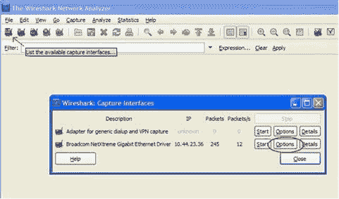
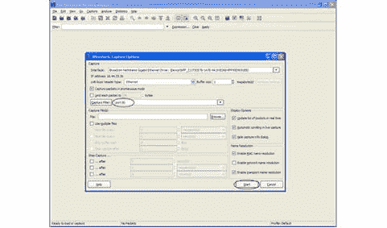
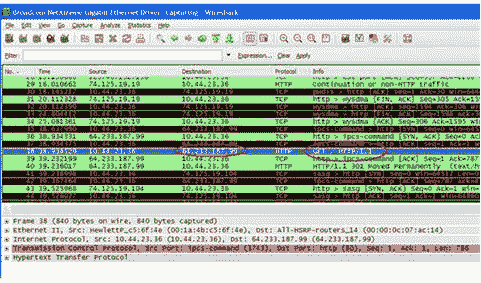
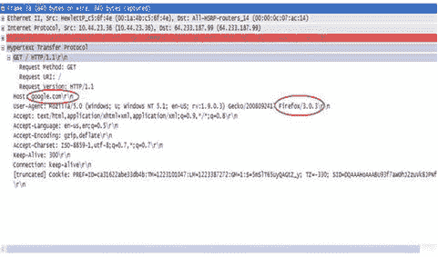

# 我们来体验一下联网

> 原文:[https://www . geeksforgeeks . org/let-实验联网/](https://www.geeksforgeeks.org/lets-experiment-with-networking/)

我们大多数人都以非常抽象的方式研究过计算机网络。换句话说，我们中没有多少人知道在现实生活中的网络(如互联网)中，层和包的抽象概念是如何翻译的。因此，让我们做一个实验，看看这些层、包等。也存在于任何真实的网络中。所以，准备好，开始钻研这个奇妙的实践和实验网络世界吧！

我们实验的大纲如下。我们将捕获一些实时数据包，为了理解这些数据包中的内容，我们将通过剖析它们来分析这些数据包。听起来像外科手术？没错。J

首先，我们需要一台运行 Windows XP 并连接到互联网的电脑。如果你正在网上阅读这篇文章，你很有可能已经做好了实验的准备。现在让我们回忆一下我们在网络书籍中读到的一些理论。几乎每本书都告诉我们的第一件事——网络架构是分层的；记住 7 层 OSI 协议栈！那么这些协议层在哪里呢？在我们的实验中，我们将使用 5 层互联网协议栈，这样我们就可以解开这些层的谜团。

我们从安装 Wireshark(早期称为 Ethereal)开始实验。Wireshark 是一个网络协议分析器，可以捕获和分析通过网络接口卡发送/接收的数据包。【你需要忍受我这个首字母缩略词，因为 Networking 充满了 acronymsJ】我们从[http://www.wireshark.org/download.html](http://www.wireshark.org/download.html)安装 Wireshark(在写这篇文章的时候，最新的 Wireshark 版本是 1.0.3)。安装 Wireshark 时，保持默认设置/选项不变。现在我们的实验装置准备好了。运行 Wireshark 并点击第一个图标(列出可用的捕获接口……)。现在，我们看到一个显示捕获接口的弹出窗口。请参见下面的快照。

根据您电脑的配置，“捕获接口”窗口中显示的接口数量和类型可能会有所不同。对我来说，它显示了两个接口，我的互联网连接是通过博通千兆接口。因此，请选择您可以使用互联网连接的接口。现在我们点击该界面的 <u>O</u> 选项按钮。现在我们看到一个名为“捕获选项”的新窗口。在此窗口中，在名为“捕获过滤器”的文本字段中键入“端口 80”。请参见下面的快照以获得澄清。

现在，我们已经准备好捕获通过网卡的数据包。通过将过滤器设置为“端口 80”，我们已经指示 Wireshark 只捕获那些因为 HTTP 流量而导致的数据包(请记住，我们总是被告知默认的 HTTP 端口是 80！).现在单击“捕获选项”窗口上的“开始”按钮。如果您的电脑中有任何程序在后台访问 HTTP 流量，您可能会在 Wireshark 中看到一些数据包；我们不要关注这个。现在打开你的浏览器，尝试访问[http://google.com](http://google.com/)，现在你应该会看到许多数据包在 Wireshark 中被捕获。请参见如下快照。

让我们开始分析捕获的数据包。首先，在它的 Info 字段中找到 GET / HTTP/1.1 的 HTTP 包的第一个实例。在上面的快照中，它以蓝色显示。如果我们仔细看一下，我们会发现这个数据包包含了互联网协议栈所有 5 层的报头。

*   **第 1 层–**
    是物理层。这里帧显示在物理层。

*   **第 2 层–**
    是数据链路层。在这个数据包中，我们可以看到以太网二被用作数据链路层协议。我们可以在这个报头中找到源和目的地的 MAC 地址。

*   **第 3 层–**
    是网络层。在这个数据包中，我们看到 IP 被用作网络层协议。我们可以在这个报头中看到源和目标 IP。

*   **第 4 层–**
    是传输层。在这个数据包中，TCP 被用作传输层协议。我们可以在这个报头中找到源端口和目的端口。

*   **第 5 层–**
    是应用层。在这个包中，HTTP 被用作应用层协议。

让我们探索其中的一层。类似地，可以进一步探索其他层。如果我们展开第 5 层，即 HTTP 头，它看起来如下。

这里我们看到主机被称为 google.com，这是我们试图从浏览器访问的。HTTP 头的用户代理字段显示了浏览器的详细信息。在我的例子中，它是 Mozilla Firefox，正如这个标题所示。目的地 IP 64.233.187.99 应该是分配给托管网络服务器的谷歌服务器的 IP 地址之一。可以使用非常方便的实用程序命令“nslookup”来验证。其他字段的细节可以在 HTTP、TCP、IP、以太网二协议的报头中探索。一些有趣的字段是——IP 报头中的区分服务字段(也称为服务质量字段)，TCP 报头中的窗口大小等。

所以我们已经看到，所有这些修辞概念的层次等。也确实存在于真实的网络中。当你剖析通过你的接口卡的所有数据包时，听起来很有趣。通过这样做，您可以了解什么通过/来自您的电脑！

这个实验的想法是提供一个有益的平台，这样你就可以探索你自己令人兴奋的网络世界。所以欢迎加入！