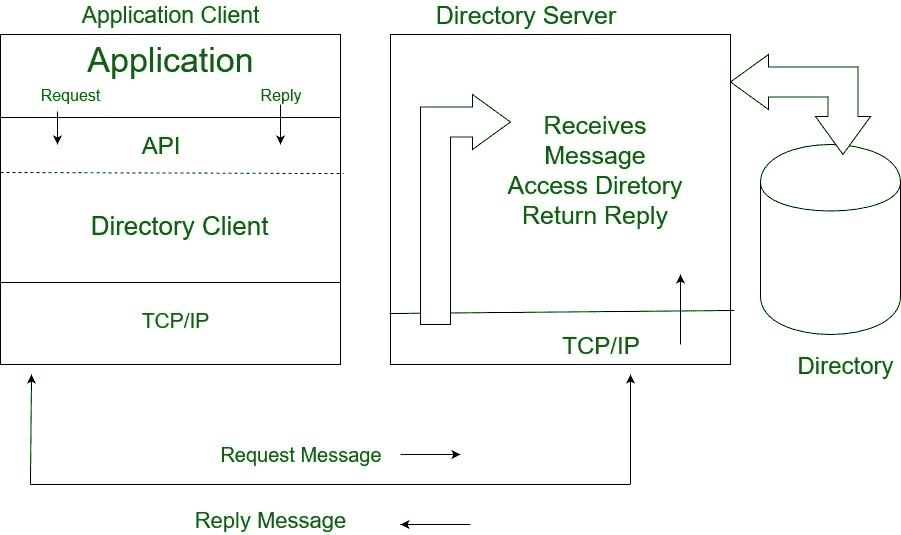
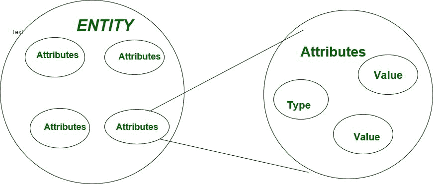

# 轻量级目录访问协议(LDAP)

> 原文:[https://www . geesforgeks . org/轻量级-目录-访问-协议-ldap/](https://www.geeksforgeeks.org/lightweight-directory-access-protocol-ldap/)

**轻量级目录访问协议(LDAP)** 是一种工作在 TCP/IP 上的互联网协议，用于从目录中访问信息。LDAP 协议基本上用于访问活动目录。

**LDAP 的特性:**

1.  LDAP 的功能模型更简单，因为它省略了重复的、很少使用的和深奥的功能。
2.  更容易理解和实现。
3.  它使用字符串来表示数据

**目录:**
目录是一组具有相似属性的对象，以逻辑和层次的方式组织。例如，电话目录。它是一个分布式数据库应用程序，用于管理目录中的属性。



LDAP 定义了访问和修改目录条目的操作，例如:

*   搜索用户指定的条件
*   添加条目
*   删除条目
*   修改条目
*   修改条目的可分辨名称或相对可分辨名称
*   比较条目

**LDAP 模型:**
LDAP 可以用它所基于的四个模型来解释:

1.  **信息模型:**
    这个模型描述了存储在 LDAP 目录中的信息结构。在这个基本信息被存储的目录中叫做一个实体。这里的条目代表现实世界中感兴趣的对象，如人、服务器、组织等。条目包含包含对象信息的属性集合。每个属性都有一个类型和一个或多个值。这里，属性的类型与语法相关联，语法指定可以存储什么类型的值
2.  **命名模型:**
    这个模型描述了 LDAP 目录中的信息是如何组织和识别的。在这种情况下，条目被组织成树状结构，称为目录信息树(DIT)。条目根据其可分辨名称排列在 DIT 中。DN 是一个唯一的名称，可以明确地标识单个条目。
3.  **功能模型:**
    LDAP 定义了访问和修改目录条目的操作。在本文中，我们以独立于编程语言的方式讨论 LDAP 操作 LDAP 操作可以分为以下几类:

    ```
    • Query
    • Update 
    • Authentication 
    ```

4.  **安全模型:**
    该模型描述了如何保护 LDAP 目录中的信息免受未经授权的访问。它基于 BIND 操作。有几个绑定操作可以执行。

**LDAP 客户端和服务器交互:**
它与任何其他客户端-服务器交互都非常相似。在这种情况下，客户端对服务器执行协议功能。互动发生如下

1.  客户端向服务器发送协议请求。
2.  服务器对目录执行搜索、更新、删除等操作。
3.  响应被发送回客户端。

微软、开放 LDAP、孙等都可以轻松做成一个 LDAP 服务器。如果用户不想安装目录服务，但想对可用的 LDAP 服务器使用 LDAP 指令，那么用户可以使用 four11、bigfoot 等。制作一个 LDAP 客户端非常简单，因为很多编程语言中都有 SDK，比如 C、C++、Perl、Java 等。

用户必须执行特定任务才能成为 LDAP 客户端:

```
(i) Go get SDK for your language
(ii) Use function of SDK to connect to LDAP 
(iii) Operate on LDAP 
```

**LDAP 功能/操作:**

*   **(a)对于身份验证:**
    它包括绑定、解除绑定和放弃操作，用于连接和断开与 LDAP 服务器的连接，建立访问权限和保护信息。在认证中，使用功能

    ```
    -> BIND/UNBIND
    -> Abandon 
    ```

    建立并结束客户端会话
*   **(b)对于查询:**
    它包括用于从目录中检索信息的搜索和比较操作。在查询中，服务器使用功能

    ```
    -> Search
    -> Compare Entry 
    ```

    执行动作
*   **(c)对于更新:**
    它包括用于更新目录中存储信息的添加、删除、修改和修改 RDN 操作。在更新中，我们可以使用功能

    ```
    -> Add an entry
    -> Delete an entry
    -> Modify an entry 
    ```

    对目录进行更改

*   客户端使用主机名/IP/和端口号与服务器(绑定)建立会话。出于安全目的，用户设置基于用户标识和密码的身份验证。
*   服务器执行诸如读取、更新、搜索等操作。
*   使用解除绑定或放弃功能的客户端会话。

**LDAP 的优势:**

*   许多客户端和库都可以使用 LDAP 中的数据。
*   LDAP 支持多种类型应用程序。
*   LDAP 非常通用，具有基本的安全性。

**在 LDAP 中的缺点:**
它不能很好地处理关系数据库。

