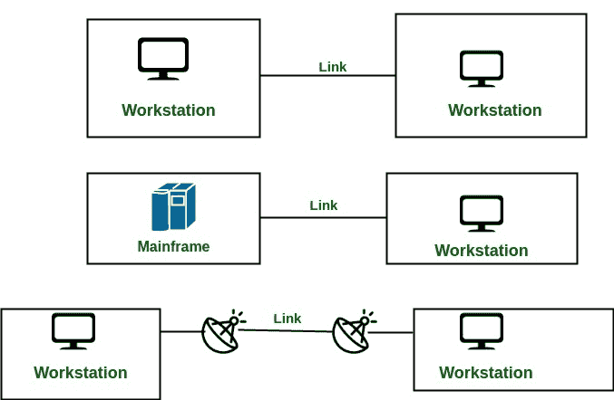
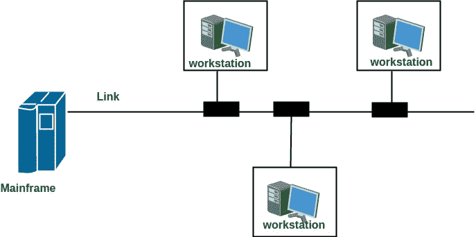

# 计算机网络中的线路配置

> 原文:[https://www . geesforgeks . org/line-configuration-computer-networks/](https://www.geeksforgeeks.org/line-configuration-computer-networks/)

网络是通过链路连接的两个或多个设备。链路是将数据从一台设备传输到另一台设备的通信路径。设备可以是计算机、打印机或任何其他能够发送和接收数据的设备。出于可视化的目的，将任何链接想象为两点之间的一条线。

要进行通信，两台设备必须以某种方式同时连接到同一链路。有两种可能的连接类型:

1.  **点对点连接**
2.  **多点连接**

**点对点连接:**

1.  点对点连接在两个设备之间提供专用链路。
2.  链路的全部容量被保留用于这两个设备之间的传输。
3.  大多数点对点连接使用实际长度的电线或电缆来连接两端，但微波或卫星链路等其他选项也是可能的。
4.  点对点网络拓扑被认为是最简单和最常规的网络之一
    拓扑。
5.  也是最简单的建立和理解。

示例:遥控器和电视之间的点对点连接，用于更改频道。

**多点连接:**

1.  也称为多点配置。在这种情况下，两个或多个设备共享一条链路。
2.  两个以上的设备共享链路，也就是说，通道的容量现在是共享的。对于共享容量，多点线路配置有两种可能性:

**空间共享:**如果多台设备可以同时共享链路，称为空间共享线路配置。
**分时:**如果用户必须轮流使用该链接，则称之为分时或分时线路配置。

参考文献:[http://mucins.weebly.com/21-line-configuration.html](http://mucins.weebly.com/21-line-configuration.html)

本文由**萨洛尼·古普塔**供稿。如果你喜欢 GeeksforGeeks 并想投稿，你也可以使用[write.geeksforgeeks.org](https://write.geeksforgeeks.org)写一篇文章或者把你的文章邮寄到 review-team@geeksforgeeks.org。看到你的文章出现在极客博客主页上，帮助其他极客。

如果你发现任何不正确的地方，或者你想分享更多关于上面讨论的话题的信息，请写评论。