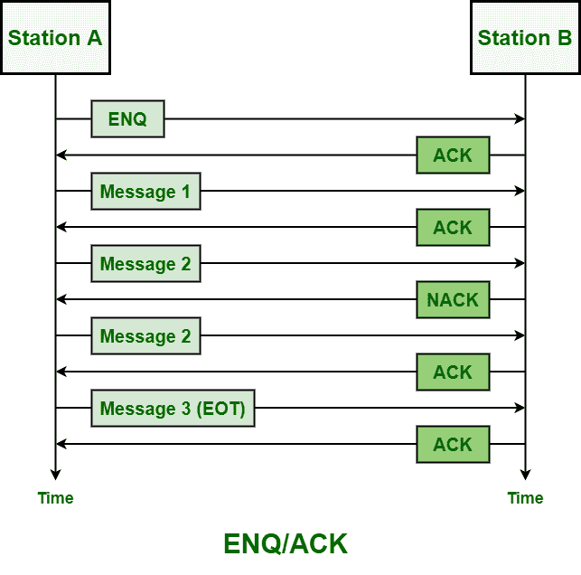
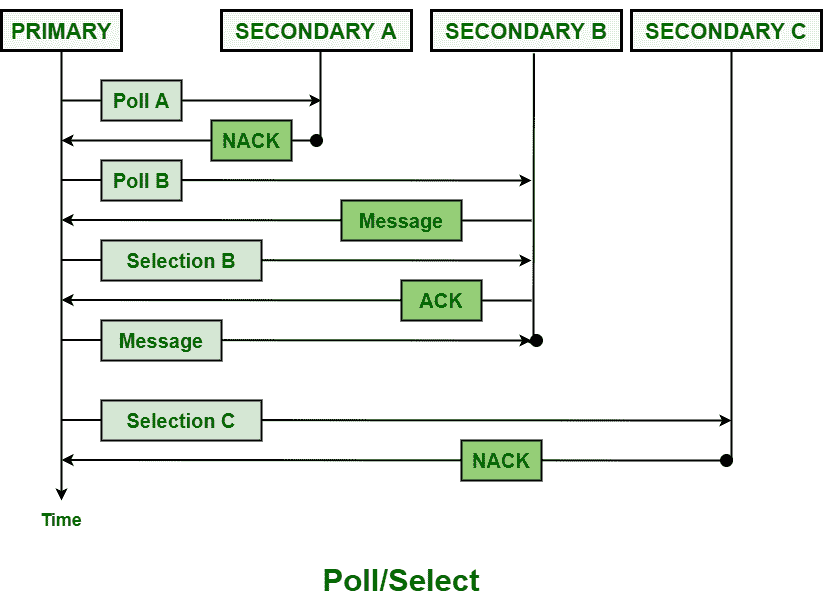

# 数据链路层的线路规程

> 原文:[https://www . geesforgeks . org/line-circuit-in-data-link-layer/](https://www.geeksforgeeks.org/line-discipline-in-data-link-layer/)

**线路规程**是[数据链路层](https://www.geeksforgeeks.org/data-link-layer-in-osi-model/)的功能。它只是决定和确定沟通的方向。它只是协调[半双工传输](https://www.geeksforgeeks.org/transmission-modes-computer-networks/)的过程，即数据可以在数据通信网络上双向传输，但不能同时传输，只需在传输数据之前在发送方和接收方之间建立和发展连续性。

它还确保接收者是否准备好接受或发信号通知发送者开始。线路规程通常是设备之间网络的各种操作的顺序，通常传输和接收数据，控制传输过程中出现的错误，处理消息集顺序，并确保确认正在接收数据。它还用于确定哪种设备可以传输数据，以及何时可以传输数据。

**线路纪律的执行方式:**
线路纪律的执行方式基本上有两种，如下所示–

**1。ENQ/确认(询问/确认):**
ENQ/确认是线路规程的程序，通常用于确定网络上的哪个设备能够发起或开始传输数据或消息，以及接收器是否准备好并能够接收数据。如果主机具有相似且相等的等级，那么主机或站中的任何一个都可以启动传输过程。

发起设备通常在全双工和半双工传输中建立会话。一旦在全双工模式下建立会话，两个设备都可以同时发送或传输。但是在全双工模式下，发起方传输数据，而响应方只是等待。当发起者完成或者仅仅请求响应时，响应者还可以接管链路。

**2。轮询/选择:**
线路规程中的轮询/选择方法基本上适用于某些拓扑，其中一个设备被视为主站，而其他设备被视为次站。可以看到多点连接，而不是两个，即多点系统必须协调几个节点。

当主站想要向次站(即下游)发送信息时，使用选择模式。要请求(要求获得)从二级到一级(即上游)的传输，则使用轮询模式。主设备基本上控制和处理链接或连接，另一方面，辅助设备只是遵循其指令。

