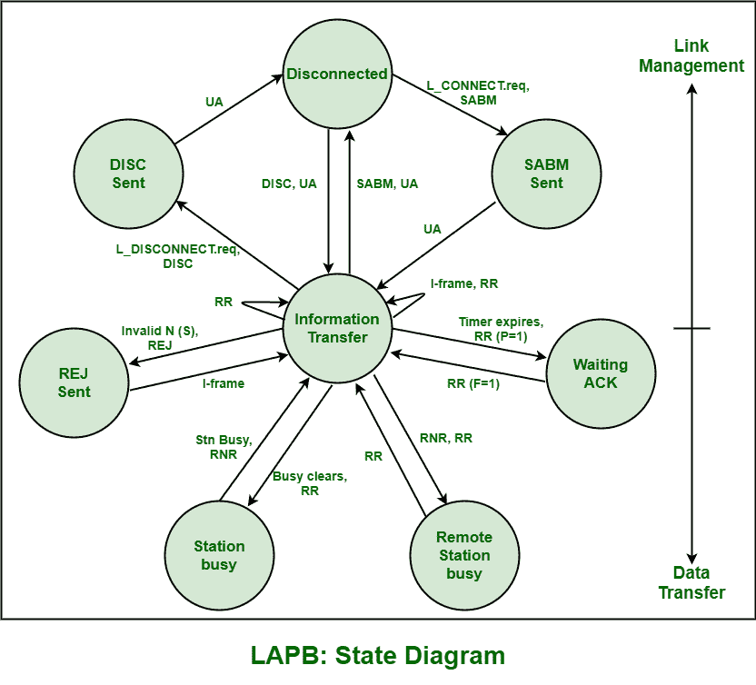

# 链路接入过程平衡(LAPB)帧类型

> 原文:[https://www . geesforgeks . org/link-access-procedure-balanced-lapb-frame-type/](https://www.geeksforgeeks.org/link-access-procedure-balanced-lapb-frame-types/)

链路接入过程，平衡(LAPB)是数据链路层通常需要的协议。是异步平衡模式下[高级数据链路控制(HDLC)](https://www.geeksforgeeks.org/types-of-hdlc-frames/) 的版本。P/F 位的 LAPB 用法不同于所有其他协议。LAPB 基本上使用三种类型的数据帧。每个框架都有不同的功能和用途。

下面给出了这三种类型的框架:

**1。信息帧:**
这些帧通常被称为信息帧。基本上是用来承载上层的信息或者数据。它包括两个不同的序列号，即用于发送序列号的 N (S)和用于接收序列号的 N (R)，序列号是 N (S)通常在下一个将要接收的 I 帧中取的期望值。该帧还包括 X.25 PLP 数据包，并且总是命令。

**2。**
这些框架通常被称为监督框架。它用于提供控制信息。此帧仅包含 N (R)。使用 S 帧，基本上有三种不同类型的消息被发送。s 帧通常通过 RR、RNR 和 REJ 帧来控制数据流。

*   **接收就绪(RR)–**
    RR 用于确认正在接收的当前帧，并指示下一帧是哪一帧。该帧可以是命令或响应，需要响应 RR 来确认正在接收的数据帧，也可以是对命令 RR 的响应。另一方面，命令 RR 在来自对等方的强制响应时是必需的，并且在链路空闲时也是必需的，仅仅是为了检查它是否仍然活动。
*   **拒绝(REJ)–**
    REJ 通常被接收机用来拒绝帧信号。当接收到带有意外序列号的 I 帧时，这基本上是必需的。意外的序列号只是向对等方指示需要再次传输或重传 I 帧。
*   **接收未就绪(RNR)–**
    RNR 用于控制数据流，并且还被要求指示接收器根本没有准备好接收任何额外的或附加的数据，并且发送器无论如何必须等待，直到发送或发送接收就绪消息。当链路的本地端暂时不能或准备好接收任何进一步的信息帧时，通常会发送或传输这些信息帧。

**2。**
这些帧通常被称为无编号帧。它用于提供未排序的控制信息。该帧根本不包括任何类型的序列号。它也是链路建立、链路断开和错误报告所必需的。基本上需要建立或发展、维护或处理与 SABM、UA、DISC、DM 和 FRMR 的通信。

*   **断开(DISC)–**
    该命令通常断开或终止链接或连接。
*   **设置异步平衡模式(SABM)–**
    用于在 Normal 即基本模式(模 8)序号下开发 DTE 和 DCE 链路。它需要被 UA Frame 确认，以便链接进入信息或数据传输。
*   **无编号确认(UA)–**
    它基本上是响应 SABM 帧发送的，只是为了设置信息传输的链接。
*   **断开模式(DM)–**
    这基本上是响应帧。当链路未准备好进入信息传输时，它在断开阶段响应命令帧而被传输或传输。
*   **帧拒绝(FRMR)–**
    它基本上报告了一个错误情况。每当发生任何错误时，都会发送响应帧，这可以通过重置数据链路来解决。

