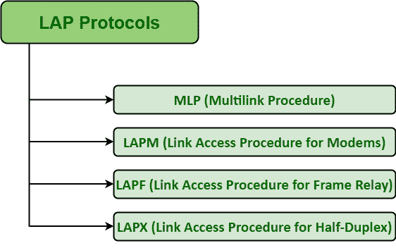

# 链路接入程序协议

> 原文:[https://www . geesforgeks . org/link-access-procedure-lap-protocol/](https://www.geeksforgeeks.org/link-access-procedure-lap-protocols/)

**链路接入过程(LAP)** 基本上被认为是[数据链路层(DLL)协议](https://www.geeksforgeeks.org/examples-of-data-link-layer-protocols/)的 ITU 家族，该协议是[高级数据链路控制(HDLC)](https://www.geeksforgeeks.org/type-of-stations-for-hdlc-protocol/) 的子集。LAP 尤其源自 IBM 的[系统开发生命周期(SDLC)](https://www.geeksforgeeks.org/software-development-life-cycle-sdlc/) 。有几种 LAP 协议。这些协议中的每一个通常都是为特定目的定制的 HDLC 协议的子集。

其中一些如下:

这些解释如下。

1.  **Multilink Procedure (MLP) –**
    MLP basically allows for Multilink Operations. It is an upper sublayer of the DLL that usually operates among Packet Layer and a multiplicity of SLP’s (Single Data Link Protocol) functions. It is generally an extension of LAPB that simply gives permission for multiple physical links along with providing better throughput.
2.  **Link Access Procedure for Modems (LAPM) –**
    LAPM has basically used in V.32 error-correcting modems and V.42 modems. Transmission among LAPM is synchronous even though transmission among computer and modem is asynchronous.

    借助面向比特的同步技术，LAPM 通常以帧或包的形式传输数据。LAPM 通常包含 SREJ(选择性拒绝)作为可选功能，允许它再次发送所有损坏的帧，并提供更快的错误恢复。即使所有连接的计算机都将数据作为标准异步输入传输到 LAPM 调制解调器，调制解调器也会以帧的形式传输数据。

    为了简单地确保数据的可靠性，即数据是否合理完整和准确，LAPM 使用了循环冗余校验和 ARQ 自动重复请求。它也被开发和建立来将一些 HDLC 特征应用到调制解调器。它还被设计和创建来进行异步-同步转换、错误检测和纠正以及重传。

3.  **Link Access Procedure for Frame Relay (LAPF) –**
    LAPF basically provides data link for frame relay networks and is designed for use along with frame relay. It is easiest and simplest version of ISDN’s LAPD. It is also required or carrying data only and even there is no signaling at DLL for performing flow and error control. It is also a part of network’s communications protocol. LAPF simply ensures that whether frames are error-free and executed in correct sequence or not. It does not make use of C/R (Command/Response) bit, even though other higher-layer protocols that need application-specific do use this bit.
4.  **Link Access Procedure for Half-Duplex (LAPX) –**
    LAPX is basically used for ship-to-shore transmission.