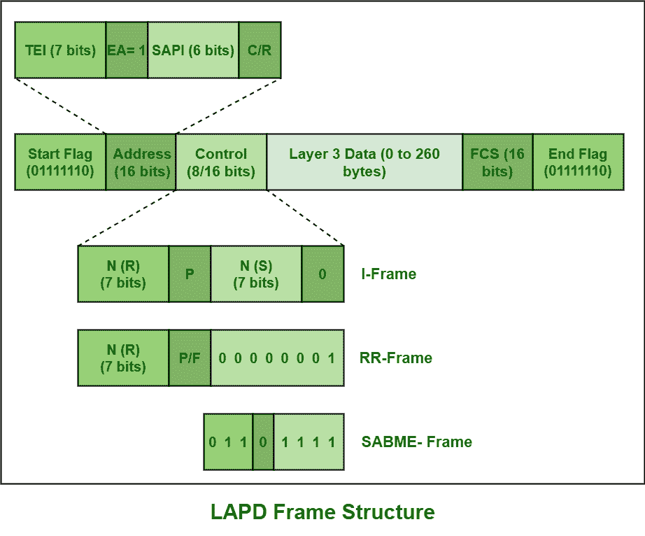
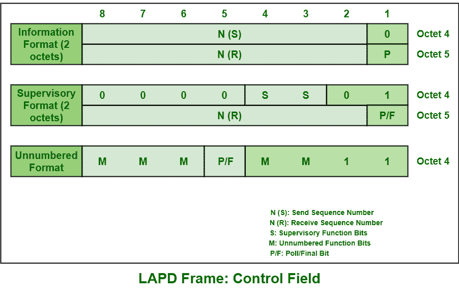

# 链路接入协议 D 信道(LAPD)

> 原文:[https://www . geesforgeks . org/link-access-protocol-d-channel-LAPD/](https://www.geeksforgeeks.org/link-access-protocol-d-channel-lapd/)

**D 信道上的 LAPD** 或**链路接入协议**基本上是 ISDN D 信道上通常需要的第 2 层协议。它源自链路接入协议平衡(LAPB)协议。它是专门为简单满足[综合业务数字网](https://www.geeksforgeeks.org/integrated-services-digital-network-isdn/)基本接入的信令要求而设计开发的。

LAPD 的主要目标只是在两个端点之间提供安全、无错误的连接，以便可靠地传输第 3 层的消息或数据帧。d 信道通常是 ISDN 网络中的交换设备和您现场的 ISDN 设备之间通信所需的数据或信令信道。它基本上支持两种不同类型的操作，即确认操作和未确认操作。

*   **确认操作–**
    在该操作中，信息或数据传输可以通过单帧传输或多帧传输完成。
*   **未确认操作–**
    该操作基本上需要无编号的信息框。

**框架结构:**

LAPD 基本上有数据链路层帧结构。它包含以下字段:

1.  **标志字段:**
    开始和结束标志简单地出现在最末端，只是为了标识消息或数据帧开始和结束。这些也称为用于同步的开始和结束标志。这些字段的位模式是 01111110。这是唯一的模式，不应该出现在这些开始和结束标志字段之间。为了防止这种情况，特别需要钻头填充。
2.  **Address Field :**

    该字段分为两个主要标识符字段，即服务接入点标识符(SAPI)和终端端点标识符(TEI)。各种功能实体之间的逻辑链接被标识为功能地址，即 SAPI。通过 A-bis 接口的信令链路仅由 TEI 简单地寻址到不同的单元。

3.  **Control Field :**
    This field is generally used to determine type of LAPD Frame that is being transferred or transmitted as well as having sequence numbers for acknowledged information transfer service. This field specifically identifies type of message or frame being transferred. It can be of three types i.e., I-frame (Information frame), S-frame (Supervisory frame), and U-frame (Unnumbered-frame).

    

4.  **帧校验序列(FCS)字段:**
    该字段通常是 LAPD 帧中除标志和 FCS 字段之外的所有元素的校验和。它还提供接收器对帧传输期间可能出现的任何类型的错误的检测。

**LAPD 功能:**

*   **成帧–**
    成帧只是提供信号的开始和传输的结束来界定帧内的用户数据。
*   **寻址–**
    只需寻址即可指示哪个设备是发射机和接收机。
*   **测序–**
    测序只是为了维护和处理正在传输的数据的序列编号。