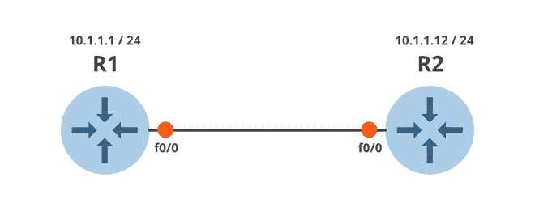
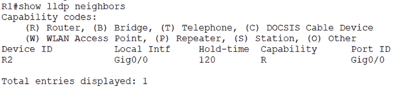

# 链路层发现协议(LLDP)

> 原文:[https://www . geesforgeks . org/link-layer-discovery-protocol-lldp/](https://www.geeksforgeeks.org/link-layer-discovery-protocol-lldp/)

**LLDP** 代表链路层发现协议。它是一个开放的 IEEE 标准(802.1AB)第 2 层协议。 **LLDP** 是 [CDP(思科发现协议)](https://www.geeksforgeeks.org/cisco-discovery-protocol-cdp-and-link-layer-discovery-protocol-lldp-in-data-link-layer/)的开源替代方案，这也是一种仅在思科制造的设备(路由器、网桥、接入服务器和交换机)上运行的第 2 层(数据链路层)设备发现协议。

LLDP 在数据链路层上运行，数据链路层允许两个不同的设备收集有关相邻设备的硬件和协议信息，这些信息对排除网络故障很有用。

它支持一组定义的属性，用于发现邻居设备，称为**TLV**，如下所示:

*   **T 型**
*   **L-长度**
*   **V 值描述**

运行 LLDP 的设备，在它们的一个接口上，使用 TLV 来接收和发送信息给它们的邻居。这些设备将相邻设备的信息存储在本地表中，可以使用简单网络管理协议进行访问。设备存储的信息包括:

*   系统名称和描述
*   端口名称和描述
*   IP 管理地址
*   虚拟局域网
*   邻居设备的能力
*   mac 地址
*   计量吸入器功率
*   链路聚合

**LLDP 的特点:**
LLDP 启用的设备可以

*   发现邻近设备。
*   向邻居公布有关其第 2 层配置的信息。
*   轻松排除故障并修复。
*   使用外围设备的即插即用配置。

**默认 LLDP 配置:**

*   LLDP 全球州-残疾人
*   LLDP 保持时间–120 秒
*   LLDP 定时器(数据包更新频率)–30 秒
*   LLDP 重新初始化延迟–2 秒
*   LLDP 顶级域名-选择–发送和接收所有顶级域名。
*   LLDP 接口状态–已启用
*   LLDP 接收–已启用
*   启用 LLDP 传输
*   LLDP 医疗-顶级域名-选择–发送所有 LLDP-MED 顶级域名

**LLDP 数据包格式:**
**【LLDP】**相邻设备以固定时间间隔通过各自支持 LLDP 的接口以 [**以太网帧**](https://www.geeksforgeeks.org/ethernet-frame-format/) 的形式发送和/或接收信息。每个以太网帧包含一个 **LLDP 数据单元** (LLDPDU)。线性低密度聚乙烯是一系列 **TLV** 结构。LLDP 以太网帧从以下强制 TLV 开始:

*   机箱标识
*   端口标识
*   生存时间


LLDP 数据包格式

**LLDP 的申请:**

*   该协议用于数据中心桥接要求。
*   用于广告**以太网供电** (PoE)。

**LLDP 优势:**

*   它可以在思科和非思科设备上运行。
*   这也是 CISCO 推荐的开放标准协议。
*   LLDP—地中海扩展比 CDP 更具优势。

**LLDP 的劣势:**

*   在 VMware 交换机上，发现支持的唯一协议是 CDP。
*   用 CDP 管理 LLDP 的成本更高。

**LLDP 配置:**

*   **在全球禁用和启用 LLDP**

```
# enabling LLDP

R1# configure terminal
R1(config)# lldp run
```

```
#disabling LLDP

R1# configure terminal
R1(config)# no lldp run
```

*   **在接口上禁用和启用 LLDP 协议**

```
#enabling LLDP on interface

R1# configure terminal
R1(config)# interface GigabitEthernet 1/1
R1(config-if)# lldp transmit
R1(config-if)# lldp receive
```

```
#disabling LLDP on interface

R1# configure terminal
R1(config)# interface GigabitEthernet 1/1
R1(config-if)# no lldp transmit
R1(config-if)# no lldp receive
```

*   **配置保持时间、** **延迟时间****和更新频率**

```
R1(config)# lldp holdtime 120
R1(config)# lldp reinit 5
R1(config)# lldp timer 15
```

**注意:**使用上述每个 LLDP 命令的“否”形式返回到设备的默认设置。



LLDP 路由器配置

对 R2 路由器执行相同的配置，使其成为上述网络中 R1 路由器的 LLDP 邻居。

*   **查看路由器上的 LLDP 配置**

```
R1# show lldp 
```


LLDP 命令结果

*   **查看 LLDP 邻居设备的详细信息**

```
R1# show lldp neighbors
```



LLDP 邻居命令结果