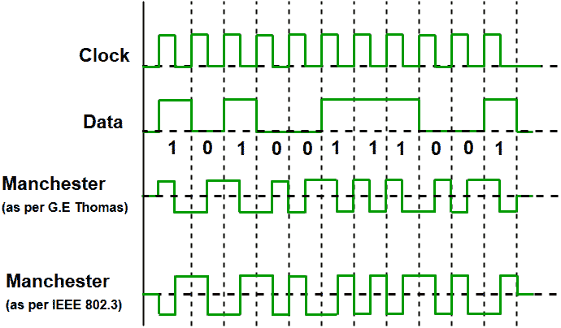
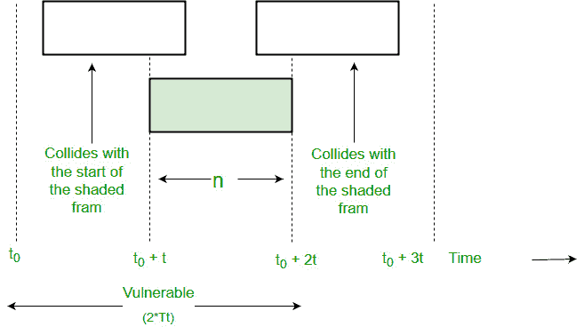
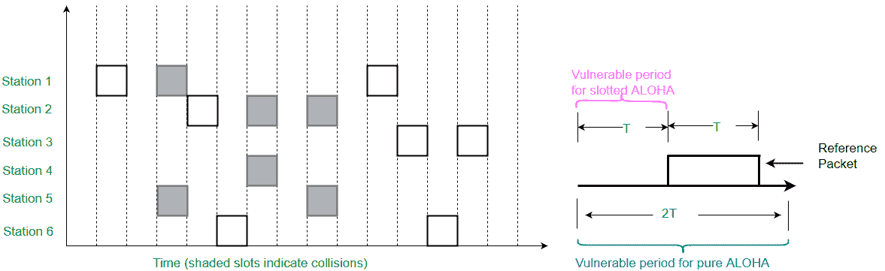

# 局域网技术|以太网

> 原文:[https://www . geesforgeks . org/局域网-局域网-technologies/](https://www.geeksforgeeks.org/local-area-network-lan-technologies/)

局域网(LAN)是连接建筑物或有限地理区域内的各种终端或计算机的数据通信网络。设备之间的连接可以是有线或无线的。以太网、令牌环网和使用 IEEE 802.11 的无线局域网都是标准局域网技术的例子。
**局域网有以下拓扑:**

*   星形布局
*   总线拓扑
*   环形拓扑
*   网状拓扑
*   混合拓扑
*   树形布局

**以太网:-**
以太网是使用最广泛的局域网技术，是在 IEEE 标准 802.3 下定义的。其广泛可用性背后的原因是以太网易于理解、实施、维护，并允许低成本的网络实施。此外，以太网在允许的拓扑方面提供了灵活性。以太网通常使用总线拓扑。以太网在现场视察模型的两层中运行，物理层和数据链路层。对于以太网，协议数据单元是帧，因为我们主要处理动态链接库。为了处理冲突，以太网中使用的访问控制机制是 CSMA/光盘。
以太网采用曼彻斯特编码技术。



由于我们谈论的是 IEEE 802.3 标准以太网，因此，0 表示由高到低的转变，1 表示由低到高的转变。在曼彻斯特编码和差分曼彻斯特中，编码波特率都是比特率的两倍。

```
 Baud rate = 2* Bit rate 
```

以太网局域网由网络节点和互连介质或链路组成。网络节点可以是两种类型:
**数据终端设备:-** 一般来说，数据终端设备是将用户信息转换成信号或重新转换接收信号的终端设备。DTEs 设备是:个人计算机、工作站、文件服务器或打印服务器，也称为终端站。这些设备要么是数据帧的源，要么是数据帧的目的地。数据终端设备可以是单件设备，也可以是多件设备，它们相互连接并执行允许用户通信所需的所有功能。用户可以与数据终端设备交互，或者数据终端设备可以是用户。

**数据通信设备(DCE):-** 数据通信设备是通过网络接收和转发帧的中间网络设备。它们可以是独立设备，如中继器、网络交换机、路由器，也可以是通信接口单元，如接口卡和调制解调器。DCE 执行信号转换、编码等功能，也可能是数字地面设备或中间设备的一部分。

目前，这些数据速率被定义为通过光纤和双绞线运行:
**i)快速以太网**
快速以太网是指能够以 100 兆比特/秒的速率传输数据的以太网

**ii)千兆以太网**
千兆以太网提供 1，000 兆比特/秒(1 千兆比特/秒)的数据速率。

**iii) 10 千兆以太网**
10 千兆以太网是最新一代，数据速率为 10 千兆比特/秒(10，000 兆比特/秒)。它通常用于要求高数据速率的高端应用中的主干。

**ALOHA**
ALOHA 协议是作为夏威夷大学一个项目的一部分而设计的。它提供了夏威夷几个岛上的计算机之间的数据传输，包括分组无线网络。Aloha 是数据链路层的多址协议，提出了多个终端如何在没有干扰或冲突的情况下访问介质。

ALOHA 有两个不同的版本:
**1。纯阿洛哈**
纯阿洛哈是一种无时隙、分散且易于实现的协议。在纯 ALOHA 中，站点只要想发送数据就简单地发送帧。在传输之前，它不会检查信道是否繁忙。如果两个或多个站同时传输，就会发生冲突，帧会被破坏。无论何时，任何一个站发送一个帧，它都期望从接收器得到确认。如果在指定时间内没有收到，该站就认为该帧或确认已被破坏。然后，工作站等待一段随机的时间，再次发送帧。这种随机性有助于避免更多的碰撞。该方案在负载不大的小型网络中运行良好。但是在负载很大的网络中，这个方案失败得很惨。这导致了开槽阿洛哈的发展。
保证纯 aloha:其吞吐量和要预测的帧的传输速率。
为此做一些假设:
i)所有的帧应该是相同的长度。
ii)站在传输或尝试传输帧时无法生成帧。
iii)站点的数量试图根据泊松分布进行传输(新帧和碰撞的旧帧)。



```
 Vulnerable Time = 2 * Tt 
```

**纯 ALOHA 的效率:**T2】

```
Spure= G * e^-2G 
*where G is number of stations wants to transmit in Tt slot.* 

Maximum Efficiency:
Maximum Efficiency will be obtained when G=1/2

(Spure)*max* = 1/2 * e^-1
           = 0.184 

*Which means, in Pure ALOHA, only about 18.4% of the time is used for successful transmissions.*
```

**2。开槽阿洛哈**
这与纯阿洛哈非常相似，只是传输方式不同。发送者等待一段时间，而不是在需要的时候发送。在时隙 ALOHA 中，共享信道的时间被分成称为*时隙*的离散间隔。这些站仅在时隙开始时有资格发送帧，并且每个时隙仅发送一帧。如果任何站不能在时隙开始时将帧放入信道，它必须等到下一个时隙开始。如果两个站试图在同一时隙的开始发送，仍然有冲突的可能性。但是，与 Pure Aloha 相比，可能发生的冲突数量大大减少，性能也变得更好。



只有当前插槽可能发生冲突。因此，脆弱的时候是 Tt。

**时隙 ALOHA 的效率:**

```
 S*slotted* = G * e^-G

Maximum Efficiency:
(Sslotted)*max* = 1 * e^-1 
              = 1/e = 0.368 
Maximum Efficiency, in Slotted ALOHA, is 36.8%.
```

图片参考:[维基百科](https://en.wikipedia.org/wiki/Manchester_code#/media/File:Manchester_encoding_both_conventions.svg)[慕尼黑工业大学](https://www.lkn.ei.tum.de/mmprog/mac/protocols/collision/aloha2.htm)

参考文献:
https://www . Cisco . com/c/en/us/tech/LAN-switching/Ethernet/index . html
https://en.wikipedia.org/wiki/Ethernet

本文由**贾芳·科利**和**阿布舍克·阿格拉瓦尔**T4 供稿