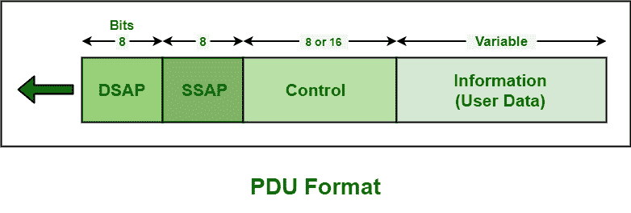

# 逻辑链路控制协议数据单元

> 原文:[https://www . geesforgeks . org/logic-link-control-LLC-protocol-data-unit/](https://www.geeksforgeeks.org/logical-link-control-llc-protocol-data-unit/)

逻辑链路控制(LLC)是一个子层，它通常为数据链路提供逻辑，因为它控制 [DLL(数据链路层)](https://www.geeksforgeeks.org/data-link-layer-in-osi-model/)的同步、多路复用、流量控制，甚至错误检查功能。DLL 分为两个子层，即 LLC 子层和 [MAC(媒体访问控制)](https://www.geeksforgeeks.org/mac-full-form/)子层。

LLC 协议的基本模型是仿照 [HDLC(高级数据链路控制)](https://www.geeksforgeeks.org/basic-frame-structure-of-hdlc/)建立的。这些协议是未确认的无连接服务、面向连接的服务和确认的无连接服务。所有这些协议都使用相同的协议数据单元格式，如图所示

该 PDU 格式基本上包含 4 个不同的字段，如下所示–

1.  **目的地服务接入点(DSAP)字段–**
    DSAP 通常是一个 8 位长的字段，用于表示接收消息的网络层实体的逻辑地址。它指示这是个人地址还是组地址。

2.  **源服务接入点(SSAP)字段–**
    SSAP 也是一个 8 位长的字段，用于表示打算创建消息的网络层实体的逻辑地址。它指示这是命令还是响应 PDU。它只是识别已经启动 PDU 的 SAP。

3.  **信息字段–**
    该字段一般包括数据或信息。

4.  **控制字段–**
    该字段识别和确定特定的 PDU，并指定各种控制功能。它是一个 8 或 16 位长的字段，通常取决于 PDU 的身份。它用于流量和错误控制。基本上有三种类型的 PDU。每个分组数据单元都有不同的控制字段格式。这些在下面给出–
    *   **信息(I)–**
        一般包括 7 位序列号(N(S))和一个捎带序列号(N(R))。它用于携带数据或信息。

    *   **监督(S)–**
        它通常包括一个确认序列号(N(R))和一个 2 位 S 字段，用于三种不同的 PDU 格式，即 RNR(接收未就绪)、RR(接收就绪)和 REJ(拒绝)。它通常用于流量和错误控制。

    *   **未编号(U)–**
        它通常是一个 5 位 M 位，用于指示 PDU 的类型。它用于各种协议 PDU。

**LLC 子层的一些功能是–**

*   它负责管理和确保数据传输的完整性。
*   它们为数据链路提供逻辑。
*   它还控制 DLL 的同步、多路复用、错误检查或纠正功能、流量控制。
*   它还允许在一系列计算机网络上进行多点通信。