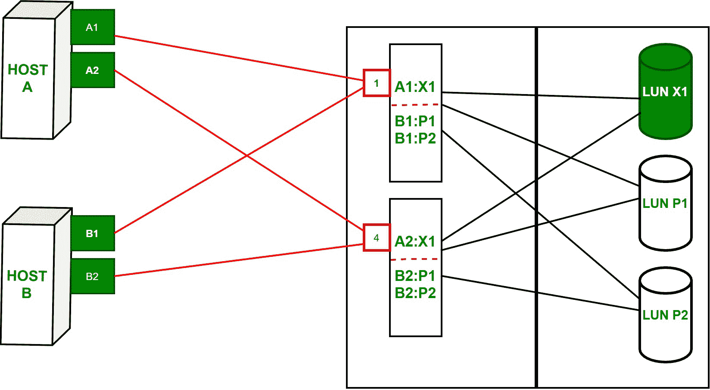

# 逻辑单元号(LUN)屏蔽

> 原文:[https://www . geesforgeks . org/logical-unit-number-LUN-masking/](https://www.geeksforgeeks.org/logical-unit-number-lun-masking/)

**逻辑单元号(LUN)屏蔽**是通过指定可由计算机系统访问的**LUN**来授予数据访问控制的过程。它通常在主机总线适配器(HBA)级别执行。

存储子集由虚拟存储区域网络**中的 LUN 屏蔽创建，在虚拟存储区域网络**中，只有已识别的服务器被授权访问这些子集。LUN 掩蔽在存储的控制器或处理器上执行。这确保服务器对卷的访问得到正确管理。因此，这有助于防止在公共环境中出现任何未经授权或意外的应用。

**示例:**
右侧存储阵列中有端口 1 和端口 4。在我们每个主机的主机中，我们有两个 HBA 或两个 HBA 8 端口。端口 A1 和 A2 位于主机 A，端口 B1 和 B2 位于主机 B。阵列端口 1 和 4 都连接到每个主机。两台主机都可以访问所有三个 LUN。我们为每个端口添加一个 **ACL(访问控制列表)**。端口 1 上的 ACL 声明 HBA 端口 A1 可以访问 LUN X1，HBA 端口 B1 可以访问 LUN P1 和 LUN P2。

同样，端口 4 上的 ACL 声明 HBA 端口 A2 可以访问 LUN X1，HBA 端口 B2 可以访问 LUN P1 和 LUN P2。对于主机 A，两个端口都授予对 LUN X1 的访问权限。主机 A 正试图通过 HBA 端口 A1 访问 LUN X1，并且 ACL 允许此访问。因此，主机 A 可以在 LUN X1 上读取或写入数据。主机 A 现在希望通过同一 HBA 端口访问 LUN P1 和 LUN P2。禁止此访问尝试，因为 LUN 掩蔽表未授予其权限。

我们现在配置 LUN 掩蔽，以允许两台主机都访问 LUN X1。如果主机 A 和 B 在没有相互通知的情况下读取和写入 LUN X1，该 LUN 上的数据将会损坏，这将导致数据丢失。这表明不应授予多个系统在同一 LUN 上读取或写入的权限。这个问题可以通过使用名为集群软件的基于**主机的软件来解决，该软件将允许多个主机访问公共 LUN 或多个共享 LUN。
T3】**

**Figure –** LUN Masking
